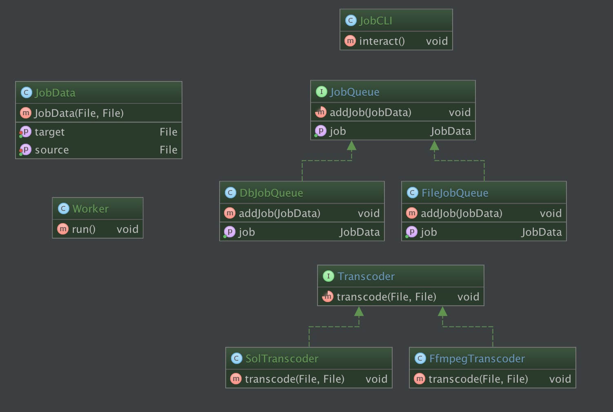
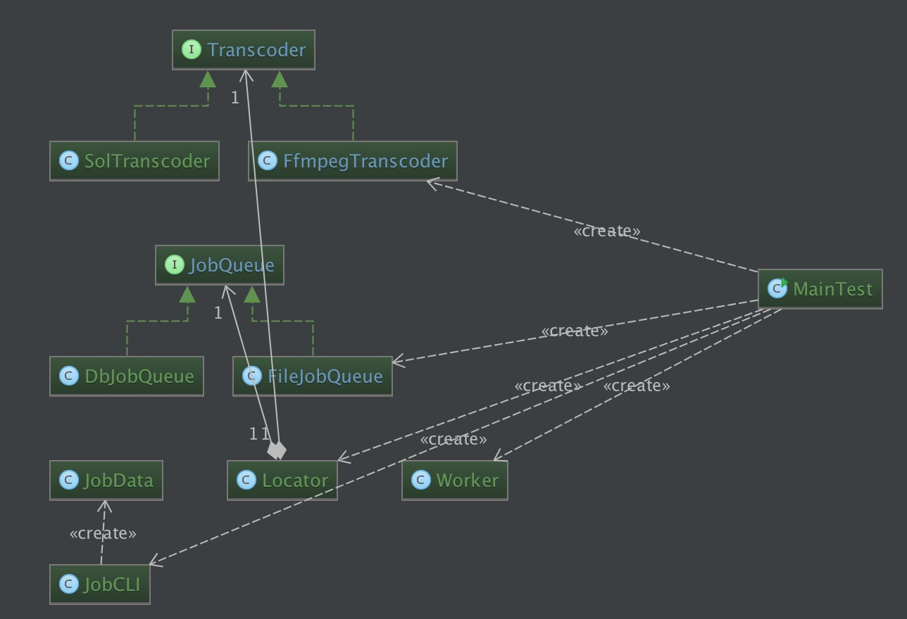

# 개발자가 반드시 정복해야할 객체지향과 디자인패턴
###리스코프 치환 원칙
리스코프 치환 원칙은 OCP을 받쳐 주는 다형성에 관한 원칙을 제공한다. 리스코프 치환 원칙은 다음과 같다. **상위 타입의 객체를 하위 타입의 객체로 치환해도 상위 타입을 사용하는 프로그램은 정상적으로 동작해야 한다.**<br>
```
public void someMethod(SuperClass sc){
  sc.someMethod();
}
```
someMethod()는 상위 타입인 SuperClass 타입의 객체를 사용하고 있는데, 이 메서드에 다음과 같이 하위 타입의 객체를 전달해도 someMethod()가 정상적으로 동작해야 한다는 것이 리스코프 치환 원칙이다.
`someMethod(new SubClass());`<br>

**리스코프 치환 원칙을 지키지 않을 때의 문제점**<br>
리스코프 치환 원칙을 설명할 때 자주 사용되는 대표적인 예가 직사각형 - 정사각형 문제이다. 
```
public class Rectangle{
  private int width;
  private int height;
  
  public void setWidth(int width){
    this.width = width;
  }
  public void setHeight(int height){
    this.height = hight;
  }
  public int getWidth(){
    return width;
  }
  public int getHeight(){
    return height;
  }
}
```
정사각형을 직사각형의 특수한 경우로 보고 정사각형이 직사각형을 상속받도록 구현했다고 하자. 정사각형은 가로, 세로 길이가 모두 동일해야 하기 때문에 setWidth() 메서드와 setHeight() 메서드를 재정의해서 가로, 세로 값이 일치되도록 구현하였다.
```
public class Square extends Rectangle{
  @Override
  public void setWidth(int width){
    super.setWidth(width);
    super.setHeight(width);
  }
  
  @Override
  public void setHeight(int height){
    super.setWidth(height);
    super.setHeight(height);
  }
}
```
이제 Rectangle 클래스를 사용하는 코드를 살펴보자. 이 코드는 높이와 폭을 비교해서 높이를 더 길게 만들어 주는 기능을 제공한다고 해보자. 
```
public void increaseHeight(Rectangle rec){
  if(rec.getHeight() <= rec.getWidth()){
    rec.setHeight(rec.getWidth() + 10);
  }
}
```
increaseHeight() 메서드를 사용하는 코드는 메서드 실행 후에 width 보다 height의 값이 더 크다고 가정할 것이다. 근데 increaseHeight() 메서드의 rec 파라미터로 Square 객체가 전달되면, 이 가정은 깨진다. Square의 setHeight() 메서드는 높이와 폭을 모두 같은 값으로 만들어 버리기 때문에 increaseHeight() 메서드를 실행하더라도 높이가 폭보다 길어지지 않게 된다.<br>
```
public void increaseHeight(Rectangle rec){
  if(rec instanceof Square)
      throw new CantSupportSquareException();
  
  if(rec.getHeight() <= rec.getWidth())
    rec.setHeight(rec.getWidth() + 10);
  
}
```
이 문제를 해소하기 위해 rec 파라미터의 실제 타입이 Square일 경우를 막는 instanceof 연산자를 사용할 수 있을 것이다. 하지만 instanceof 연산자를 사용한다는 것 자체가 리스코프 치환 원칙 위반이 되고 이는 increaseHeight() 메서드가 Rectangle의 확장에 열려 있지 않다는 것을 뜻한다. <br>

리스코프 치환 원칙을 어기는 또 다른 흔한 예는 상위 타입에서 지정한 리턴 값의 범위에 해당되지 않는 값을 리턴하는 것이다. 예를 들어, 입력 스트림으로부터 데이터를 읽어 와 출력 스트림에 복사해 주는 복사 기능은 다음과 같이 구현될 것이다.
```
public class CopyUtil {
  public static void copy(InputStream is, OutputStream out){
    byte[] data = new byte[512];
    int len = -1;
    
    //InputStream.read() 메서드는 스트림의 끝에 도달하면 -1을 리턴
    while((len = is.read(data)) != -1){
      out.write(data,0,len);
    }
  }
}
```
InputStream의 read() 메서드는 스트림의 끝에 도달해서 더 이상 데이터를 읽어올 수 없을 경우 -1을 리턴한다고 정의되어 있고, CopyUtil.copy() 메서드는 이 규칙에 따라 is.read()의 리턴 값이 -1이 아닐 때까지 반복해서 데이터를읽어 와 out에 쓴다. 그런데 만약 InputStream을 상속한 하위 타입에서 read() 메서드를 아래와 같이 구현하면 어떻게 될까?
```
public class SatanInputStream implements InputStream{
  public int read(byte[] data){
    ...
    return 0; // 데이터가 없을 때 0을 리턴하도록 구현
  }
}
```
SatanInputStream의 read() 메서드는 데이터가 없을 때 0을 리턴하도록 구현했다. SatanInputStream 클래스의 사용자는 SatanInputStream 객체로부터 데이터를 읽어 와서 파일에 저장하기 위해 다음과 같이 CopyUtil.copy() 메서드를 사용할 수 있을 것이다. 
```
InputStream is = new SatanInputStream(someData);
OutputStream out = new FileOutputStream(filePath);
CopyUtil.copy(is,out);
```
이렇게 되면 CopyUtil.copy() 메서드는 무한루프에 빠지게 된다. 왜냐하면 SatanInputStream의 read() 메서드는 데이터가 없더라도 -1을 리턴하지 않기 때문이다. 
```
public class CopyUtil{
  public static void copy(InputStream is, OutputStream out){
    ...
    // is가 SatanInputStream인 경우 read() 메서드는 -1을 리턴하지 않으므로, 아래 코드는 무한루프가 된다.
    while((len = is.read(data)) != -1){
      out.write(data,0,len);
    }
  }
}
```

**상품에 쿠폰을 적용해서 할인되는 액수 구하는 기능**<br>
```
public class Coupon{
  public int calculateDiscountAmount(Item item){
    return item.getPrice() * discountRate;
  }
}
```
이 코드에서 Coupon 클래스의 calculateDiscountAmount() 메서드는 Item 클래스의  getPrice() 메서드를 이용해서 할인될 값을 구하고 있다. 그런데 특수 Item은 무조건 할인을 해주지 않는 정책이 추가되어, 이를 위해 Item 클래스를 상속받는 SpecialItem 클래스를 추가했다고 하자.
```
public class Coupon{
  public int calculateDiscountAmount(Item item){
    if(item instanceof SpecialItem)
      return 0;
      
    return item.getPrice() * discountRate;
  }
}
```
Item 타입을 사용하는 코드(위 예제에서는 calculateDiscountAmount 메서드)는 SpecialItem 타입이 존재하는지 알 필요 없이 오직 Item 타입만 사용해야 한다. 그런데 instanceof 연산자를 통해 SpecialItem 타입인지의 여부를 확인하고있다. 즉, 하위타입인 SpecialItem이 상위 타입인 Item을 완벽하게 대체하지 못하는 상황이 발생하고 있는 것이다. <br>

**타입을 확인하는 기능을 사용한다는 것은 클라이언트가 상위 타입만을 사용해서 프로그래밍 할 수 없다는 것을 뜻하며, 이는 하위 타입이 상위 타입을 대체할 수 없다는 것을 의미한다. 즉, instanceof 연산자를 사용한다는 것 자체가 리스코프 치환 원칙 위반이 된다.** <br>

위의 예제 같은 경우는 Item에 대한 추상화가 덜 되었기 때문에 리스코프 치환 원칙을 어기게 됐다. 따라서 상품의 가격 할인 가능 여부가 Item 및 그 하위 타입에서 변화되는 부분이며, 변화되는 부분을 Item 클래스에 추가함으로써 리스코프 치환 원칙을 지킬 수 있게 된다.
```
public class Item{
  //변화되는 기능을 상위 타입에 추가 
  public boolean isDiscountAvailable(){
    return true;
  }
}

public class SpecialItem extends Item{
  @Override
  public boolean isDiscountAvailable(){
    return false;
  }
}
```
이렇게 변화되는 부분을 상위 타입에 추가함으로써, instanceof 연산자를 사용하던 코드를 Item 클래스만 사용하도록 구현할 수 있게 되었다.
```
public class Coupon{
  public int calculateDiscountAmount(Item item){
    if(!item.isDiscountAvailable())
      return 0;
      
    return item.getPrice() * discountRate;
  }
}
```
###서비스 로케이터
로버트 C 마틴은 소프트웨어를 두 개의 영역으로 구분해서 설명하고 있는데, 한 영역은 고수준 정책 및 저수준 구현을 포함한 애플리케이션 영역이고 또 다른 영역은 애플리케이션이 동작하도록 각 객체들을 연결해 주는 메인 영역이다. 본 장에서는 애플리케이션 영역과 메인 영역에 대해 살펴보고, 메인 영역에서 객체를 연결하기 위해 사용되는 방법인 DI와 서비스 로케이터에 대해 알아보자.<br>

JobQueue와 Transcoder는 변화되는 부분을 추상화한 인터페이스로서, 다른 코드에 영향을 주지 않으면서 확장할 수 있는 구조를 갖고 있다.(OCP) 따라서 Worker 클래스는 이들 콘크리트 클래스에 의존하지 않는다.<br>

Worker 클래스는 JobQueue에 저장된 객체로부터 JobData를 가져와 Transcoder를 이용해서 작업을 실행하는 책임이 있다. 
```
public class Worker {
    public void run(){
        JobQueue jobQueue = ...;// JobQueue를 구한다.
        Transcoder transcoder = ...; // Transcoder를 구한다.
        boolean someRunningCondition = true;

        while(someRunningCondition){
            JobData jobData = jobQueue.getJob();
            transcoder.transcode(jobData.getSource(), jobData.getTarget());
        }
    }
}
```
Worker가 제대로 동작하려면 JobQueue나 Transcoder를 구현한 클래스의 객체가 필요하다. 비슷하게 JobCLI 클래스도 JobQueue에 작업 데이터를 넣어야 하는데, 이를 수행하려면 JobQueue를 구현한 객체를 구해야 한다.<br>

이를 위해 Locator라는 객체를 사용하기로 했다고 해보자. 
```
public class Locator {
    private static Locator instance;
    public static Locator getInstance(){
        return instance;
    }

    public static void init(Locator locator){
        instance = locator;
    }

    private JobQueue jobQueue;
    private Transcoder transcoder;

    public Locator(JobQueue jobQueue, Transcoder transcoder){
        this.jobQueue = jobQueue;
        this.transcoder = transcoder;
    }

    public JobQueue getJobQueue(){
        return jobQueue;
    }

    public Transcoder getTranscoder(){
        return transcoder;
    }
}
```
```
public class Worker {
    public void run(){
        JobQueue jobQueue = Locator.getInstance().getJobQueue();
        Transcoder transcoder = Locator.getInstance().getTranscoder();

        boolean someRunningCondition = true;

        while(someRunningCondition){
            JobData jobData = jobQueue.getJob();
            transcoder.transcode(jobData.getSource(), jobData.getTarget());
        }
    }
}

public class JobCLI {
    public void interact(){
        JobQueue jobQueue = Locator.getInstance().getJobQueue();
        File source = new File("test.txt");
        File target = new File("test2.txt");

        jobQueue.addJob(new JobData(source,target));
    }
}
```
**여기서 질문이 발새한다. 그렇다면 과연 누가 Locator 객체를 초기화 해줄 것인가? 그리고 JobCLI 객체와 Worker 객체를 생성하고 실행해 주는 건 누구인가?**<br>

드디어 메인 영역이 출현할 차례가 되었다. 메인 영역은 다음 작업을 수행한다. 
1. 애플리케이션 영역에서 사용될 객체를 생성한다.
2. 각 객체 간의 의존 관계를 설정한다.
3. 애플리케이션을 실행한다.


```
public class MainTest {
    public static void main(String[] args) {
        JobQueue jobQueue = new FileJobQueue();
        Transcoder transcoder = new FfmpegTranscoder();

        Locator locator = new Locator(jobQueue, transcoder);
        Locator.init(locator);

        final Worker worker = new Worker();
        Thread t = new Thread(new Runnable() {
            @Override
            public void run() {
                worker.run();
            }
        });

        JobCLI cli = new JobCLI();
        cli.interact();
    }
}
```
**사용할 객체를 제공하는 책임을 갖는 객체를 서비스 로케이터라고 부른다.**<br>

프로그램 개발 환경이나 사용하는 프레임워크의 제약으로 인해 DI 패턴을 적용할 수 없는 경우가 있다. 예를 들어 안드로이드 플랫폼의 경우는 화면을 생성할 때 Activity 클래스를 상속받도록 하고 있는데, 이 때 안드로이드 실행환경은 정해진 메서드만을 호출할 뿐, 안드로이드 프레임워크가 DI 처리를 위한 방법을 제공하지는 않는다. 따라서 의존 객체를 찾는 다른 방법인 서비스 로케이터를 살펴보자.<br>

서비스 로케이터를 구현하는 방법은 다양하게 존재할 수 있는데, 본 장에서는 객체 등록 방식의 구현 방법과 상속을 통한 구현 방법에 대해 알아볼 것이다.<br>

**객체 등록 방식의 구현**
```
// 생성자를 이용해서 객체를 등록 받는 서비스 로케이터 구현
public class ServiceLocator {
    private JobQueue jobQueue;
    private Transcoder transcoder;

    public ServiceLocator(JobQueue jobQueue, Transcoder transcoder){
        this.jobQueue = jobQueue;
        this.transcoder = transcoder;
    }
    public JobQueue getJobQueue(){
        return jobQueue;
    }
    public Transcoder getTranscoder(){
        return transcoder;
    }
    //서비스 로케이터 접근 위한 static 메서드
    private static ServiceLocator instance;
    public static void load(ServiceLocator locator){
        ServiceLocator.instance = locator;
    }
    public static ServiceLocator getInstance(){
        return instance;
    }
}
```
```
// 메인 영역에서 서비스 로케이터에 객체 등록
public static void main(String[] args){
  //의존 객체 생성
  FileJobQueue jobQueue = new FileJobQueue();
  FfmpegTranscoder transcoder = new FfmpegTranscoder();
  
  //서비스 로케이터 초기화
  ServiceLocator locator = new ServiceLocator(jobQueue, transcoder);
  ServiceLocator.load(locator);
  
  //애플리케이션 코드 실행
  Worker worker = new Worker();
  JobCLI jobCli = new JobCLI();
  jobCli.interact();
}
```
```
public class Worker {
    public void run(){
        //서비스 로케이터 이용해서 의존 객체 구함
        ServiceLocator locator = ServiceLocator.getInstance();
        JobQueue jobQueue = locator.getJobQueue();
        Transcoder transcoder = locator.getTranscoder();

        boolean someRunningCondition = true;

        while(someRunningCondition){
            JobData jobData = jobQueue.getJob();
            transcoder.transcode(jobData.getSource(), jobData.getTarget());
        }
    }
}
```
그런데 서비스 로케이터가 제공할 객체 종류가 많을 경우, 서비스 로케이터 객체를 생성할 때 한번에 모든 객체를 전달하는 것은 코드 가독성을 떨어뜨릴 수 있다. 이런 경우에는 각 객체마다 별도의 등록 메서드를 제공하는 방식을 취해서 서비스 로케이터 초기화 부분의 가독성을 높여줄 수 있다.
```
// 객체마다 등록 메서드를 따로 제공하는 방식
public class ServiceLocator {
    private JobQueue jobQueue;
    private Transcoder transcoder;

    public void setTranscoder(Transcoder transcoder) {
        this.transcoder = transcoder;
    }
    public void setJobQueue(JobQueue jobQueue) {
        this.jobQueue = jobQueue;
    }
    public JobQueue getJobQueue(){
        return jobQueue;
    }
    public Transcoder getTranscoder(){
        return transcoder;
    }
    //서비스 로케이터 접근 위한 static 메서드
    private static ServiceLocator instance;
    public static void load(ServiceLocator locator){
        ServiceLocator.instance = locator;
    }
    public static ServiceLocator getInstance(){
        return instance;
    }
}
```
객체를 등록하는 방식의 장점은 서비스 로케이터 구현이 쉽다는 점이다. 하지만 서비스 로케이터에 객체를 등록하는 인터페이스가 노출되어 있기 때문에 애플리케이션 영역에서 얼마든지 의존 객체를 바꿀 수 있다.
```
public class Worker{
  public void run(){
    //고수준 모듈에서 저수준 모듈에 직접 접근하는 걸 유도할 수 있음
    ServiceLocator oldLocator = ServiceLocator.getInstance();
    ServiceLocator newLocator = new ServiceLocator(
      //DIP 위반
      new DbJobQueue(), oldLocator.getTranscoder());
  }
}
```
**상속을 통한 구현**<br>
객체를 구하는 추상 메서드를 제공하는 상위 타입 구현<br>
상위 타입을 상속받은 하위 타입에서 사용할 객체 설정<br>
```
// 상속 방식 서비스 로케이터 구현의 상위 타입
public abstract class ServiceLocator {
    public abstract JobQueue getJobQueue();
    public abstract Transcoder getTranscoder();

    protected ServiceLocator(){
        if(instance != null)
            throw new IllegalStateException("이미 있어");
        ServiceLocator.instance = this;
    }

    private static ServiceLocator instance;
    public static ServiceLocator getInstance(){
        return instance;
    }
}
```
ServiceLocator가 추상 클래스라는 것은 이 클래스를 상속받아 추상 메서드의 구현을 제공하는 클래스가 필요하다는 뜻이다. 
```
public class MyServiceLocator extends ServiceLocator{
    private FileJobQueue jobQueue;
    private FfmpegTranscoder transcoder;

    public MyServiceLocator() {
        super();
        this.jobQueue = new FileJobQueue();
        this.transcoder = new FfmpegTranscoder();
    }

    @Override
    public JobQueue getJobQueue() {
        return jobQueue;
    }

    @Override
    public Transcoder getTranscoder() {
        return transcoder;
    }
}
```
**서비스 로케이터의 단점은 인터페이스 분리 원칙을 위반한다는 점이다. 예를 들어 JobCLI 클래스가 사용하는 타입은 JobQueue 뿐인데, ServiceLocator를 사용함으로써 Transcoder 타입에 대한 의존이 함께 발생하게 된다.**
```
public class JobCLI {
    public void interact(){
        ...
        //ServiceLocator의 인터페이스 변경 시 영향을 받을 수 있음
        JobQueue jobQueue = ServiceLocator.getInstance().getJobQueue();
  }
}
```
###옵저버(Observer) 패턴