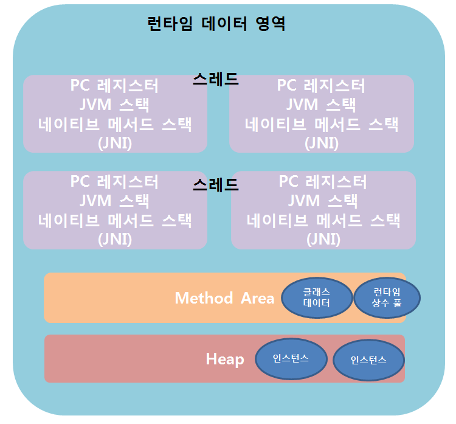
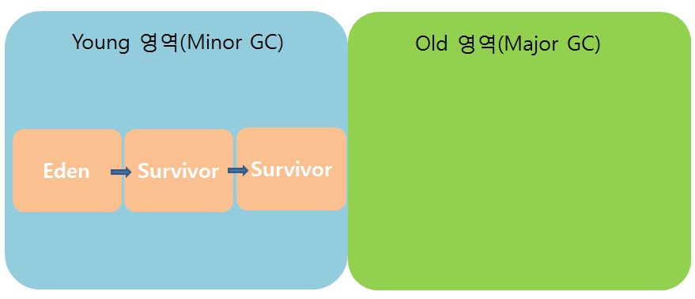

###1. 자바의 날짜와 시간 API
2014년에 최종 배포된 JDK8에는 JSR-310이라는 표준 명세로 날짜와 시간에 대한 새로운 API가 추가됐다. 스프링 프레임워크4.0에서는 JSR-310을 기본으로 지원한다.

```
public class Jsr310Test {
	@Test
	public void shouldGetAfterOneDay() {
		LocalDate theDay = IsoChronology.INSTANCE.date(1582, 10, 4);
		DateTimeFormatter formatter = DateTimeFormatter.ofPattern("yyyy.MM.dd");
		assertThat(theDay.format(formatter)).isEqualTo("1582.10.04");
		
		LocalDate nextDay = theDay.plusDays(1);
		assertThat(nextDay.format(formatter)).isEqualTo("1582.10.05");
	}
	
	@Test
	public void shouldGetAfterOneHour() {
		ZoneId seoul = ZoneId.of("Asia/Seoul");
		ZonedDateTime theTime = ZonedDateTime.of(1988, 5, 7, 23, 0, 0, 0, seoul);
		DateTimeFormatter formatter = DateTimeFormatter.ofPattern("yyyy.MM.dd HH:mm");
		assertThat(theTime.format(formatter)).isEqualTo("1988.05.07 23:00");
		ZoneRules seoulRules = seoul.getRules();
		assertThat(seoulRules.isDaylightSavings(Instant.from(theTime))).isFalse();

		ZonedDateTime after1Hour = theTime.plusHours(1);
		assertThat(after1Hour.format(formatter)).isEqualTo("1988.05.08 01:00");
		assertThat(seoulRules.isDaylightSavings(Instant.from(after1Hour))).isTrue();
	}
	
	@Test
	public void shouldGetAfterOneMinute() {
		ZoneId seoul = ZoneId.of("Asia/Seoul");
		ZonedDateTime theTime = ZonedDateTime.of(1961, 8, 9, 23, 59, 59, 0, seoul);
		DateTimeFormatter formatter = DateTimeFormatter.ofPattern("yyyy.MM.dd HH:mm");
		assertThat(theTime.format(formatter)).isEqualTo("1961.08.09 23:59");
		
		ZonedDateTime after1Minute = theTime.plusMinutes(1);
		assertThat(after1Minute.format(formatter)).isEqualTo("1961.08.10 00:30");
	}

	@Test
	public void shouldGetAfterTwoSecond() {
		ZoneId utc = ZoneId.of("UTC");
		ZonedDateTime theTime = ZonedDateTime.of(2012, 6, 30, 23, 59, 59, 0, utc);
		DateTimeFormatter formatter = DateTimeFormatter.ofPattern("yyyy.MM.dd HH:mm:ss");
		assertThat(theTime.format(formatter)).isEqualTo("2012.06.30 23:59:59");
		
		ZonedDateTime after2Seconds = theTime.plusSeconds(2);
		assertThat(after2Seconds.format(formatter)).isEqualTo("2012.07.01 00:00:01");
	}

	@Test(expected=ZoneRulesException.class)
	public void shouldThrowExceptionWhenWrongTimeZoneId(){
		ZoneId.of("Seoul/Asia");
	}
	
	@Test
	public void shouldGetDate() {
		LocalDate theDay = LocalDate.of(1999, 12, 31);
		
		assertThat(theDay.getYear()).isEqualTo(1999);
		assertThat(theDay.getMonthValue()).isEqualTo(12);		
		assertThat(theDay.getDayOfMonth()).isEqualTo(31);		
	}
	
	@Test(expected=DateTimeException.class)
	public void shouldNotAcceptWrongDate() {
		LocalDate.of(1999, 13, 31);
	}

	
	@Test
	public void shouldGetDayOfWeek() {
		LocalDate theDay = LocalDate.of(2014, 1, 1);
		
		DayOfWeek dayOfWeek = theDay.getDayOfWeek();
		assertThat(dayOfWeek).isEqualTo(DayOfWeek.WEDNESDAY);
	}
}
```

JDK7에서도 백포트 모듈을 통해 JSR-310을 쓸 수 있다.
```
<dependency>
    <groupId>org.threeten</groupId>
    <artifactId>threetenbp</artifactId>
    <version>0.8.1</version>
</dependency>

```

**오늘 날짜 구하기**<br>
```
LocalDate date = LocalDate.now();
LocalTime time = LocalTime.now();

System.out.println(date.getYear());
System.out.println(date.getMonthValue());
System.out.println(date.getDayOfMonth());
System.out.println(time.getHour());
System.out.println(time.getMinute());
System.out.println(time.getSecond());
```

###2. 자바의 HashMap은 어떻게 작동하는가? 
HashMap은 보조 해시 함수를 사용하기 때문에 보조 해시 함수를 사용하지 않는 HashTable에 비해 해시 충돌 발생이 덜하다. 그리고 HashMap은 null을 키로 사용할 수 있다. 

**해시 충돌처리**<br> 
1. 개방 주소법(open addressing) 
    1. 선형탐색법 : 해당 위치가 포화상태면 한자리씩 옮기면서 빈자리 찾아감
    2. 2차탐색법 : 해당 위치가 포화상태면 그 자리의 주소 + m^2 값으로 옮기면서 빈자리 찾아감
2. 연쇄방법
    1. 합병연쇄 : 빈 버켓에 충돌을 일으키는 레코드를 삽입하고 그 위치를 포인터로서 기억시킴
    
    2. 분리연쇄(seperate chaining) : 각 버켓을 주소로 하는 레코드들을 연결리스트로 연결하고 그 헤드 포인터를 해시 테이블에 저장
    


자바 HashMap에서 사용하는 방식은 seperate chaining이다. open addressing은 연속된 공간에 데이터를 저장하기 때문에 separate chaining보다 캐시 효율이 높다. 따라서 데이터 개수가 충분히 적다면 open addressing이 separate chaining보다 성능이 더 좋다. 하지만 배열의 크기가 커질수록 캐시 효율이 높다는 open addressing의 장점은 사라진다. 

자바8에서는 데이터 개수가 많아지면 separate chaining에서 연결 리스트 대신 레드블랙 트리를 사용한다. 즉 하나의 해시 버킷에 8개의 키-값 쌍이 모이면 연결리스트를 트리로 변경한다. 만약 해당 버킷에 있는 데이터를 삭제해 개수가 6개에 이르면 다시 연결 리스트로 변경한다. 

**보조 해시 함수**<br> 
HaspMap은 키-값 쌍 데이터 개수가 일정 개수 이상이면 해시 버킷의 개수를 두배로 늘린다.(버킷의 최대 개수는 2^30개) 그런데 이렇게 해시 버킷 크기를 두 배로 확장하는 것에는 결정적인 문제가 있다. 해시 버킷의 개수 M이 2^a 형태가 되기 때문에 'index = X.hashCode() % M'을 계산할때 X.hashCode()의 하위 a개의 비트만 사용하게 된다는 것이다. 즉 해시 함수가 32비트 영역을 고르게 사용하도록 만들었다 하더라도 해시 값을 2의 승수로 나누면 해시 충돌이 쉽게 발생할 수 있다. 이 때문에 보조 해시 함수가 필요하다. 

'index = X.hashCode() % M'을 계산할 때 사용하는 M값은 소수일때 index값의 분포가 가장 균동할 수 있다. 그러나 M값이 소수가 아니기 때문에 별도의 보조 해시 함수를 이용해 index 값 분포가 가급적 균등할 수 있게 해야 한다. 

보조 해시 함수의 목적은 '키'의 해시 값을 변형해 해시 충돌 가능성을 줄이는 것이다. 
```
static final int hash(Object key){
    int h;
    return (key == null) ? 0 : (h = key.hashCode()) ^ (h >>> 16);
}
```
자바 8에서는 자바 5~7과는 다르게 새로운 방식의 보조 해시 함수를 사용하고 있다.
자바 8의 HashMap 보조 해시 함수는 상위 16비트 값을 XOR로 연산하는 매우 단순한 형태의 보조 해시 함수를 사용한다. 이유는 두가지다. 첫째, 자바 8에서는 해시 충돌이 많이 발생하면 연결 리스트 대신 레드블랙 트리를 사용하므로 해시 충돌 시 발생할 수 있는 성능 문제가 완화됐다. 둘째, 최근 해시 함수는 균등분포가 잘 되게 만들어지는 경향이 있어 자바7까지 사용했던 보조 해시 함수의 효과가 크지 않다. 두번째 이유가 좀 더 결정적인 원인이 되어 자바 8에서 보조 해시 함수 구현을 바꿨다.

**String 객체에 대한 해시 함수**<br> 
String 객체의 해시 함수에 31을 사용하는 이유는 31이 소수고 어떤 수에 31을 곱하는 것은 빠르게 계산할 수 있기 때문이다. '31N = 32N-N'인데, 32는 2^5이니 어떤 수에 대한 32를 곱한 값은 시프트 연산으로 쉽게 구현할 수 있다. 따라서 N에 31을 곱한 값은 `(N<<5)-N` 과 같다. 31을 곱하는 연산은 이렇게 최적화된 머신 코드로 생성할 수 있기 때문에 String 클래스에서 해시 값을 계산할 때는 31을 승수로 사용한다. 

###4. 람다가 이끌어 갈 모던 자바
람다 표현식은 함수를 간결하게 표현한다. 프로그래밍 언어의 개념으로는 단순한 익명 함수 생성 문법이라 이해할만 하다.<br>

클로저 : 자신을 감싼 영역에 있는 외부 변수에 접근하는 함수다. 클로저에서 접근하는 함수 밖의 변수를 자유 변수라 한다. 이 정의에 따르면 람다 표현식으로 정의한 익명 함수 가운데 일부는 클로저고 일부는 클로저가 아니다.<br>

자바8 인 액션에서 설명한 클로저 : 원칙적으로 클로저란 함수의 비지역 변수를 자유롭게 참조할 수 있는 함수의 인스턴스를 가리킨다. 예를 들어 클로저를 다른 함수의 인수로 전달할 수 있다. 클로저는 클로저 외부에 정의된 변수의 값에 접근하고, 값을 바꿀수 있다. 자바8의 람다와 익명 클래스는 모두 메서드의 인수로 전달될 수 있으며 자신의 외부 영역의 변수에 접근할 수 있지만 람다가 정의한 메서드의 지역변수 값은 바꿀수 없다.<br>

**람다 표현식의 내부 구현**<br>
자바의 람다는 앞에서 본 다른 JVM 언어가 그랬듯(groovy, scala, kotlin 일부 함수) 익명 클래스의 생성을 축약한 것처럼 보인다. 그러나 람다는 익명 클래스를 생성하지 않는다. 컴파일된 소스 폴더나 역컴파일을 해도 익명 클래스의 흔적은 없다.<br>

우선 람다 표현식이 익명 클래스가 아니기 때문에 언어를 쓰는 사용자에게 가장 드러나는 차이는 this 키워드의 의미다. 
```
public class ThisDifference {
    //네이버를 만든 기술 - 자바편 p107
    public static void main(String[] args) {
        new ThisDifference().print();
    }

    public void print() {
        Runnable anonClass = new Runnable() {
            @Override
            public void run() {
                verifyRunnable(this);
            }
        };

        anonClass.run();

        Runnable lambda = () -> verifyRunnable(this);
        lambda.run();
    }

    private void verifyRunnable(Object obj) {
        System.out.println(obj.getClass());
    }
}

결과
class java8.ThisDifference$1 //익명 클래스
class java8.ThisDifference
```
익명 클래스 내부에서 전달한 this는 Runnable을 구현한 익명 클래스 그 자체인데 반해 람다 표현식을 썼을 때는 익명 클래스가 아닌 것이다. 람다 표현식 안에서 선언한 this의 타입은 이를 생성한 클래스인 ThisDifference다. 익명 클래스 안에서 이를 생성한 객체를 전달하려면 'ThisDifference.this' 처럼 직접 타입을 지정하면 된다.<br>

이렇듯 람다 표현식은 익명 클래스와 다르다. 다른 JVM 언어처럼 람다 표현식을 익명 클래스로 바꾸는 것이 적절하고 쉬운 방법으로 보인다. 하지만 익명 클래스로는 매번 새로운 인스턴스를 생성하고 단순한 바이트코드 명세로 표현되지 않는 등의 단점이 있다. 결과적으로 자바8에서 람다 표현식은 invokedynamic이라는 바이트코드로 변환된다.<br>

원래 invokedynamic은 자바 언어가 아닌 JRuby, Jython, Groovy와 같은 동적 타입 언어를 위한 명세였다. 동적 타입 언어는 컴파일 시점에 타입이 확정되지 않은 메서드를 런타임에 호출할 수 있는데 이를 효율적으로 지원하기 위해 자바7부터 invokedynamic 명세가 포함됐다.<br>

cf) 람다 표현식을 쓴 코드를 자바6과 자바7에서도 실행 할 수 있도록 컴파일 하는 Retrolambda라는 프로젝트도 있다. 메이븐이나 그래들의 플러그인으로 설정하면 익명 클래스를 생성하는 방식으로 람다 표현식을 컴파일한다. 자바8의 문법을 지원하지 않는 안드로이드 환경에서도 활용할 만하다.
###5. JVM 이해하기
JVM의 역할은 자바 애플리케이션을 클래스 로더를 통해 읽어 들여 자바 API와 함께 실행하는 것이다. 

가상머신이란 프로그램을 실행하기 위해 물리적 머신(컴퓨터)과 유사한 머신을 소프트웨어로 구현한 것이라고 정의한다. 

**JVM의 특징**<br>
스택 기반의 가상 머신(대표적인 컴퓨터 아키텍처인 인텔x86 아키텍처나 ARM 아키텍처가 레지스터 기반으로 작동하는데 비해 JVM은 스택 기반으로 작동한다).<br>
심벌릭 레퍼런스<br>
가바지 컬렉션<br>
기본 자료형을 명확하게 정의해 플랫폼 독립성 보장한다(플랫폼에 따라 기본 자료형 크기가 변하지 않는다).<br>
네트워크 바이트 순서(자바 클래스 파일은 네트워크 바이트 순서를 사용한다).<br>

안드로이드에 탑재된 달빅 VM은 JVM이긴 하지만 JVM 명세를 따르지 않는다. 스택 머신인 다른 JVM과 달리 달빅 VM은 레지스터 머신이다. 

**JVM 구조 **<br>

클래스 로더가 컴파일된 자바 바이트코드를 런타임 데이터 영역에 로드하고 실행엔진이 자바 바이트코드를 실행한다.

**클래스 로더 : **자바는 동적코드, 컴파일 타임이 아니라 런타임에 클래스를 처음으로 참조할 때 해당 클래스를 로드하고 링크하는 특징이 있다. 이 동적 코드를 담당하는 부분이 JVM의 클래스 로더다(WAS 제조사마다 조금씩 다른 형태의 계층 구조를 갖고 있다).

**런타임 데이터 영역 : **JVM이라는 프로그램이 OS위에서 실행되면서 할당받는 메모리 영역.

Method Area와 Heap은 모든 스레드가 공유해서 사용한다. 

**실행엔진 : **클래스로더를 통해 JVM내의 런타임 데이터 영역에 배치된 바이트코드는 실행엔진에 의해 실행된다. 

바이트 코드 --> 기계어<br>

인터프리터 : 바이트코드 명령어를 하나씩 읽어서 해석하고 실행. 그래서 느려.<br>
JIT 컴파일러 : 느림을 보완하기 위해 인터프리터 방식으로 실행하다가 적절한 시점에 바이트코드 전체를 컴파일해 네이티브 코드로 변경하고 직접 실행하는 방식(네이티브 코드를 캐시에 보관하기 때문에 빠름). 

**한번만 실행되는 코드라면 컴파일 하지 않고 인터프리팅하는게 훨씬 유리**

###10. 자바 가비지 컬렉션의 작동과정 
**stop the world : **가비지컬렉션을 실행하기 위해 JVM이 애플리케이션 실행을 멈추는것.(GC 실행하는 스레드 말고 나머지 스레드 작업 멈춰) GC 튜닝이랑 stop the world 시간을 줄이는것. 

오라클 JVM인 HOTSPOT VM 에서는 물리적 공간을 둘로 나눔 

새로 생성한 대부분의 객체는 Eden에 쌓인다. GC 한번 발생 후 살아남은 객체들은 Survivor로 옮겨가고 가득 차면 비어있는 Survivor로 이동한다. 그리고 가득찼던 Survivor 영역은 아무 데이터도 없는 상태가 된다. 이 과정을 반복하다 계속해서 살아남는 객체는 old 영역으로 이동한다. Survivor 영역 중 하나는 반드시 비어 있는 상태로 남아 있어야 한다. 만약 두 Survivor 영역에 모두 데이터가 존재하거나 두 영역 모두 사용량이 0이라면 시스템이 정상적인 상황이 아니라고 생각하면 된다.<br>

참고로 HotSpot VM에서는 더욱 빠른 메모리 할당을 위해 두 가지 기술을 사용한다. <br>
**bump the pointer : ** Eden영역에 할당된 마지막 객체를 추적해서 빠르게 메모리 할당 이루어지게 하는 방법.<br>
**TLABS : **멀티스레드에서는 객체를 Eden에 넣으려면 스레드 세이프하기 위해 락이 발생할 수 밖에 없고, 락으로 인한 경합 때문에 성능이 떨어진다. 이를 해결 하기 위해, 스레드가 각각의 몫에 해당하는 Eden 영역의 작은 덩어리를 가질 수 있게 하는 기술이다. <br>


Old 영역 GC(JDK 7기준)<br>

1. Serial GC : 운영서버에서 사용하면 안된다 (CPU 코어 하나 짜리)
2. Parallel GC : GC 처리하는 스레드가 여러개.
3. CMS GC : 초기 Initial Mark 단계에서는 클래스 로더에서 가장 가까운 객체 중 살아 있는 객체만 찾는 것으로 끝낸다. 따라서 멈추는 시간이 매우 짧다. 그리고 Concurrent Mark 단계에서는 방금 살아있다고 확인한 객체에서 참조하고 있는 객체를 따라가면서 확인하는데 이 단계의 특징은 다른 스레드가 실행 중인 상태에서 동시에 진행된다는 점이다. 그 다음 Remark 단계에서는 Concurrent Mark 단계에서 새로 추가되거나 참조가 끊긴 객체를 확인한다. 마지막으로 Concurrent Sweep 단계에서는 쓰레기를 정리하는 작업을 실행한다. 이 작업도 다른 스레드가 실행되고 있는 상황에서 진행한다. 
<br>이러한 단계로 진행되기 때문에 stop the world 시간이 매우 짧지만 다른 GC 방식보다 메모리와 CPU를 더 많이 사용하고 Compaction 단계가 기본적으로 제공되지 않는다. 따라서 조각난 메모리가 많아 Compaction 작업을 실행하면 오히려 stop the world 시간이 길어지기 때문에 신중하게 사용해야 한다.

4. G1 GC : 바둑판의 각 영역에 객체를 할당하고 GC를 실행. 그러다가 해당 영역이 꽉 차면 다른 영역에 객체를 할당하고 GC를 실행한다. Young->Old로 가는 이동단계가 사라진 방식 

자바7부터 공식적으로 사용하게 된 G1 GC는 기존의 GC 개념을 획기적으로 발전시켜 놓았다. G1 GC는 멀티 프로세서 환경에서 대용량의 메모리가 사용되는 현대 애플리케이션을 목표로 새롭게 개발된 GC 메커니즘으로 간단히 말해 메모리 영역을 작은 단위(Region)로 나눠 CMS를 수행한다. 즉, 작은 영역별로 나뉘어진 메모리에 병렬로 GC를 수행해 지연이 최소화된 최적의 중단 없는 고성능 자바 실행 환경을 제공한다. 

