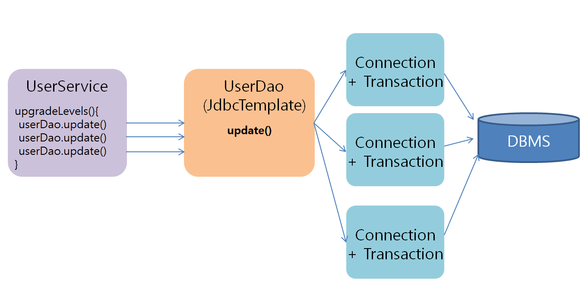
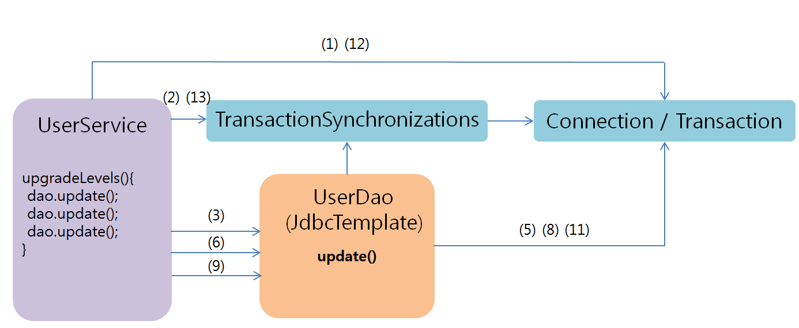

# 서비스 추상화
추상화란 하위 시스템의 공통점을 뽑아내서 분리시키는 것을 말한다. 그렇게 하면 하위 시스템이 어떤 것인지 알지 못해도, 또는 하위 시스템이 바뀌더라도 일관된 방법으로 접근할 수가 있다.


객체지향적인 코드는 다른 오브젝트의 데이터를 가져와서 작업하는 대신 데이터를 갖고 있는 다른 오브젝트에게 작업을 해달라고 요청한다. 오브젝트에게 데이터를 요구하지 말고 작업을 요청하라는 것이 객체지향 프로그래밍의 가장 기본이 되는 원리이다. 

일반적으로 서비스 추상화라고 하면 트랜잭션과 같이 기능은 유사하나 사용 방법이 다른 로우레벨의 다양한 기술에 대해 추상 인터페이스와 일관성 있는 접근 방법을 제공해 주는 것을 말한다. 

**비지니스 로직 트랜잭션 문제점**<br>

`setAutoCommit(false`로 트랜잭션의 시작을 선언하고 `commit()`또는 `rollback()`으로 트랜잭션을 종료하는 작업을 트랜잭션의 경계설정이라고 한다. 트랜잭션의 경계는 하나의 Connection이 만들어지고 닫히는 범위 안에 존재한다. 이렇게 하나의 DB 커넥션 안에서 만들어지는 트랜잭션을 로컬 트랜잭션이라고도 한다. 

그런데 위의 그림과 같이 트랜잭션의 문제점이 있다. DAO를 분리해놓았을 경우에는 이처럼 DAO 메서드를 호출할 때마다 하나의 새로운 트랜잭션이 만들어지는 구조가 될 수밖에 없다. **따라서 UserService의 모든 메서드 전체를 하나의 트랜잭션으로 묶을 방법이 없게된다.** 결국 비지니스 로직에 트랜잭션 경계설정을 해야하는데 그렇게되면 비지니스로직에 데이터 액세스 코드가 들어가게 되므로 단일책임원칙도 어긋나고, DB에 의존적인 코드가 돼버린다. 

이를 위해 스프링이 제안하는 방법은 독립적인 **트랜잭션 동기화** 방식이다. 트랜잭션 동기화란 UserService에서 트랜잭션을 시작하기 위해 만든 Connection 오브젝트를 특별한 저장소에 보관해두고, 이후에 호출되는 DAO의 메서드에서는 저장된 Connection을 가져다가 사용하게 하는 것이다. 정확히는 DAO가 사용하는 JdbcTemplate이 트랜잭션 동기화 방식을 이용하도록 하는 것이다. 그리고  트랜잭션이 모두 종료되면, 그때는 동기화를 마치면 된다.


(1) UserService는 Connection을 생성하고 (2) 이를 트랜잭션 동기화 저장소에 저장해두고 Connection의 `setAutoCommit(false)`를 호출해 트랜잭션을 시작시킨 후에 본격적으로 DAO의 기능을 이용하기 시작한다. (3) 첫 번째 update() 메서드가 호출되고, update() 메서드 내부에서 이용하는 JdbcTemplate 메서드에서는 가장 먼저 (4) 트랜잭션 동기화 저장소에 현재 시작된 트랜잭션을 가진 Connection 오브젝트가 존재하는지 확인한다. (2) upgradeLevels() 메서드 시작 부분에서 저장해둔 Connection을 발견하고 이를 가져온다. 가져온 (5) Connection을 이용해 PreparedStatememt를 만들어 수정 SQL을 실행한다. 트랜잭션 동기화 저장소에서 DB 커넥션을 가져왔을 때는 JdbcTemplate은 Connection을 닫지 않은 채로 작업을 마친다. 이렇게 해서 트랜잭션 안에서 첫 번째 DB 작업을 마쳤다. 여전히 Connection은 열려 있고 트랜잭션은 진행 중인 채로 트랜잭션 동기화 저장소에 저장되어 있다. (6) 두 번째 update()가 호출되면 이때도 마찬가지로 (7) 트랜잭션 동기화 저장소에서 Connection을 가져와 (8) 사용한다. (9) 마지막 update()도 (10) 같은 트랜잭션을 가진 Connection을 가져와 (11) 사용한다. 트랜잭션 내의 모든 작업이 정상적으로 끝났으면 UserService는 이제 (12) Connection의 `commit()`을 호출해서 트랜잭션을 완료시킨다. 마지막으로 (13) 트랜잭션 저장도가 더 이상 Connection 오브젝트를 저장해두지 않도록 이를 작업한다. 어느 작업 중에라도 예외상황이 발생하면 UserService는 즉시 Connection의 `rollback()`을 호출하고 트랜잭션을 종료할 수 있다. 

**트랜잭션 동기화 방식을 적용한 UserService**
```
private DataSource dataSource;

//Connection을 생성할 때 사용할 DataSource를 DI 받도록 한다.
public void setDataSource(DataSource dataSource){
    this.dataSource = dataSource;
}

public void upgradeLevels() throws Exception{
    //트랜잭션 동기화 관리자를 이용해 동기화 작업을 초기화한다.
    TransactionSynchronizationManager.initSynchronization();
    //DB 커넥션을 생성하고 트랜잭션을 시작한다. 이후의 DAO 작업은 모두 여기서 시작한 트랜잭션 안에서 진행된다.
    Connection c = DataSourceUtils.getConnection(dataSource);//DB 커넥션 생성과 동기화를 함께 해주는 유틸리티 메서드
    c.setAutoCommit(false);
    
    try{
        List<User> users = userDao.getAll();
        for(User user : users){
            if(canUpgradeLevel(user){
                upgradeLevel(user);
            }
        }
        c.commit(); //정상적으로 작업을 마치면 트랜잭션 커밋
    }catch(Exception e){
        
    }
}
```