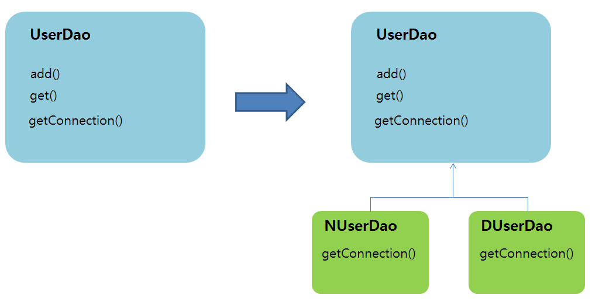

###상속을 통한 UserDao 확장 

DB 커넥션 연결이라는 관심을 상속을 통해서 서브 클래스로 분리했다. 

```
public abstract class UserDao{
    public void add(User user) throws ClassNotFoundException, SQLException{
        Connection c = getConnection();
    }
    
    public void get(String id) throws ClassNotFoundException, SQLException{
        Connection c = getConnection();
    }
    
    //구현코드는 제거되고 추상 메서드로 마뀌었다. 메서드의 구현은 서브클래스가 담당한다.
    public abstract Connection getConnection() throws ClassNotFoundException, SQLException; 
}

public Class NUserDao extends UserDao{
    public Connection getConnection() throws ClassNotFoundException, SQLException{
        //N사 DB Connection 생성코드
    }
}


public Class DUserDao extends UserDao{
    public Connection getConnection() throws ClassNotFoundException, SQLException{
        //D사 DB Connection 생성코드
    }
}
```
새로운 DB 연경방법을 적용해야 할 때는 UserDao를 상속을 통해 확장해주기만 하면 된다. 

**템플릿 메서드 패턴 :**상속을 통해 슈퍼클래스의 기능을 확장할 때 사용하는 가장 대표적인 방법이다. <br>

**팩토리 메서드 패턴 :**서브클래스에서 오브젝트 생성 방법과 클래스를 결정할 수 있도록 미리 정의해둔 메서드. (오브젝트 생성 방법을 나머지 로직, 즉 슈퍼클래스의 기본 코드에서 독립시킴.) 

**하지만 이 방법은 상속을 사용했다는 단점이 있다.** 상속관계는 두 가지 다른 관심사(UserDao 고유기능과 DB연결기능)에 대해 긴밀한 결합을 허용한다. 그리고 서브클래스는 슈퍼클래스의 기능을 직접 사용할 수 있다. 확장된 기능인 DB 커넥션을 생성하는 코드를 다른 DAO 클래스에 적용할 수 없다는 것도 큰 단점이다. 

###인터페이스를 통한 관계설정 책임의 분리 
```
public interface ConnectionMaker{
    public Connection makeConnection() throws ClassNotFoundException, SQLException;
}
```
<br>
```
public UserDao(ConnectionMaker connectionMaker){
    this.connectionMaker = connectionMaker;
}
```
UserDao 생성자는 ConnectionMaker 인터페이스 타입으로 전달받기 때문에 ConnectionMaker 인터페이스를 구현했다면 어떤 클래스로 만든 오브젝트라도 성관없고, 관심도 없다. 

```
public class UserDaoTest{
    public static void main(String[] args) throws ClassNotFoundException, SQLException{
        //UserDao가 사용할 ConnectionMaker구현 클래스를 결정하고 오브젝트를 만든다.
        ConnectionMaker connectionMaker = new DCoomectionMaker();
        
        UserDao dao = new UserDao(connectionMaker);
    }
}

```
UserDao와 특정 ConnectionMaker 구현 클래스의 오브젝트 간 관계를 맺는 책임 담당을 UserDao의 클라이언트에게 넘겼다. 

```
public class UserDao{
    private ConnectionMaker connectionMaker;
    
    public UserDao(){
        connectionMaker = new DConnectionMaker(); //문제!! 
    }
    
    public void add(User user) throws ClassNotFoundException, SQLException{
        Connection c = connectionMaker.makeConnection();
    }
    
    public void get(String id) throws ClassNotFoundException, SQLException{
        Connection c = connectionMaker.makeConnection();
    }
}

```
그럼으로써 위의 코드처럼 이전의 UserDao에서 직접 구현 클래스의 오브젝트를 결정하는 문제를 없앨 수 있게 됐다. 

개선한 UserDaoTest - UserDao - ConnectionMaker 구조를 디자인 패턴의 시각으로 본면 **전략 패턴**에 해당한다고 볼 수 있다. 

**전략 패턴**은 자신의 기능 맥락(context)에서, 필요에 따라 변경이 필요한 알고리즘을 인터페이스를 통해 통째로 외부로 분리시키고, 이를 구현한 구체적인 알고리즘 클래스를 필요에 따라 바꿔서 사용할 수 있게 하는 디자인 패턴이다. 

컨텍스트(UserDao)를 사용하는 클라이언트(UserDaoTest)는 컨텍스트가 사용할 전략(ConnectionMaker를 구현한 클래스, 예를 들어 DConnectionMaker)을 컨텍스트의 생성자 등을 통해 제공해주는 게 일반적이다. 

