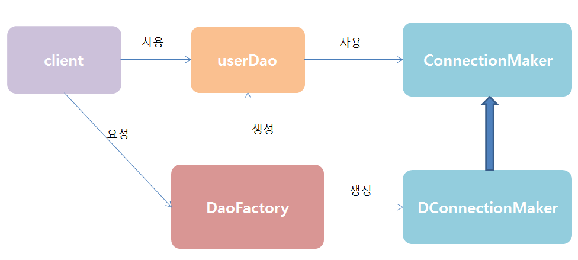
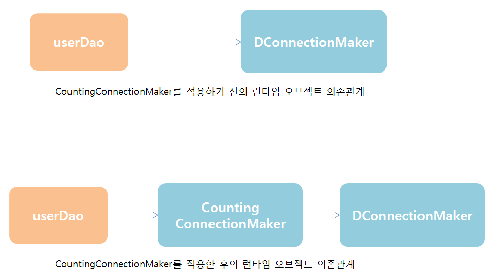

###상속을 통한 UserDao 확장 

DB 커넥션 연결이라는 관심을 상속을 통해서 서브 클래스로 분리했다. 

```
public abstract class UserDao{
    public void add(User user) throws ClassNotFoundException, SQLException{
        Connection c = getConnection();
        ...
    }
    
    public void get(String id) throws ClassNotFoundException, SQLException{
        Connection c = getConnection();
        ...
    }
    
    //구현코드는 제거되고 추상 메서드로 바뀌었다. 메서드의 구현은 서브클래스가 담당한다.
    public abstract Connection getConnection() throws ClassNotFoundException, SQLException; 
}

public Class NUserDao extends UserDao{
    public Connection getConnection() throws ClassNotFoundException, SQLException{
        //N사 DB Connection 생성코드
    }
}


public Class DUserDao extends UserDao{
    public Connection getConnection() throws ClassNotFoundException, SQLException{
        //D사 DB Connection 생성코드
    }
}
```
새로운 DB 연경방법을 적용해야 할 때는 UserDao를 상속을 통해 확장해주기만 하면 된다.<br>

**하지만 이 방법은 상속을 사용했다는 단점이 있다.** 상속관계는 두 가지 다른 관심사(UserDao 고유기능과 DB연결기능)에 대해 긴밀한 결합을 허용한다. 그리고 서브클래스는 슈퍼클래스의 기능을 직접 사용할 수 있다. 확장된 기능인 DB 커넥션을 생성하는 코드를 다른 DAO 클래스에 적용할 수 없다는 것도 큰 단점이다. 만약 UserDao 외의 DAO 클래스들이 계속 만들어진다면 그때는 상속을 통해서 만들어진 getConnection()의 구현 코드가 매 DAO 클래스마다 중복돼서 나타나는 심각한 문제가 발생할 것이다.<br>

cf) <br> 
**템플릿 메서드 패턴 : **상속을 통해 슈퍼클래스의 기능을 확장할 때 사용하는 가장 대표적인 방법이다. <br>

**팩토리 메서드 패턴 : **서브클래스에서 오브젝트 생성 방법과 클래스를 결정할 수 있도록 미리 정의해둔 메서드(오브젝트 생성 방법을 나머지 로직, 즉 슈퍼클래스의 기본 코드에서 독립시킴). 

###인터페이스를 통한 관계설정 책임의 분리 
```
public interface ConnectionMaker{
    public Connection makeConnection() throws ClassNotFoundException, SQLException;
}
```
```
public UserDao(ConnectionMaker connectionMaker){
    this.connectionMaker = connectionMaker;
}
```
UserDao 생성자는 ConnectionMaker 인터페이스 타입으로 전달받기 때문에 ConnectionMaker 인터페이스를 구현했다면 어떤 클래스로 만든 오브젝트라도 성관없고, 관심도 없다. 

```
public class UserDaoTest{
    public static void main(String[] args) throws ClassNotFoundException, SQLException{
        //UserDao가 사용할 ConnectionMaker구현 클래스를 결정하고 오브젝트를 만든다.
        ConnectionMaker connectionMaker = new DCoomectionMaker();
        
        UserDao dao = new UserDao(connectionMaker);
    }
}

```
UserDao와 특정 ConnectionMaker 구현 클래스의 오브젝트 간 관계를 맺는 책임 담당을 UserDao의 클라이언트에게 넘겼다. 

```
public class UserDao{
    private ConnectionMaker connectionMaker;
    
    public UserDao(){
        connectionMaker = new DConnectionMaker(); //문제!! 
    }
    
    public void add(User user) throws ClassNotFoundException, SQLException{
        Connection c = connectionMaker.makeConnection();
    }
    
    public void get(String id) throws ClassNotFoundException, SQLException{
        Connection c = connectionMaker.makeConnection();
    }
}

```
그럼으로써 위의 코드처럼 이전의 UserDao에서 직접 구현 클래스의 오브젝트를 결정하는 문제를 없앨 수 있게 됐다. 

개선한 UserDaoTest - UserDao - ConnectionMaker 구조를 디자인 패턴의 시각으로 본면 **전략 패턴**에 해당한다고 볼 수 있다. 

**전략 패턴**은 자신의 기능 맥락(context)에서, 필요에 따라 변경이 필요한 알고리즘을 인터페이스를 통해 통째로 외부로 분리시키고, 이를 구현한 구체적인 알고리즘 클래스를 필요에 따라 바꿔서 사용할 수 있게 하는 디자인 패턴이다. 

컨텍스트(UserDao)를 사용하는 클라이언트(UserDaoTest)는 컨텍스트가 사용할 전략(ConnectionMaker를 구현한 클래스, 예를 들어 DConnectionMaker)을 컨텍스트의 생성자 등을 통해 제공해주는 게 일반적이다. 


**팩토리 :** 객체의 생성 방법을 결정하고 그렇게 만들어진 오브젝트를 돌려주는 일을 하는 오브젝트.

**어떻게 만들지와 어떻게 사용할지는 분명 다른 관심이다.**<br>
UserDao의 생성 책임을 맡은 팩토리 클래스 
```
public class DaoFactory{
    public UserDao userDao(){
        //팩토리의 메서드는 UserDao 타입의 오브젝트를 어떻게 만들고, 어떻게 준비시킬지 결정한다. 
        ConnectionMaker connectionMaker = new DConnectionMaker();
        UserDao userDao = new UserDao(connectionMaker);
        return userDao; 
    }
}
```

이제 UserDaoTest는 UserDao가 어떻게 만들어지는지 어떻게 초기화되어 있는지에 신경 쓰지 않고 팩토리로부터 UserDao 오브젝트를 받아다가, 자신의 관심사인 테스트를 위해 활용하기만 하면 그만이다. 
```
public class UserDaoTest{
    public static void main(String[] args) throws ClassNotFoundException, SQLException{
        
        UserDao userDao = new DaoFactory().userDao(); 
    }
}
```


DaoFactory를 스프링에서 사용이 가능하도록 변신시켜보자. 
```
@Configuration //애플리케이션컨텍스트 또는 빈 팩토리가 사용할 설정정보라는 표시
public class DaoFactory{
    @Bean //오브젝트 생성을 담당하는 IoC용 메서드라는 표시 
    public UserDao userDao(){
        return new UserDao(connectionMaker());
    }
    
    @Bean
    public ConnectionMaker connectionMaker(){
        return new DConnectionMaker(); 
    }
}
```
자바 코드의 탈을 쓰고 있지만, 사실은 XML과 같은 스프링 전용 설정정보라고 보는 것이 좋다. 


이제 DaoFactory를 설정정보로 사용하는 애플리케이션 컨텍스트를 만들어보자. 
```
public class UserDaoTest{
    public static void main(String[] args) throws ClassNotFoundException, SQLException{
        ApplicationContext context = new AnnotationConfigApplicationContext(DaoFactory.class);
        
        UserDao dao = context.getBean("userDao", UserDao.class); 
    }
}

```
@Configuration이 붙은 자바 코드를 설정정보로 사용하려면 AnnotationConfigApplicationContext를 이용하면 된다. 


**애플리케이션 컨텍스트 동작방식**<br>
DaoFactory가 UserDao를 비롯한 DAO 오브젝트를 생성하고 DB 생성 오브젝트와 관계를 맺어주는 제한적인 역할을 하는 데 반해, 애플리케이션 컨텍스트는 애플리케이션에서 IoC를 적용해서 관리할 모든 오브젝트에 대한 생성과 관계설정을 담당한다.대신 ApplicationContext에는 DaoFactory와 달리 직접 오브젝트를 생성하고 관계를 맺어주는 코드가 없고, 그런 생성정보와 연관관계 정보를 별도의 설정정보를 통해 얻는다.

**의존관계 검색(DL)**<br>
dependency lookup, 런타임 시에 의존관계를 결정한다는 점에서 DI와 비슷하지만, 의존관계를 맺는 방법이 외부로부터의 주입이 아니라 스스로 검색을 이용한다.

의존관계 검색은 자신이 필요로하는 의존 오브젝트를 능동적으로 찾는다. 물론 자신이 어떤 클래스의 오브젝트를 이용할지 결정하지는 않는다. 

```
public UserDao(){
    AnnotationConfigApplicationContext context = 
        new AnnotationConfigApplicationContext(DaoFactory.class);
    this.connetionMaker = context.getBean("connectionMaker", ConnectionMaker.class); 
}
```
스프링의 IoC 컨테이너인 애플리케이션 컨텍스트는 getBean()이라는 메서드를 제공한다. 바로 이 메서드가 의존관계 검색에 사용되는 것이다. (미리 정해놓은 이름을 전달해서 그 이름에 해당하는 오브젝트를 찾음. 따라서 이를 일종의 검색이라 볼 수 있다.)

그러나 의존관계 검색 방법은 코드 안에 오브젝트 팩토리 클래스나 스프링 API가 나타난다. 그래서 DI 방식이 훨씬 단순하고 깔끔하다. 대개는 DI를 사용하는 편이 낫다. 

그런데 의존관계 검색 방식을 사용해야 할 때가 있다. 애플리케이션의 기동 시점에서 적어도 한 번은 의존관계 검색 방식을 사용해 오브젝트를 가져와야 한다. main()에서는 DI를 이용해 오브젝트를 주입받을 방법이 없기 때문이다. 서버에서도 마찬가지다. main() 메서드와 비슷한 역할을 하는 서블릿에서 스프링 컨테이너에 담긴 오브젝트를 사용하려면 한 번은 의존관계 검색 방식을 사용해 오브젝트를 가져와야 한다.(이런 서블릿은 스프링이 미리 만들어서 제공하므로 직접 구현이 필요없다.)

**DL 방식에서는 검색하는 오브젝트는 자신이 스프링의 빈 일 필요가 없다.** 반면에 DI는 자기 자신이 컨테이너가 관리하는 빈이 되야한다. 


---

**DI 응용  - 부가기능 추가**<br>
DAO가 DB를 얼마나 많이 연결해서 사용하는지 파악하고 싶다고 해보자. DAO 코드의 makeConnection() 메서드를 수정해서 카운터를 증가시키는건 무식한 방법이다. 





```
//연결횟수 카운팅 기능이 있는 클래스
public class CountingConnectionMaker implements ConnectionMaker{
    int counter =0;
    private ConnectionMaker realConnectionMaker;
    
    public CountingConnectionMaker(ConnectionMaker realConnectionMaker){
        this.realConnectionMaker = realConnectionMaker;
    }
    
    public Connection makeConnection() throws ClassNotFoundException, SQLException{
        this.counter++;
        
        return realConnectionMaker.makeConnection(); //다시 실제 사용할 DB 커넥션을 제공
    }
    
    public int getCounter(){
        return this.counter;
    }
}
```

```
//CountingConnectionMaker 의존관계가 추가된 DI 설정용 클래스 
@Configuration
public class CountingDaoFactory{
    @Bean
    public UserDao(){
        return new UserDao(connectionMaker()); //변경 없음 
    }
    
    @Bean
    public ConnectionMaker connectionMaker(){
        return new CountingConnectionMaker(realConnectionMaker());
    }
    
    @Bean
    public ConnectionMaker realConnectionMaker(){
        return new DConnectionMaker(); 
    }
}
```

