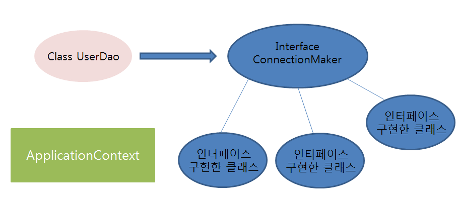
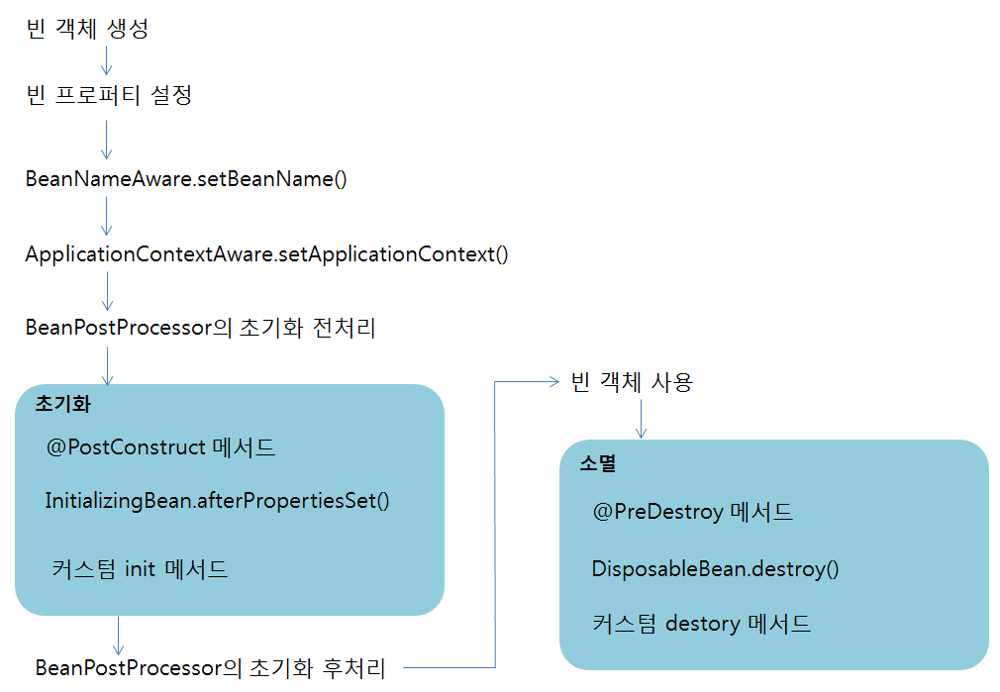

## 스프링 정의 
자바 엔터프라이즈 개발을 편하게 해주는 오픈소스 경량급 애플리케이션 프레임워크<br>  

**애플리케이션 프레임워크 :** 특정 계층에서 동작하는 한가지 기술분야가 아닌 범용적인 프레임워크 <br> 

**경량급 :** 과거 EJB같은 과도한 엔지니어링이 적용된 기술은 무겁다. 스프링은 복잡한 EJB와 고가의 WAS를 갖추지 않고 단순 서버환경인 톰캣, 제티에서도 잘돌아간다. <br> 

**자바 엔터프라이즈 개발을 편하게 해준다 :** 스프링이라는 프레임워크가 제공하는 기술이 아니라 자신이 작성하는 애플리케이션 로직에 더 많은 관심과 시간을 쏟게 해준다(초기 기본설정, 적용기술을 잘 선택하고 준비해두면 더이상 크게 신경 쓸 부분이 없다). 

자바의 근본적인 목적 : 객체지향 프로그래밍을 통해 유연하고 확장성 좋은 애플리케이션을 빠르게 만드는것.

스프링이 만들어진 이유 : 경량급 프레임워크인 스프링을 활용해서 엔터프라이즈 개발을 편하게 해준다.<br>
엔터프라이즈 시스템 : 서버에서 동작하며 기업과 조직의 업무를 처리해주는 시스템이다. 그래서 많은 사용자의 요청을 동시에 처리해야한다(보안성, 안정성, 확장성 고려).

**스프링은 비침투적인 기술을 적용(IOC, DI, AOP 등)함으로써 비지니스 로직의 복잡함과 엔터프라이즈 기술의 복잡함을 분리시켜 애플리케이션 코드에서 설계와 구현 방식을 제한하지 않는다.** 

기술적 복잡함을 상대하는 전략은 1. 서비스 추상화 2. AOP

스프링의 DI/AOP는 단지 객체지향언어의 장점을 제대로 살리지 못하게 방해했던 요소를 제거하도록 도와줄뿐이다. 

##IoC(Inversion of Control)제어의 역전
일반적인 자바프로그램에서는 main() 메서드에서 시작해서 개발자가 미리 정한 순서를 따라 오브젝트가 생성되고 실행된다. 그런데 서블릿을 개발해서 서버에 배포할 수는 있지만, 그 실행을 개발자가 직접 제어할 수 있는 방법은 없다. 서블릿 안에 main() 메서드가 있어서 직접 실행시킬 수 있는 것도 아니다. **대신 서블릿에 대한 제어 권한을 가진 컨테이너가 적절한 시점에 서블릿 클래스의 오브젝트를 만들고 그 안에 메서드를 호출한다.**<br>

템플릿 메서드 패턴에서도 제어의 역전 개념이 적용되었다. 추상 UserDao를 상속한 서브 클래스는 getConnection()을 구현한다. 하지만 이 메서드가 언제 어떻게 사용될지 자신은 모른다. 서브 클래스에서 결정되는 것이 아니다. 단지 이런 방식으로 DB 커넥션을 만든다는 기능만 구현해놓으면, 슈퍼 클래스인 UserDao의 템플릿 메서드인 add(), get() 등에서 필요할 때 호출해서 사용하는 것이다. 즉, 제어권을 상위 템플릿 메서드에 넘기고 자신은 필요할 때 호출되어 사용되도록 한다는 개념이다. 

**라이브러리와 프레임워크의 차이 :** 라이브러리를 사용하는 애플리케이션 코드는 애플리케이션 흐름을 직접 제어한다. 단지 동작하는 중에 필요한 기능이 있을 때 능동적으로 라이브러리를 사용할 뿐이다. 

프레임워크는 거꾸로 애플리케이션 코드가 프레임워크에 의해 사용된다. 보통 프레임워크 위에 개발한 클래스를 등록해두고, 프레임워크가 흐름을 주도하는 중에 개발자가 만든 애플리케이션 코드를 사용하도록 만드는 방식이다. <br>
cf) 라이브러리는 기능을 제공하고 프레임워크는 방법을 제공한다. <br>

**빈 :** 스프링이 제어권을 가지고 직접 만들고 관계를 부여하는 오브젝트(제어의 역전이 허용된 오브젝트). 

**빈팩토리 :** 스프링의 IoC를 담당하는 핵심 컨테이너. 빈을 등록하고 생성하고 조회하고 돌려주고, 그 외에 부가적인 빈을 관리하는 기능을 담당한다. 

**ApplicationContext :** 빈 팩토리를 상속한, 빈 팩토리를 확장한 IoC 컨테이너. 
기본적인 기능은 빈 팩토리와 동일하고 스프링이 제공하는 각종 부가 서비스를 추가로 제공한다. 

### 스프링 싱글톤 
스프링은 여러번에 걸쳐 빈을 요청하더라도 매번 동일한 오브젝트를 돌려준다. 

ApplicationContext는 싱글톤을 저장하고 관리하는 싱글톤 레지스트리다. 스프링은 별다른 설정을 하지 않으면 기본적으로 내부에서 생성하는 빈 오브젝트를 모두 싱글톤으로 만든다. 

**서버 애플리케이션과 싱글톤**<br>
싱글톤으로 빈을 만드는 이유는 스프링이 주로 적용되는 대상이 자바 엔터프라이즈 기술을 사용하는 서버 환경이기 때문이다. 대규모 엔터프라이즈 서버 환경은 서버 하나당 초당 수십에서 수백번씩 요청을 받아 처리해야 되기 때문에 요청이 올때마다 각 로직을 담당하는 오브젝트를 새로 만들어서 사용하면 부하가 심해진다. 

**싱글톤 패턴 :** 어떤 클래스를 애플리케이션 내에서 제한된 인스턴스 개수, 주로 하나만 존재하도록 강제하는 패턴이다. 이렇게 하나만 만들어지는 클래스의 오브젝트는 애플리케이션 내에서 전역적으로 접근이 가능하다. 단일 오브젝트만 존재해야 하고, 이를 애플리케이션의 여러 곳에서 공유하는 경우에 주로 사용한다.

```
public class UserDao{

    private static UserDao userDao;
    
    private UserDao(){
        //...
    }
    
    public static UserDao getInstance(){
        if(userDao == null) userDao = new UserDao();
        retrun userDao; 
    }
}
```

**싱글톤 방식의 문제점 :**<br>
1. private 생성자로 인해 상속을 못한다(객체지향 특징이 적용안됌).
2. 테스트 하기 힘들다 - 테스트에서 사용될 때 목 오브젝트 등으로 대체하기 힘들다. 
3. 서버 환경에서는 싱글톤이 하나만 만들어 지는 것을 보장하지 못한다.
    1. 서버에서 클래스 로더를 어떻게 구성하고 있는가에 따라 싱글톤 클래스임에도 하나 이상의 오브젝트가 만들어질 수 있다. 
    2. 여러 개의 JVM에 분산돼 설치가 되는 경우에도, 각각 독립적으로 오브젝트가 생기기 때문에 싱글톤으로서의 가치가 떨어진다. 
4. 싱글톤의 사용은 전역 상태를 만들 수 있기 때문에 바람직하지 못하다.
    1. 아무 객체나 자유롭게 접근, 수정, 공유할 수 있는 전역상태는 객체지향 프로그래밍에서 권장되지 않는 모델이다. 


**스프링은 직접 싱글톤 형태의 오브젝트를 만들고 관리하는 기능을 제공한다. => 싱글톤 레지스트리 (자바의 기본적인 싱글톤 패턴 구현방식에 여러가지 단점이 있기 때문에) **<br>

스프링 컨테이너는 싱글톤을 생성하고 관리하고 공급하는 싱글톤 관리 컨테이너이기도 하다. 싱글톤 레지스트리의 장점은 static 메서드와 private 생성자를 사용해야 하는 비정상적인 클래스가 아니라 평범한 자바클래스를 싱글톤으로 활용하게 해준다. 

평범한 자바 클래스도 IoC방식의 컨테이너를 사용해서 생성, 관계 설정 등에 대한 제어권을 컨테이너에게 넘기면 쉽게 싱글톤 방식으로 만들어져 관리될 수 있다. 

싱글톤은 멀티스레드 환경이라면 여러 스레드가 동시에 접근해서 사용할 수 있다. 따라서 상태관리에 주의를 기울여야 한다. <br>
=> 상태정보를 내부에 갖고 있지 않는 무상태(stateless)방식으로 만들어져야 한다.<br>
cf)읽기 전용이라면 인스턴스 변수로 생성해도 상관없다. 값이 바뀌는 정보를 담은 변수가 문제를 야기시킨다.

스프링 빈의 기본 스코프는 싱글톤이다. 그러나 싱글톤 외의 스코프를 가질 수도 있는데 웹을 통한 새로운 http요청이 생길때마다 생성되는 request 스코프 세션 스코프 등 ...

**DI**<br>
보통 그동안 `<context: annotation-config>` 하고 `@Autowired` 통해서 자동으로 주입 받아서 사용했다.(따로 빈 등록 필요없이) 

스프링 IOC 기능의 대표적인 동작원리는 주로 의존관계 주입이라고 불린다. 


A는 B에 의존한다.(B가 변하면 A에 영향을 끼친다)

모델이나 코드에서 클래스와 인터페이스를 통해 드러나는 의존관계 말고, 런타임 시에 오브젝트 사이에서 만들어지는 의존관계도 있다. (런타임 의존관계, 오브젝트 의존관계) 설계 시점의 의존관계가 실체화 된것. 

의존관계 주입은 구체적인 의존 오브젝트와 그것을 사용할 주체, 보통 클라이언트라고 부르는 오브젝트를 **런타임시에** 연결해주는 작업이다.

DI란 다음 3가지 조건을 충족해야 한다. 
1. 클래스 모델이나 코드에는 런타임 시점의 의존관계가 드러나지 않는다. 그러기 위해서는 인터페이스에만 의존하고 있어야 한다. 
2. 런타임 시점의 의존관계는 컨테이너나 팩토리 (ApplicationContext)같은 제 3의 존재가 결정한다.
3. 의존관계는 사용할 오브젝트에 대한 레퍼런스를 외부에서 제공해줌으로써 만들어진다.



UserDao와 ConnectionMaker 사이에 DI가 적용되려면 UserDao도 반드시 컨테이너가 만드는 빈 오브젝트여야한다. 

**DI를 원하는 오브젝트는 먼저 자기 자신이 컨테이너가 관리하는 빈이 되야 한다는 사실을 잊지 말자.** 

##빈 라이프사이클과 빈 범위(scope)
스프링 컨테이너는 빈 객체를 생성하고, 프로퍼티를 할당하고, 초기화를 수행하고, 사용이 끝나면 소멸시키는 일련의 과정을 관리한다. 예를 들어, 데이터베이스에 대한 커넥션풀을 제공하는 빈은 사용되기 전에 일정 개수의 커넥션을 연결해야 하고, 애플리케이션 종료 시점에는 열려 있는 커넥션을 모두 닫아야 하는데, 스프링 컨테이너는 이런 커넥션 생성과 종료 시점을 제어하게 된다. 

스프링은 InitializingBean 인터페이스를 제공하고 있으며, 빈 객체의 클래스가 InitializingBean 인터페이스를 구현하고 있으면 InitializingBean 인터페이스에 정의된 메서드를 호출해서 빈 객체가 초기화를 진행할 수 있도록 한다. 또한, 스프링 설정에서 초기화 메서드를 지정하면, 스프링은 그 메서드를 호출해서 빈이 초기화를 수행할 수 있게 한다. 

**빈 라이프사이클 개요**<br>


**InitializingBean 인터페이스와 DisposableBean 인터페이스**<br>
스프링은 객체의 초기화 및 소멸 과정을 위해 다음의 두 인터페이스를 제공하고 있다. 
```
public interface InitializingBean{
    void afterPropertiesSet() throws Exception;
}

public interface DisposableBean{
    void destroy() throws Exception; 
}
```
스프링 컨테이너는 생성한 빈 객체가 InitializingBean 인터페이스를 구현하고 있으면, InitializingBean 인터페이스로 정의되어 있는 afterPropertiesSet() 메서드를 호출한다.

```
public class ConnPool implements InitializingBean, DisposableBean{
...
@Override
public void afterPropertiesSet() throws Exception{
    //커넥션 풀 초기화 실행: DB 커넥션을 여는 코드 
    }

@Override
public void destory() throws Excption{
    //커넥션 풀 종료 실행: 연 DB 커넥션을 닫은 코드 
    }
}
```
위 클래스를 스프링 빈으로 등록하면 스프링 컨테이너는 빈 생성 후 afterPropertiesSet() 메서드를 호출해서 초기화를 진행하고 destroy() 메서드를 호출해서 소멸을 진행한다. 

```
<bean id="connPool" class="jorg.springframwork.connPool"/>
```

이 두 인터페이스를 모두 상속해야 하는 것은 아니며, 필요한 인터페이스만 상속 받으면 된다. 

그런데 위와 같이 스프링에 종속된 인터페이스를 구현하면 빈이 스프링에 종속되므로 스프링 IoC컨테이너 외부에서 재사용하지 못한다. 

**@PostConstruct와 @PreDestroy**<br>
각각 초기화를 실행하는 메서드와 소멸을 실행하는 메서드에 애노테이션을 적용한다.

```
import javax.annotation.PostConstruct;
import javax.annotation.PreDestroy;

public class ConnPool2{
    
    @PostConstruct
    public void initPool(){
        //커넥션 풀 초기화 실행:DB 커넥션을 여는 코드
    }
    
    @PreDestroy
    public void destroyPool(){
        //커넥션 풀 종료 실행 : 연 DB 커넥션을 닫는 코드 
    }
}
```
두 애노테이션이 적용된 메서드를 초기화/소멸 과정에서 실행하려면 다음과 같이 `CommonAnnotationBeanPostProcessor` 전처리기를 스프링 빈으로 등록해줘야 한다. 
(context:annotation-config 태크를 사용하면 CommonAnnotationBeanPostProcessor가 빈으로 등록됨) 


초기화와 소멸 과정에서 사용될 메서드는 파라미터를 가져서는 안된다.

**커스텀 init 메서드와 커스텀 destroy 메서드**<br>
만약 외부에서 제공받는 라이브러리가 있는데, 이 라이브러리의 클래스를 스프링 빈으로 사용해야 할 수 도 있다. 이 라이브러리의 클래스는 초기화를 위해 init() 메서드를 제공하고 있는데, 이 init()메서드는 @PostConstruct 애노테이션을 갖고 있지 않고 스프링의 InitializingBean 인터페이스를 상속받지도 않았다. 이때 커스텀 방식을 사용한다.

```
<bean id="pool3" class="net.madvirus.spring4.chap03.ConnPool3"
    init-method="init" destroy-method="destroy"/>
```
자바 기반 설정을 사용한다면 
```
@Bean(initMethod = "init", destroyMethod = "destroy")
public ConnPool3 connPool3(){
    return new ConnPool3(); 
}
```
초기화와 소멸 과정에서 사용될 메서드는 파라미터를 가져서는 안된다.

**ApplicationContextAware 인터페이스와 BeanNameAware 인터페이스**<br>
빈으로 사용될 객체에서 스프링 컨테이너에 접근해야 한다거나, 빈 객체에서 로그를 기록할 때 빈의 이름을 남기고 싶다면 어떻게 해야할까? 이런 경우에 다음의 두 인터페이스를 사용하면 된다. 

`o.s.context.ApplicationContextAware`<br>
이 인터페이스를 상속받은 빈 객체는 초기화 과정에서 컨테이너(ApplicationContext)를 전달받는다.<br>
`o.s.beans.factory.BeanNameAware`<br>
이 인터페이스를 상속받은 빈 객체는 초기화 과정에서 빈 이름을 전달받는다.<br>

먼저 ApplicationContextAware 인터페이스는 다음과 같이 정의되어 있다.
```
public interface ApplicationContextAware extends Aware{
    void setApplicationContext(ApplicationContext applicationContext)
    throws BeansException;
}

```
ApplicationContextAware 인터페이스를 상속받아 구현한 클래스는 setApplicationContext() 메서드를 통해서 컨테이너 객체(ApplicationContext)를 전달받는다. 따라서, 전달받은 컨테이너를 필드에 보관한 후, 이를 이용해서 다른 빈 객체를 구하거나, 컨테이너가 제공하는 기능(이벤트 발생, 메시지 구하기)을 사용할 수 있다. 아래 코드는 ApplicationContextAware 인터페이스의 구현 예시이다. 
```
public class WorkScheduler implements ApplicationContextAware{
    
    private WorkRunner workRunner;
    private ApplicationContext ctx;
    
    @Override
    public void setApplicationContext(ApplicationContext applicationContext)
    throws BeansException{
        this.ctx = applicationContext;
    }
    
    public void makeAndRunWork(){
        for(long order = 1; order<=10; order++){
            Work work = ctx.getBean("workProto",Work.class);
            work.setOrder(order);
            workRunner.execute(work);
        }
    }
}
```
BeanNameAware 인터페이스는 다음과 같이 정의되어 있다.
```
public interface BeanNameAware extends Aware{
    void setBeanName(String name);
}
```
BeanNameAware 인터페이스를 상속받아 구현한 클래스는 setBeanName() 메서드를 이용해서 빈의 이름을 전달받는다. 따라서, 로그 메시지에 빈의 이름을 함께 기록해야 할 때처럼 빈의 이름이 필요한 경우에 BeanNameAware 인터페이스를 사용하면 된다. 
```
public class WorkRunner implements BeanNameAware{
    private String beanId;
    
    @Override
    public void setBeanName(String name){
        this.beanId = name;
    }
    
    public void execute(Work work){
        logger.debug(String.format("WorkRunner[%s] execute Work[%d]",beanId,work.getOrder()));
    }
}
```

**빈 객체 범위(scope)**<br>
스프링의 빈은 범위를 갖는데 주요 범위에는 싱글톤과 프로토타입이 있다. (두개의 범위 외에 요청범위, 세션 범위가 존재하지만 잘 사용되지 않는다.)

1.싱글톤 범위 
```
<bean id="pool1" class="net.madvirus.chap03.ConnPool1"/>
```
별로 설정을 하지 않으면 빈은 싱글톤 범위를 갖는다. 명시적으로 표기하고 싶다면 

```
-- XML
<bean id="pool1" class="net.madvirus.chap03.ConnPool1" scope="singleton"/>

--Java
@Bean
@Scope("singleton")
public ConnPool1 pool1(){
    return new ConnPool1();
}
```

```
ConnPool1 p1 = ctx.getBean("pool1", ConnPool1.class);
ConnPool1 p2 = ctx.getBean("pool1", ConnPool1.class);
```
getBean()메서드는 매번 동일한 객체를 리턴하기 때문에 p1과 p2는 동일한 객체를 참조하게 된다. 

2.프로토타입 범위<br>
프로토타입 범위의 빈은 객체의 원형(즉, 프로토타입)으로 사용되는 빈으로서, 프로토타입 범위 빈을 getBean()등을 이용해서 구할 경우 스프링 컨테이너는 매번 새로운 객체를 생성한다. 프로토타입 범위로 설정하기 위해서는 다음과 같이 `<bean>`태그의 scope 속성을 "prototype"으로 지정하면 된다.

