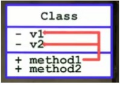

#클린코더스 강의 정리

###Function
**함수는 한 가지 일만 해야 한다.** <br>
**함수의 크기는 4줄 짜리여야 한다.** <br>
**잘 지어진 서술적인 긴 이름을 갖는 많은/작은 함수들로 유지해야한다.** <br>

함수의 Role : 더 이상 작아질 수 없을 만큼 작아야한다.(if, else, while 문장 내부 블록은 한줄이어야 함, 괄호없고 함수 호출일 것) 큰 함수를 보면 클래스로 추출할 생각을 해라.(큰 함수의 기준은 20줄 정도, 한눈에 이해할 수 없는 정도) <br>

cf) 메서드와 함수의 차이(객체지향의 사실과 오해) <br>
메시지를 처리하기 위해 내부적으로 선택하는 방법을 메서드라고 한다. 메시지를 처리할 수 있다고 판단되면 자신에게 주어진 책임을 다하기 위해 메시지를 처리할 방법인 메서드를 선택하게 된다. 객체지향 프로그래밍 언어에서 메서드는 클래스안에 포함된 함수 또는 프로시저를 통해 구현된다. 즉, 어떤 객체에게 메시지를 전송하면 결과적으로 메시지에 대응되는 특정 메서드가 실행된다. 

우리는 객체를 일종의 데이터처럼 사용하지만 객체는 데이터가 아니다. 객체에서 중요한 것은 ‘객체의 행동’이다. 상태는 행동의 결과로 초래된 부수효과를 쉽게 표현하기 위해 도입한 추상적인 개념이다. 

클래스 : 일련의 변수들에 동작하는 기능의 집합. (큰 함수는 항상 하나 이상의 클래스로 분리할 수 있다.)  

멤버변수 중 한곳에서만 사용되면(전체가 사용되지 않고) 로컬변수나 파라미터로 바꿔라. 인텔리제이를 기준으로 했을 때 보라색 변수(멤버변수)가 사용된 곳을 파악하고 작업하면 된다.  

함수는 한 가지 일만 해야 한다고 했을 때 ‘한 가지 일’이 되기 위해서는 주요 섹션들을 다른 함수로 추출한다. 함수를 서로 다른 추상화 레벨로 분리(extract till you drop)해야 하는데 사람들마다 느끼는 추상화 레벨이 달라서 매우 어렵다. 

###Function Structure
**Argument(인자)는 최대 3개를 넘지 마라.**<br>
**생성자에 많은 인자가 필요할 땐 builder 패턴**<br>
**Boolean 인자 사용금지(true일 때, false일 때 두가지 이상의 일을 하기 때문에 함수를 나눠야 한다)** <br>
**Innies not Outies(파라미터는 입력으로 작용하는 거지 output으로 작용하면 안된다)** <br>
```
private String toSimpleText(Parse table, StringBuffer returnText){
	if(table.parts == null){
		SimpleTextOfLeave(table, returnText);
		SimpleTextOfMore(table, returnText);

		retrun returnText.toString();
	}
}
```
위 예제를 보면 returnText 파라미터가 다른 메서드의 파라미터로 간다. 그리고 returnText.toString 으로 리턴된다. 이 얘기는 파라미터 returnText가 toSimpleText  메서드 안에서 변경됐다는 것이다. input으로 들어와서 변경되서 return 되는 구조는 안좋다. 로컬 변수로 만들어서 그 로컬변수에 담고 그걸 리턴하는게 좋다. 

**Null** <br>
null을 전달/기대하는 함수는 없어야 한다. boolean을 전달하는 만큼 잘못된 것이다. null의 경우의 행위와 null이 아닌 경우의 행위 2개의 함수를 만드는 것이 좋다. 

cf) null값 조사(체크)가 괜찮을 때가 있는데, public api를 사용할 경우에는 defensive하게 프로그래밍 하는게 좋다.

**The Stepdown Rule**<br>
모든 public은 위에 private은 아래에 둔다. <br>
중요한 부분을 위로, 상세한 부분을 아래로 둔다. <br>

**Switches and Cases**
제일 중요하다. Switch 문장 사용을 왜 꺼리나? 객체지향의 가장 큰 장점은 ‘의존성 관리 능력’이다. 
예를 들어 DIP


B가 거꾸로 I에 의존성이 있어서 inversion이란 말을 쓴다. B의 소스코드 의존성은 runtime 의존성과 반대가 된다.(이게 좋은것) 

**스프링을 쓰면 좋은점은 레코드가 위와 같은 구조를 준수하게 도와준다. ** 

Switch 문장은 독립적 배포에 방해가 된다. 각 Case 문장은 외부 모듈에 의존성을 갖는다. 다수의 다른 모듈에 의존성을 가질 수 있어서 fan-out problem을 유발한다. 

**application / main partition**<br>


###Function Structure2
Temporal Coupling - 함수들이 순서를 지키며 호출되어 한다. <br>
예) open, execute, done <br>
1. // file should be opened before processing
2. **fileCommand.process(file);**
3. // file should be closed after processing
이 방법은 실수할 여지도 많고 좋지 않다.(누군가는 open 안하고 실행하거나 실행하고 close를 안하는 등)<br>

**So 전략패턴**<br>
```
fileCommandTemplate.process(myfile, new FileCommand(){
	public void process(File f){
		// file processing codes here
	}
});

class FileCommandTemplate{
	public void process(File file, FileCommand command){
		file.open();
		command.process(file);
		file.close();
	}
}
```
전략패턴과 컨텍스트를 템플릿이라 부르고, 익명 내부 클래스로 만들어지는 오브젝트를 콜백이라 부른다. <br>
콜백 : 실행되는 것을 목적으로 다른 오브젝트의 메서드에 전달되는 오브젝트. 파라미터로 전달되지만 값을 참조하기 위한 것이 아니라 특정 로직을 담은 메서드를 실행시키기 위해 사용한다. 

Template/Callback 패턴은 보통 단일 메소드 인터페이스를 사용한다. 템플릿의 작업 흐름 중 특정 기능을 위해 한 번 호출되는 경우가 일반적이기 때문이다. 

**CQS**<br>
정의 : 상태를 변경하는 함수는 값을 반환하면 안된다. 값을 반환하는 함수는 상태를 변경하면 안된다. <br>
Command : 시스템의 상태변경 가능. side effect를 갖는다. 아무것도 반환하지 않는다. <br>
Query : side effect가 없다. 계산값이나 시스템의 상태를 반환한다. <br>
CQS는 신뢰를 기반으로 한다.(다음 행동이 예측 가능하다라는 뜻) <br>

**Tell, Don’t ask**<br>
What에 대해서 생각하라. How에 대해서 생각하지 마라.  


**Law of Demeter**<br>
함수가 시스템의 전체를 알게 하면 안된다. 개별 함수는 아주 제한된 지식만 가져야 한다. 객체는 요청된 기능 수행을 위해 이웃객체에게만 요청해야 한다. 요청을 수신하면 적절한 객체가 수신할때가지 전파되야 한다.

**Early returns**<br>
최대한 리턴은 빠르게. 

**Error handling**<br>
Spring의 default는 Runtime-exception이 발생하면 롤백. Checked-exception이 발생하면 롤백 아님. <br>
**Special Cases**<br>
size 0일때. <br>
**Null is not error**<br>
**Null is a value**<br>
**try도 하나의 역할/기능이다**<br>

###Form 
Comment는 특별한 경우에만 작성되야 한다. <br>
**Bad Comments**<br>
1. Closing Brace Comments (중괄호 닫는거 알리는 주석)
2. Bing Banner Comments
3. attribution Comments( add by yangbongsoo)

Commetns와 해당 코드는 항상 붙어있어라. 

**Vertical Formatting**<br>
공란을 함부로 사용하지 마라. 공란은 메서드 사이, private 변수들과 public 변수들 사이, 변수 선언과 메서드 실행의 나머지 부분 사이, if / while 블록과 다른 코드 사이에 둔다.<br>
서로 관련된 것들은 vertical하게 근접해야 한다.(vertical의 거리가 그들간의 관련성을 나타낸다) 

**classes**<br>
안 좋은 설계 방식이 getter/setter 자바빈 규약(예전에는 애플릿으로 네트워크 통신할 때 필요했었던 ...) <br>
변수를 private로 해놓고 왜 getter/setter를 제공하는가? <br>

Tell, Don’t ask. getter/setter가 많으면 get, get, get 해서 요청하게 되고 set 시킬 수 있다고 생각하게 됌. getter, setter가 없으면 Ask를 안해. 그냥 시키게 된다.(이런 규칙을 따라야 함) 

**Max Cohesive**<br>
응집도가 높아야 된다. 좀 더 구체적으로 말하면 



method1은 굉장히 Cohesive하다. 왜? 이 클래스의 변수를 다 사용하기 때문에. 변수들 중 하나라도 바뀌면 method1은 영향을 받는다. 


method1, method2 둘 다 2개의 변수 모두 사용한다. 변수 하나의 변경은 모두에게 전파가 된다. (마찬가지로 high cohesion)

**getter/setter는 cohesion이 낮다.** 왜? getter/setter는 변수 하나만 사용하기 때문이다. getter/setter가 없을 수는 없다. 하지만 최소화 해야 된다. 그리고 예를들어 name 변수에 getName() 이렇게 메서드 만들지 말고 추상화 시켜서 제공해라. 