#클린코더스 강의 정리

###Function
**함수는 한 가지 일만 해야 한다.** <br>
**함수의 크기는 4줄 짜리여야 한다.** <br>
**잘 지어진 서술적인 긴 이름을 갖는 많은/작은 함수들로 유지해야한다.** <br>

함수의 Role : 더 이상 작아질 수 없을 만큼 작아야한다.(if, else, while 문장 내부 블록은 한줄이어야 함, 괄호없고 함수 호출일 것) 큰 함수를 보면 클래스로 추출할 생각을 해라.(큰 함수의 기준은 20줄 정도, 한눈에 이해할 수 없는 정도) <br>

cf) 메서드와 함수의 차이(객체지향의 사실과 오해) <br>
메시지를 처리하기 위해 내부적으로 선택하는 방법을 메서드라고 한다. 메시지를 처리할 수 있다고 판단되면 자신에게 주어진 책임을 다하기 위해 메시지를 처리할 방법인 메서드를 선택하게 된다. 객체지향 프로그래밍 언어에서 메서드는 클래스안에 포함된 함수 또는 프로시저를 통해 구현된다. 즉, 어떤 객체에게 메시지를 전송하면 결과적으로 메시지에 대응되는 특정 메서드가 실행된다. 

우리는 객체를 일종의 데이터처럼 사용하지만 객체는 데이터가 아니다. 객체에서 중요한 것은 ‘객체의 행동’이다. 상태는 행동의 결과로 초래된 부수효과를 쉽게 표현하기 위해 도입한 추상적인 개념이다. 

클래스 : 일련의 변수들에 동작하는 기능의 집합. (큰 함수는 항상 하나 이상의 클래스로 분리할 수 있다.)  

멤버변수 중 한곳에서만 사용되면(전체가 사용되지 않고) 로컬변수나 파라미터로 바꿔라. 인텔리제이를 기준으로 했을 때 보라색 변수(멤버변수)가 사용된 곳을 파악하고 작업하면 된다.  

함수는 한 가지 일만 해야 한다고 했을 때 ‘한 가지 일’이 되기 위해서는 주요 섹션들을 다른 함수로 추출한다. 함수를 서로 다른 추상화 레벨로 분리(extract till you drop)해야 하는데 사람들마다 느끼는 추상화 레벨이 달라서 매우 어렵다. 

###Function Structure
**Argument(인자)는 최대 3개를 넘지 마라.**<br>
**생성자에 많은 인자가 필요할 땐 builder 패턴**<br>
**Boolean 인자 사용금지(true일 때, false일 때 두가지 이상의 일을 하기 때문에 함수를 나눠야 한다)** <br>
**Innies not Outies(파라미터는 입력으로 작용하는 거지 output으로 작용하면 안된다)** <br>
```
private String toSimpleText(Parse table, StringBuffer returnText){
	if(table.parts == null){
		SimpleTextOfLeave(table, returnText);
		SimpleTextOfMore(table, returnText);

		retrun returnText.toString();
	}
}
```
위 예제를 보면 returnText 파라미터가 다른 메서드의 파라미터로 간다. 그리고 returnText.toString 으로 리턴된다. 이 얘기는 파라미터 returnText가 toSimpleText  메서드 안에서 변경됐다는 것이다. input으로 들어와서 변경되서 return 되는 구조는 안좋다. 로컬 변수로 만들어서 그 로컬변수에 담고 그걸 리턴하는게 좋다. 

**Null** <br>
null을 전달/기대하는 함수는 없어야 한다. boolean을 전달하는 만큼 잘못된 것이다. null의 경우의 행위와 null이 아닌 경우의 행위 2개의 함수를 만드는 것이 좋다. 

cf) null값 조사(체크)가 괜찮을 때가 있는데, public api를 사용할 경우에는 defensive하게 프로그래밍 하는게 좋다.

**The Stepdown Rule**<br>
모든 public은 위에 private은 아래에 둔다. <br>
중요한 부분을 위로, 상세한 부분을 아래로 둔다. <br>

**Switches and Cases**
제일 중요하다. Switch 문장 사용을 왜 꺼리나? 객체지향의 가장 큰 장점은 ‘의존성 관리 능력’이다. 
예를 들어 DIP
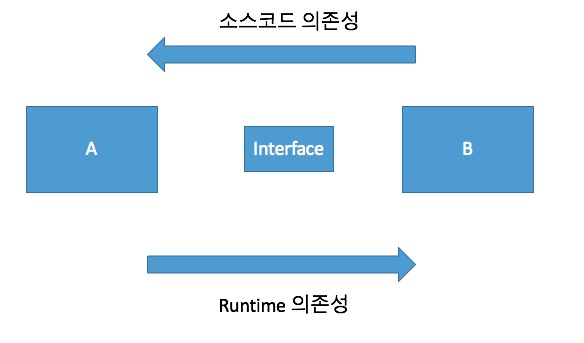

B가 거꾸로 I에 의존성이 있어서 inversion이란 말을 쓴다. B의 소스코드 의존성은 runtime 의존성과 반대가 된다.(이게 좋은것) 

**스프링을 쓰면 좋은점은 레코드가 위와 같은 구조를 준수하게 도와준다. ** 

Switch 문장은 독립적 배포에 방해가 된다. 각 Case 문장은 외부 모듈에 의존성을 갖는다. 다수의 다른 모듈에 의존성을 가질 수 있어서 fan-out problem을 유발한다. 

**application / main partition**<br>


###Function Structure2
Temporal Coupling - 함수들이 순서를 지키며 호출되어 한다. <br>
예) open, execute, done <br>
1. // file should be opened before processing
2. **fileCommand.process(file);**
3. // file should be closed after processing
이 방법은 실수할 여지도 많고 좋지 않다.(누군가는 open 안하고 실행하거나 실행하고 close를 안하는 등)<br>

**So 전략패턴**<br>
```
fileCommandTemplate.process(myfile, new FileCommand(){
	public void process(File f){
		// file processing codes here
	}
});

class FileCommandTemplate{
	public void process(File file, FileCommand command){
		file.open();
		command.process(file);
		file.close();
	}
}
```
전략패턴과 컨텍스트를 템플릿이라 부르고, 익명 내부 클래스로 만들어지는 오브젝트를 콜백이라 부른다. <br>
콜백 : 실행되는 것을 목적으로 다른 오브젝트의 메서드에 전달되는 오브젝트. 파라미터로 전달되지만 값을 참조하기 위한 것이 아니라 특정 로직을 담은 메서드를 실행시키기 위해 사용한다. 

Template/Callback 패턴은 보통 단일 메소드 인터페이스를 사용한다. 템플릿의 작업 흐름 중 특정 기능을 위해 한 번 호출되는 경우가 일반적이기 때문이다. 

**CQS**<br>
정의 : 상태를 변경하는 함수는 값을 반환하면 안된다. 값을 반환하는 함수는 상태를 변경하면 안된다. <br>
Command : 시스템의 상태변경 가능. side effect를 갖는다. 아무것도 반환하지 않는다. <br>
Query : side effect가 없다. 계산값이나 시스템의 상태를 반환한다. <br>
CQS는 신뢰를 기반으로 한다.(다음 행동이 예측 가능하다라는 뜻) <br>

**Tell, Don’t ask**<br>
What에 대해서 생각하라. How에 대해서 생각하지 마라.  


**Law of Demeter**<br>
함수가 시스템의 전체를 알게 하면 안된다. 개별 함수는 아주 제한된 지식만 가져야 한다. 객체는 요청된 기능 수행을 위해 이웃객체에게만 요청해야 한다. 요청을 수신하면 적절한 객체가 수신할때가지 전파되야 한다.

**Early returns**<br>
최대한 리턴은 빠르게. 

**Error handling**<br>
Spring의 default는 Runtime-exception이 발생하면 롤백. Checked-exception이 발생하면 롤백 아님. <br>
**Special Cases**<br>
size 0일때. <br>
**Null is not error**<br>
**Null is a value**<br>
**try도 하나의 역할/기능이다**<br>

###Form 
Comment는 특별한 경우에만 작성되야 한다. <br>
**Bad Comments**<br>
1. Closing Brace Comments (중괄호 닫는거 알리는 주석)
2. Big Banner Comments
3. attribution Comments( add by yangbongsoo)

Commetns와 해당 코드는 항상 붙어있어라. 

**Vertical Formatting**<br>
공란을 함부로 사용하지 마라. 공란은 메서드 사이, private 변수들과 public 변수들 사이, 변수 선언과 메서드 실행의 나머지 부분 사이, if / while 블록과 다른 코드 사이에 둔다.<br>
서로 관련된 것들은 vertical하게 근접해야 한다.(vertical의 거리가 그들간의 관련성을 나타낸다) 

**classes**<br>
안 좋은 설계 방식이 getter/setter 자바빈 규약(예전에는 애플릿으로 네트워크 통신할 때 필요했었던 ...) <br>
변수를 private로 해놓고 왜 getter/setter를 제공하는가? <br>

Tell, Don’t ask. getter/setter가 많으면 get, get, get 해서 요청하게 되고 set 시킬 수 있다고 생각하게 됌. getter, setter가 없으면 Ask를 안해. 그냥 시키게 된다.(이런 규칙을 따라야 함) 

**Max Cohesive**<br>
응집도가 높아야 된다. 좀 더 구체적으로 말하면 


method1은 굉장히 Cohesive하다. 왜? 이 클래스의 변수를 다 사용하기 때문에. 변수들 중 하나라도 바뀌면 method1은 영향을 받는다. 

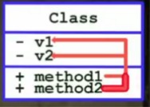

method1, method2 둘 다 2개의 변수 모두 사용한다. 변수 하나의 변경은 모두에게 전파가 된다. (마찬가지로 high cohesion)

**getter/setter는 cohesion이 낮다.** 왜? getter/setter는 변수 하나만 사용하기 때문이다. getter/setter가 없을 수는 없다. 하지만 최소화 해야 된다. 그리고 예를들어 name 변수에 getName() 이렇게 메서드 만들지 말고 추상화 시켜서 제공해라. 

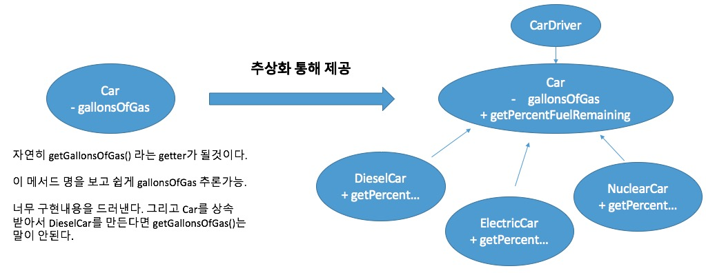


만약 디젤카라면, 런타임의 flow는 CarDriver -> Car(인터페이스) -> DisielCar 이렇게 흘러간다. 그러나 소스코드 의존성은 DisielCar -> Car 이렇게 거꾸로 되고 있다.(IoC)<br>
다형성은 클라이언트 코드를 서버 코드의 구현 변경으로부터 보호해준다.(객체 지향의 핵심) IoC를 통해 High Level Policy(클라이언트, 비지니스 로직)를 Low Level Detail로부터 보호하는것이다.

**내부 변수를 hide했을 때, 상세 구현을 덜 노출 할 수록 다형성 클래스를 활용할 기회가 늘어난다. ** <br>

###Architecture
Architecture : 전체적인 시스템 개발에 기반을 제공하는 변경 불가한 초기 결정사항의 집합. <br>

건축의 아키텍처가 해머, 못, 기욋장이 아니듯이 Java, Eclipse, MVC, Spring, Tomcat, Hibernate 들도 아키텍처가 아니고 도구이다. **아키텍처는 사용법을 드러내야 한다.**

시스템의 사용법을 보여주는 것은 Usecase가 되야 한다. Usecase는 일련의 단계를 나타낸다. 사용자가 ~한다 그러면 시스템은 ~ 한다. 다시 사용자가 ~ 한다. 시스템은 ~ 한다. (반복) 즉, 시스템과 Actor(사용자 집합) 간의 상호작용을 정의하는 일련의 절차이다. <br>

cf) 그동안 내가 작성했던 아키텍처는 시스템이 만들어진 재료에 대한 설명 뿐이었다. (기능들에 대한 설명이 들어가는게 좋다) <br>

MVC로 구성된 Web 시스템만 가지고 아키텍처라고 많이 하는데, 이건 Usecase를 숨기고 Delivering 메커니즘(MVC를 말함. 사용자 요청을 시스템에 전달하고 시스템에서 가공된 결과를 사용자에게 전달하는 ...)만 노출한다. 그거에 대해선 자세히 설명하면서 '그 시스템이 무엇을 하고 있다’ 라는건 보여지지 않는다. 중요한건 Usecase다. 그래서 Usecase가 Delivering 메커니즘에 의존성이 없어야 되고, UI, DB, Framework, Tool에 대한 결정들은 Usecase와 decouple 되야 한다. **Usecase should stand alone**<br>

**좋은 아키텍처는 Framework, WAS, UI 등과 같은 stuff들에 대한 결정을 미룰 수 있어야 된다. 연기 될 수 있어야 되고, 연기 되어야만 한다.(시간이 지날수록 결정을 위한 정보가 더 풍부해진다)**

우린 뭔가 시작할 때 DB부터 생각한다. MySQL 써서 테이블 이렇게 저렇게 만들고 ... but 그러지 말자. 개발자 입장에서는 data부터 생각하고 시작하면 꼬인다. 반드시 절차지향적으로 가게 된다. 아키텍처를 Usecase에 집중해라(시스템의 의도) <br>

cf) ‘POJOs in Action’책 Developing Domain Model에 의한 개발 방법 순서 <br>
1. 클래스, 속성, 관계 식별(정적 모델링) => 요구사항 명세 식별
2. 도메인 모델에 행위 추가하기. 
  3. 요구사항 식별하기 -> 요구사항은 2가지 부분으로 구성된다. (사용자 행위 / 사용자 행위 요청에 대한 애플리케이션의 응답)
메서드 식별하기
  4. TDD로 메서드 구현하기

Web기반 Accounting 시스템의 아키텍처는 Web이 아닌 Account 이슈에 대해서 잘 드러내야 한다.(Web에 대해서 언급할 필요가 없다) 하지만 대부분 Web MVC에 대해서 자세히 말함. 실질적인 비지니스 로직은 언급하지 않는다. <br>

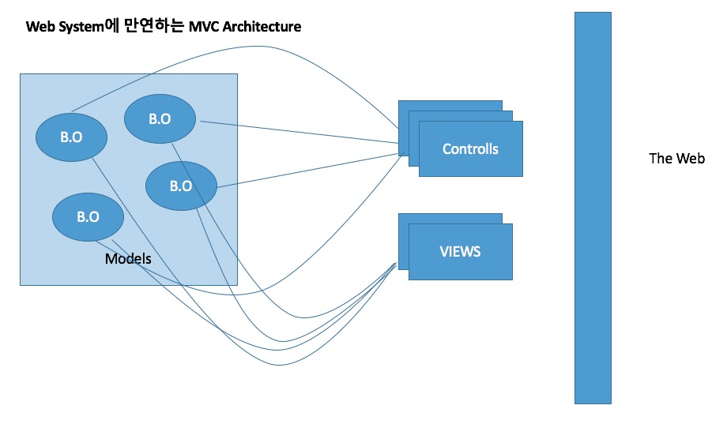

Controller, View는 html, http와 강하게 연관돼있다. 그런데 Controller가 사용하는 Moel이라는 거는 Controller에 의존적일 수 밖에 없다.(Controller가 요구하는 기능들을 잘 제공 해야 되니까) 그러면 View, Controller가 강하게 Model에 커플링이 일어나서 Model이 순수하게 POJO가 아니고 http, html 이런거에 의존적인 코드가 들어가게 된다. 원래 MVC의 Model은 pure해야 되는데 Web MVC에서 Model은 pure할 수가 없다. <br>

위 그림을 보면 Model이 중심이 아니고, Web이 중심이어서 Web에 의해 Model이 오염되는 모습을 보인다. So 시스템 아키텍처는 아키텍처 변경 없이 delivery 메커니즘을 변경할 수 있어야 한다. So Usecase가 시스템에서 가장 중요하다. (delivery 메커니즘이 변경되도 내 애플리케이션의 비지니스 로직이 보호받을 수 있어야 한다) <br>

**Usecase는 사용자가 특정 목적을 이루기 위해 시스템과 어떻게 상호작용하는지에 대한 형식적 기술이다. Usecase는 입력 데이터를 해석하여 출력 데이터를 생성하는 필수 알고리즘이다. **<br>

결론 : 아키텍처는 Tool이나 Framework에 기반/의존하지 않는다. 좋은 아키텍처는 Tool, Framework에 대한 결정을 아주 오랫동안 미룰 수 있어야 한다.(delivery 메커니즘에 의존하지 않고, 노출시키지 않고 숨김) 시스템의 모양을 보면 Web인지 App인지 몰라야 된다. 대신 어떤 기능을 제공하는지, 뭘 하는지 알 수 있어야 된다.<br>

###SOLID
소스코드는 document이다. <br>

Design Smells(잘못하고 있다는 증거)<br>
**Rigidity** : 시스템의 의존성으로 인해 변경하기 어려워지는 것. <br>
원인 : 많은 시간이 소요되는 테스트와 빌드. 전체 리빌드를 유발하는 아주 작은 변화.<br>
=> 테스트와 리빌드 시간을 줄이면 Rigidity가 줄어들고 수정이 용이해진다. <br>

**Fragility**: 한 모듈의 수정이 다른 모듈에 영향을 미칠 때. => 모듈 간의 의존성을 제거해야 한다.<br>
**Immobility**: 모듈이 쉽게 추출되지 않고 재사용 되지 않는 경우. => DB, UI, Framework 등과 결합도를 낮춰야 한다. <br>

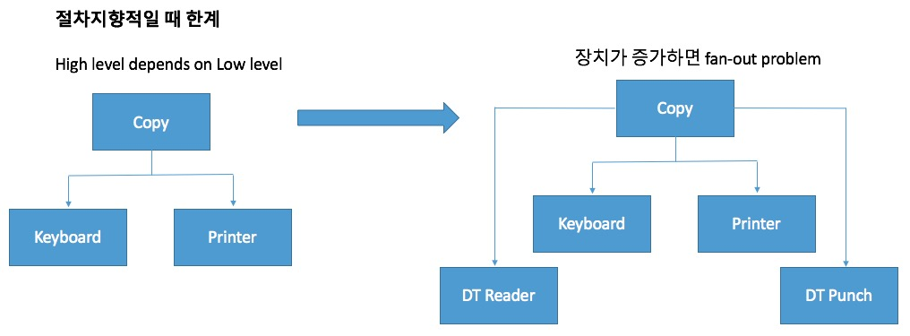

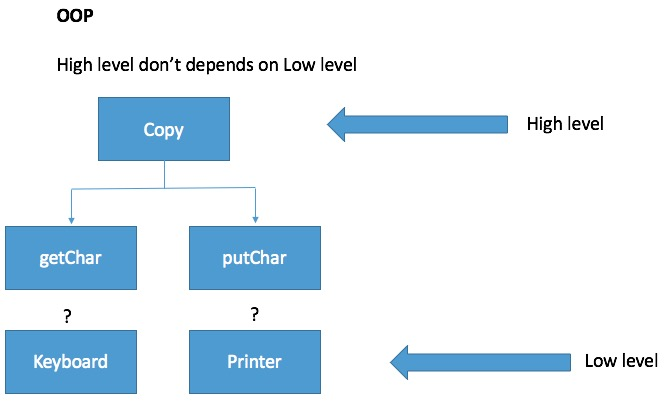

**상속, 다형성, 캡슐화 등등은 객체지향의 핵심이 아니라 메커니즘이다. 객체지향의 핵심은 IoC를 통해 상위레벨의 모듈을 하위 레벨의 모듈로부터 보호하는 것이다.**<br>
객체지향 설계는 의존성을 잘 관리하는 것이다.(Isolate the high level policies from low level details) <br>

**SRP**<br>
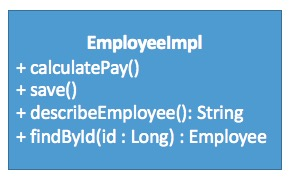

save / findById 는 같은 부류 <br>
만약 CalculatePay 책임이 있는 경우, CalculateDeduction, CalculateSalary 추가해도 책임의 수는 변하지 않음. <br>
그러므로 같은 부류로 나눠서 책임이 몇개인가 보면 된다.<br>

**그렇다면 어떻게 부류를 나눌 수 있냐에 대해서, “누가 해당 메서드의 변경을 유발하는 사용자인가”로 메서드를 그룹핑할 수 있다. **<br>

SRP는 사용자에 관한 것이다. 책임은 SW의 변경을 요청하는 특정 사용자들에 대해 클래스나 함수가 갖는 것이다. **변경의 근원**으로 책임을 볼 수 있는데 변경의 원인이 같은 것은 같은 책임으로 볼 수 있다. 

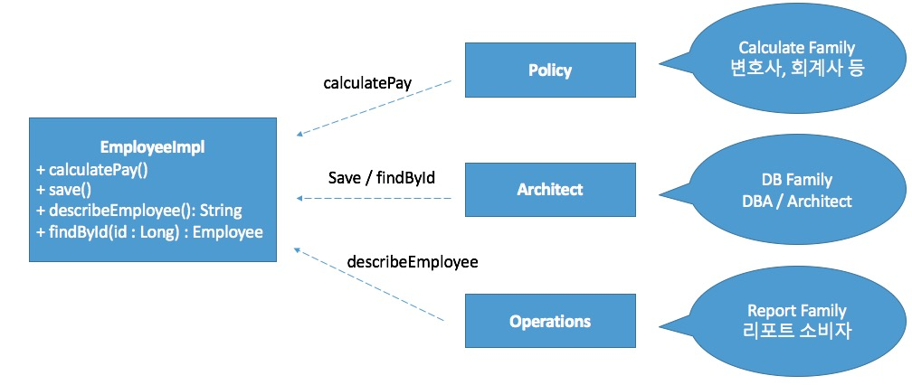

지금 여기에는 3개의 Actor가 있다. (Employee 클래스의 변경을 요구하는 사용자들) <br>
Actor는 서로 다른 Needs와 Expectation을 가진다. <br>

User들을 Role에 따라 나눠야 한다. 개별 User가 Actor가 아니라 User가 특정 Role을 수행할 때 Actor라 부른다. 결국 책임은 individual 한게 아니라 Actor와 연결되어 있다. <br>

책임이라는 것은 특정 Actor의 요구사항을 만족시키기 위한 일련의 함수의 집합이다. Actor의 요구사항 변경이 일련의 함수들의 변경의 근원이 된다. <br>

**Two values of SW**<br>
Secondary value of SW is it’s behavior : 현재의 SW가 현재 사용자의 현재 요구사항을 만족하는가?<br>
Primary value of SW : 지속적으로 변화하는 요구사항을 수용하는 것. 대부분의 SW는 현재의 요구사항을 잘 만족하지만 변경하긴 어렵다. <br>

**SRP 하나의 모듈은 반드시 하나의 변경사유만 가져야 한다.**<br>

**SRP Solution**<br>
정답은 없다. <br>
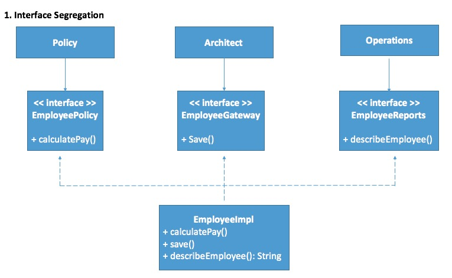

Create 3 interfaces for each responsibility <br>
3개의 인터페이스를 하나의 클래스로 구현 <br>
장점 : Actor들을 완전히 decouple 시켰다. <br>
단점 : 어디에 구현되었는지 찾기 어렵다. 그리고 하나의 클래스에 구현되어 구현은 coupled 되어 있다. <br>

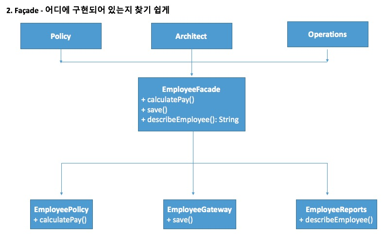
Facade 클래스가 3개의 다른 구현체들에게 위임하는 구조이다. 어디에 구현되어 있는지 찾기는 쉽지만, Actor들은 여젼히 coupled 되어 있다. <br>
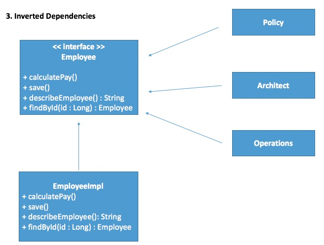

Actor를 구현 클래스에서 decouple 시켰다. 그러나 모든 Actor들이 하나의 인터페이스에 coupled 되어 있다. 그리고 하나의 클래스에 구현되어 구현도 coupled <br>
**레거시를 다룰때는 좋은 방법이다.**<br>
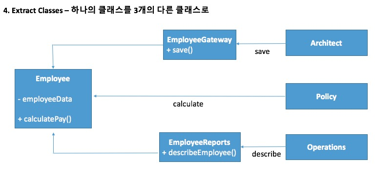

결과 : Actor들은 분리된 3개의 클래스에 의존 <br>
3개의 책임에 대한 구현은 분리 <br>
하나의 책임의 변경에 따른 다른 책임에 영향을 안미침 <br>

문제점 : transitive dependency가 존재한다. 다시 말해 Employee에서 변경이 일어 났을 때 EmployeeGateway / EmployeeReporter에 영향을 미칠 수 있다.<br>

**OCP**<br>
확장에 대해선 연려 있고, 변경에 대해선 닫혀있다. <br>
확장 : 새로운 type을 추가함으로써 새로운 기능을 추가 할 수 있다. <br>
이미징ㅇㅇㅇㅇㅇㅇㅇㅇㅇㅇㅇㅇㅇㅇㅇㅇㅇㅇ

OCP가 가능한가? <br>
이론적으론 가능한데 비실용적이다. 2가지 문제점이 있다. 
1. main partition : main에서 의존성 주입을 해줘야 하는 경우가 있으니까, 거기는 어차피 if / else가 있으니까. main은 OCP를 준수 할 수 없음(Spring에서 해결해줄수는 있어) 
2. Crystal ball problem : 확장을 위해 미리 인터페이스를 준비해 놓는다는게 현실적으로 불가능해.(고객은 자신이 원하는 걸 직접 만져봐야만 그때서야 알 수 있어)

cf) 모든 Design Smell 중 Fragility가 가장 먼저 제거해야 할 대상이다. <br>

Crystal ball problem을 해결하기 위한 방법 <br>
1. Big Design Up Front(BDUF) : OCP가 가능하도록 고객의 요구사항을 예측하여 도메인 모델을 만든다. 변경 가능한 모든것들에 대한 청사진을 얻을 때까지 헛된 짓을 계속한다.<br>
  2. 문제 : 머피의 법칙처럼 미리 추상화 시켜놓은 것엔 고객이 변경을 요구하지 않고 예상치 못한 곳에서 요구한다. 그리고 추상화로 도배된 설계는 직관적이지 않고 더 복잡해서 안하늬만 못한 결과를 초래한다.
2. Agile Design : 최대한 빨리 고객의 요구사항을 끌어낼 수 있는 가장 단순한 일을 한다. 그럼 고객은 그 결과물에 대해 요구사항 변경을 시작한다. 그럼 어떤 변경이 요구되는지 알게 된다.

우리는 실제로 BDUF와 Agile 두 극단 사이에 살고 있다. BDUF를 피해야 하지만 No DUF도 피해야 한다. 사전 설계하는 것은 가치있는 일이다. 그러나 목적은 시스템의 기본 모양을 수립하는 것이지 모든 작은 상세까지 수립하는 것이 아니다.(불필요한 추상화 초래) <br>

So 빨리 자주 Deliver하고 고객의 요구사항 변화에 기반하여 리팩토링하라.<br>