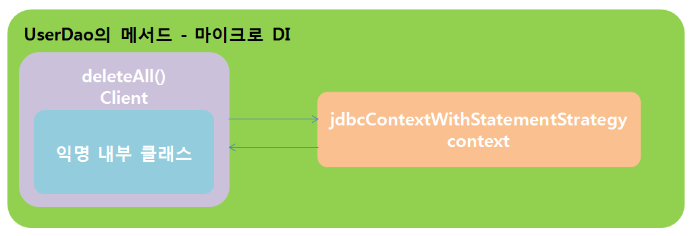

# 템플릿
**템플릿이란 바뀌는 성질이 다른 코드 중에서 변경이 거의 일어나지 않으며 일정한 패턴으로 유지되는 특성을 가진 부분을 자유롭게 변경되는 성질을 가진 부분으로부터 독립시켜서 효과적으로 활용할 수 있도록 하는 방법이다.**

예외처리 기능을 갖춘 DAO
```
public void deleteAll() throws SQLException{
    Connection c = null;
    PreparedStatement ps = null;
    
    //예외가 발생할 가능성이 있는 코드를 모두 try 블록으로 묶어준다. 
    try{

        c = dataSource.getConnection();
        ps = c.prepareStatement("delete from users");
        ps.executeUpdate();

    }catch(SQLException e){
        throw e;
    }finally{//예외 발생하건 안하건 항상 실행 

        if(ps != null){ //ps가 null일때 close 호출하면 NullPointerException 
            try{
                ps.close(); //close()도 예외 발생할 수 있다. 
            }catch(SQLException e){
            }
        }

        if(c != null){
            try{
                c.close();
            }catch(SQLException e){
            }
        }

    }// finally end
}
```
close()는 만들어진 순서의 반대로 하는 것이 원칙이다. 

이제 이 deleteAll() 메서드에 담겨 있던 변하지 않는 부분, 자주 변하는 부분을 전략 패턴을 사용해 깔끔하게 분리해보자.


클라이언트 책임을 담당할 deleteAll() 메서드
```
public void deleteAll() throws SQLException{
    StatementStrategy st = new DeleteAllStatement();
    jdbcContextWithStatementStrategy(st);
}
```
메서드로 분리한 try/catch/finally 컨텍스트 코드

```
public void jdbcContextWithStatementStrategy(StatementStrategy stmt) throws SQLException{
    Connection c = null;
    PreparedStatement ps = null; 
    
    try{
        c = dataSource.getConnection();
        
        ps = stmt.makePreparedStatement(c);
        
        ps.executeUpdate();
    }catch(SQLException e){
        throw e;
    }finally{
        if(ps != null) { try { ps.close(); } catch (SQLException e) {} }
        if(c != null) { try { c.close(); } catch (SQLException e) {} }
    }
}
```
StatementStrategy 인터페이스
```
public interface StatementStrategy{
    PreparedStatement makePreparedStatement(Connection c) throws SQLException;
}
```
deleteAll() 메서드의 기능을 구현한 StatementStrategy 전략 클래스 
```
public class DeleteAllStatement implements StatementStrategy{

    public PreparedStatement makePreparedStatement(Connection c) throws SQLException{
        PreparedStatement ps = c.preparedStatement("delete from users");
     
        return ps;
    }
}
```
이 방법은 두 가지 개선할 부분이 있다. 첫째는 DAO 메서드마다 새로운 StatementStrategy 구현 클래스를 만들어야 한다는 점이다. 이렇게 되면 상속을 사용하는 템플릿 메서드 패턴을 적용했을 때보다 그다지 나을게 없다. 두 번째는 add() 메서드 같은 경우, 새로운 user에 대한 부가적인 정보가 있어서 번거롭게 인스턴스 변수를 만들어야 한다는 점이다. 
```
public class AddStatement implements StatementStrategy {
  User user;
  
  public AddStatement(User user) {
    this.user = user;
  }
  
  public PreparedStatement makePreparedStatement(Connection c) {
    ...
    ps.setString(1, user.getId());
    ps.setString(2, user.getName());
    ps.setString(3, user.getPassword());
    ...
  }
}
```
```
public void add(User user) throws SQLException {
  StatementStrategy st = new AddStatement(user);
  jdbcContextWithStatementStrategy(st);
}
```
이 두 가지 문제를 해결할 수 있는 방법을 생각해보자.
###로컬 클래스
StatementStrategy 전략 클래스를 매번 독립된 파일로 만들지 말고 UserDao 클래스 안에 내부 클래스로 정의해버리는 간단한 방법이 있다. 

```
//내부 클래스에서 외부의 변수를 사용할 때는 외부변수를 반드시 final로 선언해줘야된다.
public void add(final User user) throws SQLException{

    class AddStatement implements StatementStrategy{
        public PreparedStatement makePreparedStatement(Connection c) throws SQLException{
            
            PreparedStatement ps = c.prepareStatement(
                "insert into users(id, name, password) values(?,?,?)");
            ps.setString(1, user.getId());
            ps.setString(2, user.getName());
            ps.setString(3, user.getPassword());
            
            return ps;
        }
    }// class end 
    
    StatementStrategy st = new AddStatement(); // 생성자 파라미터로 user 전달하지 않아도 된다.
    jdbcContextWithStatementStrategy(st); 
    
}
```
로컬 클래스로 만들어두니 장점이 많다. AddStatement는 복잡한 클래스가 아니므로 메서드 안에서 정의해도 그다지 복잡해 보이지 않는다. 메서드마다 추가해야 했던 클래스 파일을 하나 줄일 수 있다는 것도 장점이고, 내부 클래스의 특징을 이용해 로컬 변수를 바로 가져다 사용할 수 있다는 것도 큰 장점이다.
###익명 내부 클래스
클래스 선언과 오브젝트 생성이 결합된 형태로 만들어지며, 클래스를 재사용할 필요가 없고 구현한 인터페이스 타입으로만 사용할 경우에 유용하다. 

익명 내부 클래스는 선언과 동시에 오브젝트를 생성한다. 이름이 없기 때문에 클래스 자신의 타입을 가질 수 없고, 구현한 인터페이스 타입의 변수에만 저장할 수 있다. 


```
public void add(final User user) throws SQLExecption{
    jdbcContextWithStatementStrategy(
        new StatementStrategy(){
               public PreparedStatement makePreparedStatement(Connection c) throws SQLException{
                
                PreparedStatement ps = c.prepareStatement(
                    "insert into users(id, name, password) values(?,?,?)");
                ps.setString(1, user.getId());
                ps.setString(2, user.getName());
                ps.setString(3, user.getPassword());
                
                return ps;
            } 
        }
    );
}

```

```
public void deleteAll() throws SQLException{
    jdbcContextWithStatementStrategy(
        new StatementStrategy(){
            public PreparedStatement makePreparedStatement(Connection c) throws SQLException{
            
                return c.preparedStatement("delete from users");
            }
        }
    );
}
```
###컨텍스트와 DI
**jdbcContext의 분리**<br>
전략 패턴의 구조로 보자면 UserDao의 메서드가 클라이언트이고, 익명 내부 클래스로 만들어지는 것이 개별적인 전략이고, jdbcContextWithStatementStrategy() 메서드는 컨텍스트다. 컨텍스트 메서드는 UserDao 내의 PreparedStatement를 실행하는 기능을 가진 메서드에서 공유할 수 있다. 그런데 JDBC의 일반적인 작업 흐름을 담고 있는 jdbcContextWithStatementStrategy()는 다른 DAO에서도 사용 가능하다. 그러니 jdbcContextWithStatementStrategy()를 UserDao 클래스 밖으로 독립시켜서 모든 DAO가 사용할 수 있게 해보자.<br>


