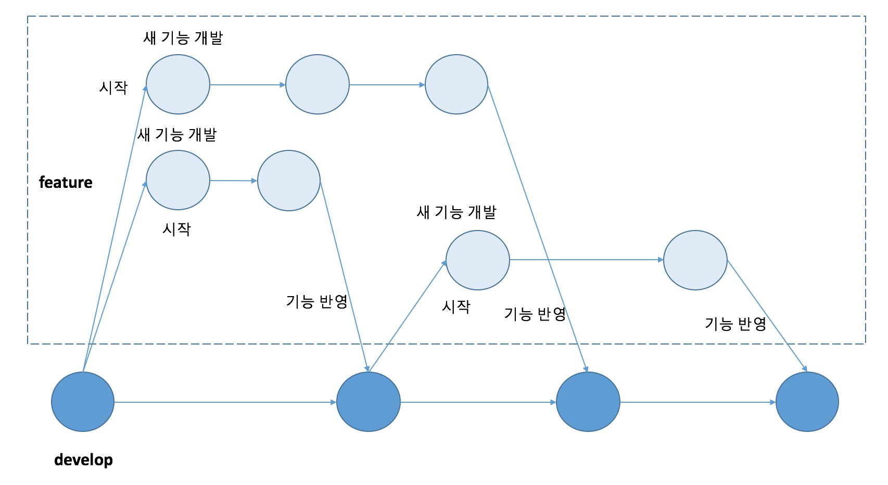

# Git-Flow 
참고 : http://nvie.com/posts/a-successful-git-branching-model/  

이 작업 흐름 모델은 branch 그룹에 역할을 부여하고 각 branch의 상호작용을 엄격하게 제한한다. 이 모델은 branch를 5 가지 역할로 나눈다. 
1. develop branch
2. feature branch
3. release branch
4. master branch
5. hotfix branch

**develop branch** 
develop branch는 하나만 존재한다. 여기에서 모든 개발이 시작된다. 하지만 절대로 develop branch에 곧바로 commit하지 않는다. 이 브랜치에 merge되는 것은 feature branch와 release나 hotfix의 버그 수정이다. 이 브랜치는 오직 merge commit만 할 수 있다. 

**feature branch** 
feature branch는 여러 개 존재할 수 있다. 여기에 속하는 branch는 develop branch를 기반에 두고 새롭게 branch되어 새로운 기능 개발이나 버그 수정을 담당한다. 그리고 각각의 branch는 하나의 기능(의도)만을 맡는다. 따라서 branch의 이름을 제대로 짓는 것이 중요하다. 

feature branch들은 오직 develop branch에 merge될 때만 관계성이 생긴다. 갈라져 나오는 것도 다시 merge하는 것도 오직 develop branch와 한다. 

**release branch** 
release branch는 develop branch에서 가라져 나와서 배포 준비를 하는 branch이다. 이 branch는 새로운 기능 추가는 더 하지 않고 오로지 버그 수정만 한다. 즉 배포본의 완성도를 높이는 branch이다. 당연히 수정된 버그는 develop branch로 merge되야 한다.