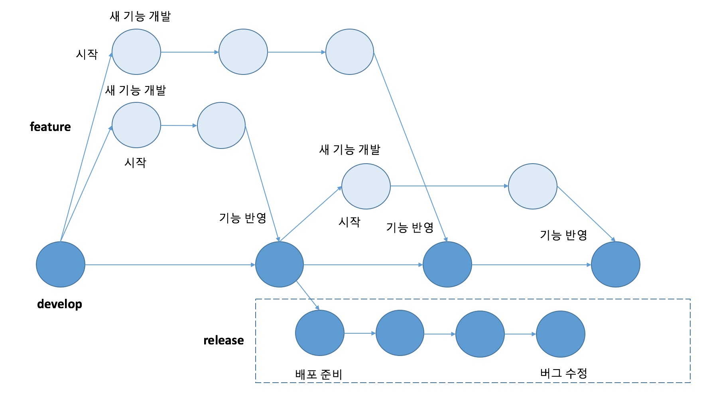
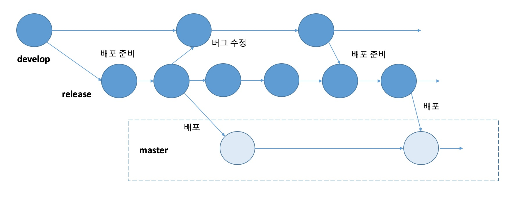
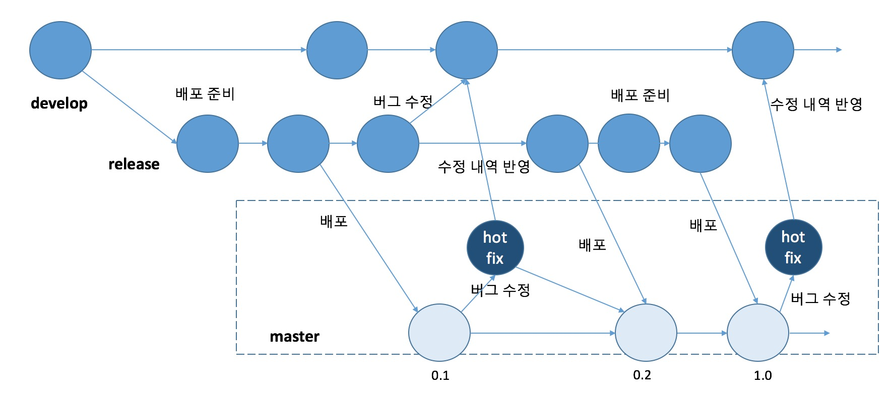
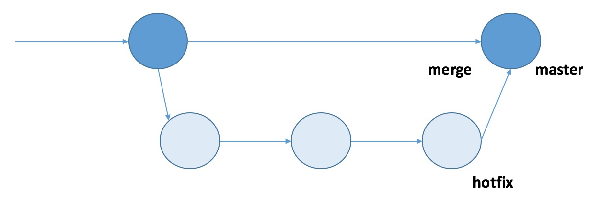
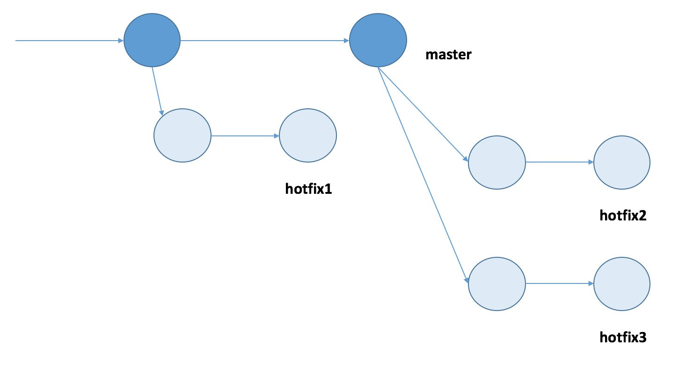
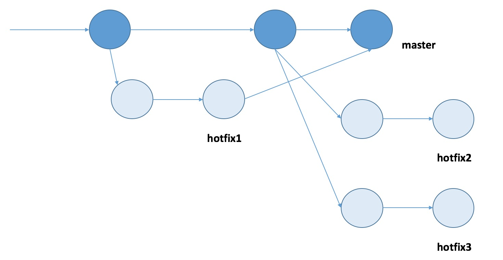
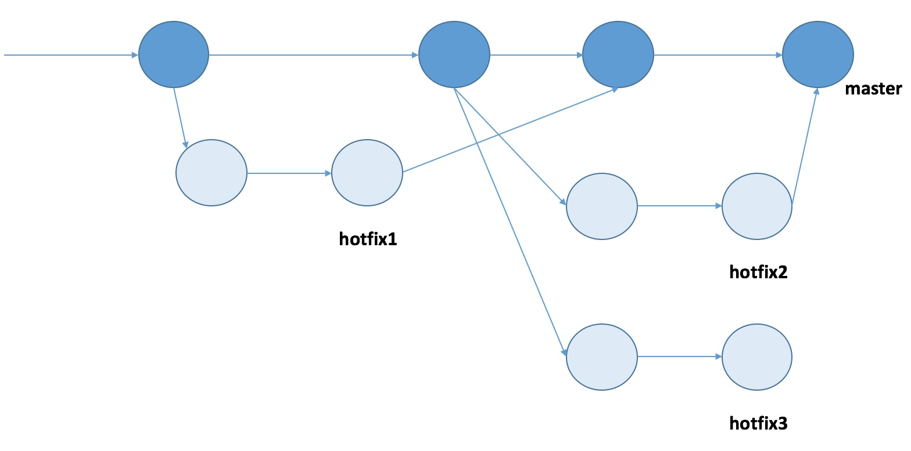
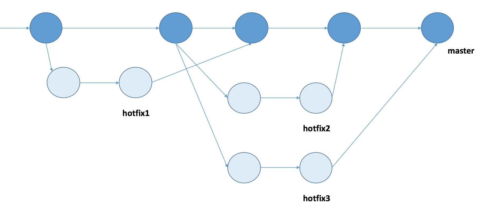
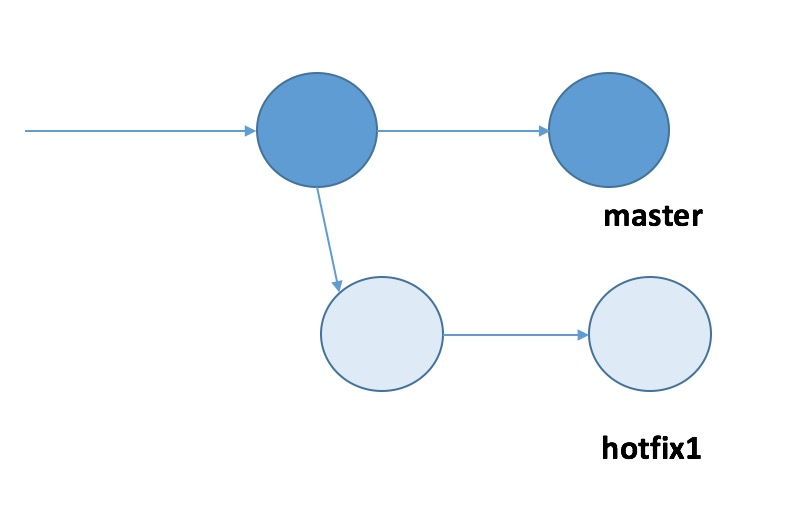

# Git-Flow 
참고 : http://nvie.com/posts/a-successful-git-branching-model/ <br>

이 작업 흐름 모델은 branch 그룹에 역할을 부여하고 각 branch의 상호작용을 엄격하게 제한한다. 이 모델은 branch를 5 가지 역할로 나눈다.<br>
1. develop branch
2. feature branch
3. release branch
4. master branch
5. hotfix branch

**develop branch**<br>
develop branch는 하나만 존재한다. 여기에서 모든 개발이 시작된다. 하지만 절대로 develop branch에 곧바로 commit하지 않는다. 이 브랜치에 merge되는 것은 feature branch와 release나 hotfix의 버그 수정이다. 이 브랜치는 오직 merge commit만 할 수 있다.<br>

**feature branch**<br>
feature branch는 여러 개 존재할 수 있다. 여기에 속하는 branch는 develop branch를 기반에 두고 새롭게 branch되어 새로운 기능 개발이나 버그 수정을 담당한다. 그리고 각각의 branch는 하나의 기능(의도)만을 맡는다. 따라서 branch의 이름을 제대로 짓는 것이 중요하다. 

feature branch들은 오직 develop branch에 merge될 때만 관계성이 생긴다. 갈라져 나오는 것도 다시 merge하는 것도 오직 develop branch와 한다.<br>

**release branch**<br>
release branch는 develop branch에서 가라져 나와서 배포 준비를 하는 branch이다. 이 branch는 새로운 기능 추가는 더 하지 않고 오로지 버그 수정만 한다. 즉 배포본의 완성도를 높이는 branch이다. 

당연히 수정된 버그는 develop branch로 merge되야 한다.<br>

**master branch**<br>
master branch는 실제 배포되는 버전이 있는 branch이다. 이 branch는 오직 release와 hotfix branch하고만 관계를 맺는다.


**hotfix branch**<br>
hotfix branch는 master branch, 즉 현재 배포 중인 코드에 버그가 있어 급히 수정할 때만 사용하는 branch이다. hotfix branch로 수정한 내용은 master와 develop branch에만 반영한다.



**정리**<br>
develop branch를 중심으로 feature branch들을 통해 기능을 추가하고, release branch를 통해 배포 준비와 코드의 버그를 수정하며, master로 배포하고, hotfix로 배포된 버전의 버그를 수정해 master와 develop branch에 반영하는 것을 반복하는 것이 git-flow 작업 흐름이다. 

# Git-Rebase
아래 커밋 그래프는 일반적으로 merge했을 때의 모습이다. 



하지만 두 개를 넘어서 세 개 이상의 branch가 하나의 master branch에 merge된다고 해보자.

구체적으로 설명해보면 hotfix1 branch를 만든 이후에 master branch에 어떠한 커밋 내역이 있는 상태로 hotfix2, hotfix3 branch를 만들어서 각각 커밋을 했고, hotfix1 branch에도 다른 커밋 내역이 있는 상황이다. 이를 차례대로 master branch에 merge한다고 해보자.<br>

먼저 hotfix1 branch를 merge해봤다.

이번에는 hotfix2 branch를 merge했다. 벌써 커밋 그래프가 상당히 꼬여가는 것이 보인다. 

이제 hotfix3 branch를 merge한 다음이다. 이제 그냥 보기만 해도 꽤 복잡해 보인다. 고작 세 개째인데 말이다. 

프로젝트 메머가 세 명 이상이면 혹은 동시에 개발 중인 기능이 여러 개라면 브랜치가 세 개 이상으로 생성되는 일은 매우 흔한 상황이다. 그럴 때마다 각자의 코드를 master branch에 반영하면 커밋 내역 그래프가 매울 알아보기 어려울 것이다. 하지만 git rebase 명령을 사용하면 이를 깔끔하게 정리할 수 있다(rebase는 단어 그대로 다시 base를 정하는 것이다).<br>

**git-rebase 구체적인 과정**<br>
최초 커밋 그래프는 다음과 같다. 

hotfix1 branch부터 정리해보겠다. master branch 앞으로 hotfix1 branch를 이동시키는 것이다. 따라서 `git checkout hotfix1` 명령을 실행해 master branch에서 hotfix1 branch로 체크아웃한다. 그리고 git rebase master 명령을 실행한다. 충돌이 나면 해결하기 위해 git rebase는 세 가지 옵션을 제공한다.
```
git rebase --continue : 충돌 생태를 해결한 후 계속 작업을 진행할 수 있게 한다.
git rebase --skip : merge 대상 branch의 내용으로 강제 merge를 실행한다. 즉 여기서 명령을 실행하면 master branch를 강제로 merge한 상태가 된다. 또한 해당 branch에서는 다시 git rebase 명령을 실행할 수 없다. 
git rebase --abort : git rebase 명령을 실행을 취소한다. 
```
명령을 실행하면 master branch의 공통 부모까지의 hotfix1 branch의 커밋을 master branch의 뒤에 차례대로 적용한다. 