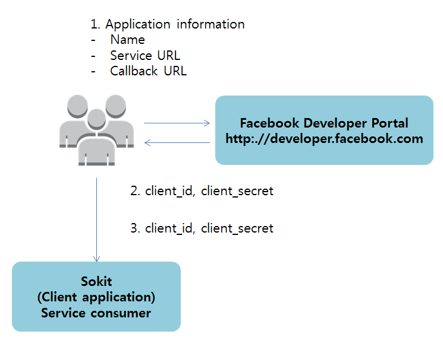

#Identity
통합인증(SSO, Single Sign On)은 한 번의 인증 과정으로 여러 컴퓨터 상의 자원을 이용 가능하게 하는 인증 기능이다. 싱글 사인온, 단일 계정 로그인, 단일 인증이라고 한다.

보안이 필요한 환경에서 통합인증을 도입하는 경우, 여러 응용 프로그램의 로그인 처리가 간소화되어 편리성을 도모할 수 있는 반면, 통합인증의 시작점이 되는, 즉 최초의 로그인 대상이 되는 응용 프로그램 혹은, 운영체제에 대한 접근 보안이 중요하게 된다. 보안위험이 적은 환경에서는 편리성만을 추구하면 되지만, 보안이 요구되는 환경에서는 1회용 비밀번호를 이용하는 등, 이중 인증 등으로 보안을 강화할 필요가 있다.

Single Sign On을 지원하기 위한 프로토콜이나 방법은 여러가지가 있다. 

그중 대표적인 방법으로 CAS,SAML,OAuth등이 있는데, CAS는 쿠기를 기반으로 하기 때문에 같은 도메인명 (xxx.domain.com yyy.domain.com) 사이에서만 SSO가 가능하다. (그만큼 구현도 쉽다.) OAuth는 현재 B2C쪽에 많이 사용되는 프로토콜이고, 그리고 마지막으로 SAML 있다. cross domain간 SSO 구현이 가능하며, OAuth 만큼이나 많이 사용되고 있다.

###PingFederate(SSO)

###Facebook OAuth
추가적인 보안 강화를 위해 사용자 인증(ID, Password)뿐만 아니라, 클라이언트 인증 방식을 추가할 수 있다. 페이스북은 API 토큰을 발급받도록 사용자 ID, 비밀번호 뿐만 아니라 Client ID와 Client Secret이라는 것을 같이 입력받도록 하는데, Client ID는 특정 앱에 대한 등록 ID이고 Client Secret은 특정 앱에 대한 비밀번호로, 페이스북 개발자 포털에서 앱을 등록하면 앱 별로 발급되는 일종의 비밀번호다.

                                                                                                                                                                                                                                                                                                                                                                                                                                                                          
###원문
위키 : https://ko.wikipedia.org/wiki/%ED%86%B5%ED%95%A9_%EC%9D%B8%EC%A6%9D 
조대협 블로그 : http://bcho.tistory.com/755

