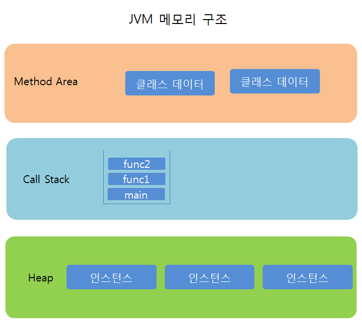
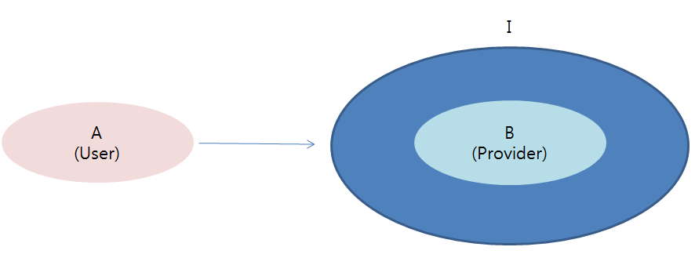
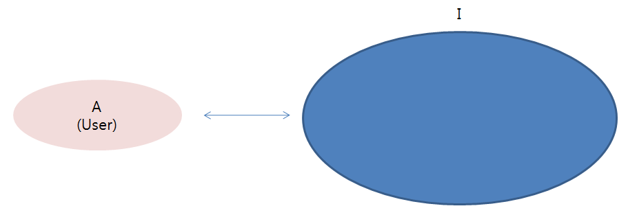

#JAVA의 정석(남궁성 지음) 놓친부분 다시보기

###Chapter 1 자바를 시작하기 전에
**동적 로딩(Dynamic Loading)을 지원한다.**<br>
자바로 작성된 애플리케이션은 여러 개의 클래스로 구성되어 있다. 자바는 동적 로딩을 지원하기 때문에 실행 시에 모든 클래스가 로딩되지 않고 필요한 시점에 클래스를 로딩하여 사용할 수 있다는 장점이 있다. 그 외에도 일부 클래스가 변경되어도 전체 애플리케이션을 다시 컴파일 하지 않아도 되며, 애플리케이션의 변경사항이 발생해도 비교적 적은 작업만으로도 처리할 수 있다.

**javac.exe **<br>
자바 컴파일러, 자바소스코드를 bytecode로 컴파일한다.

**java.exe **(JIT 컴파일러)<br> 
자바 인터프리터, 컴파일러가 생성한 bytecode를 해석하고 실행한다. 

JRE(자바실행환경) = JVM + Java API(클래스 라이브러리) <br>
JDK(자바개발도구) = JRE + 개발에 필요한 실행파일(javac.exe 등)<br>

###Chapter 2 변수
**리터럴**<br>
그 자체로 데이터인 것을 리터럴(literal)이라고 한다. 상수(constant)와 의미가 같지만 프로그래밍에서는 상수를 '값을 한번 저장하면 변경할 수 없는 저장공간' 으로 정의하기 때문에 이와 구분하기 위해 '리터럴'이라는 용어를 사용한다. 

###Chapter 3 연산자
**연산자**<br>
큰 자료형에서 작은 자료형으로의 형 변환은 캐스트 연산자 생략 가능하다.<br>
long은 8byte고 float은 4byte지만 실수형이 정수형보다 훨씬 더 큰 범위를 갖기 때문에 더 크다고 할 수 있다. 또한 char와 short 모두 2byte지만 char는 음수를 갖지 않으므로 서로 범위가 달라서 자동적으로 형변환이 수행되지 않는다.

**사칙연산**<br>
사칙 연산에서 int형 보다 크기가 작은 자료형은 int형으로 형변환 후에 연산을 수행한다.<br>
byte + short -> int + int -> int<br>
두개의 피연산자 중 자료형의 표현범위가 큰 쪽에 맞춰서 형변환 된 후 연산을 수행한다.<br>
float + long -> float + float -> float <br>

###Chapter 4 조건문과 반복문
**이름 붙은 반복문** 
```
Loop1 : for(int i=0; i<9; i++){
            for(int j=1; j<9; j++){
                if(j==5)
                    break Loop1; 
            }
        }
```
위와 같이 break를 설정하면 바로 빠져나오게 할 수 있다. 

###Chapter 5 배열
**배열의 복사**<br>
System클래스의 arraycopy()를 사용하면 보다 간단히 배열을 복사할 수 있다. <br>
```
System.arraycopy(arr1, 0, arr2, 0, arr1.length);
```
arr1배열의 0번째부터 arr1.length까지의 내용을 arr2의 0번째부터 복사하겠다는 뜻

###Chapter 6 객체지향 프로그래밍1
**class**<br>
프로그래밍 언어에서 데이터 처리를 위한 데이터 저장형태의 발전과정은 다음과 같다. 

그동안 데이터와 함수가 서로 관계가 없는 것처럼 따로 다루어져 왔지만, 사실 함수는 주로 데이터를 가지고 작업을 하기 때문에 많은 경우에 있어서 데이터와 함수는 관계가 깊다.예를들어 C언어에서는 문자열을 문자의 배열로 다루지만, 자바에서는 String이라는 클래스로 문자열을 다룬다. 문자열을 단순히 문자의 배열로 정의하지 않고 클래스로 정의한 이유는 문자열과 문자열을 다루는데 필요한 함수들을 함께 묶기 위해서이다. 

**parameter**<br>
메서드의 매개변수가 있는 경우, 본격적인 작업을 시작하기에 앞서 넘겨받은 매개변수의 값이 유효한 것인지 꼭 확인 하는것이 중요하다. 

**return**<br>
아래 왼쪽같이 메서드 내에서 return문을 여러 번 쓰는 것보다 가능하면 오른쪽처럼 마지막에 한번만 사용하는 것이 좋다.
```
int max(int a, int b)            int max(int a, int b)
{                                {
    if(a>b)                          int result = 0;          
        return a;                    if(a>b)
    else                                result = a;
        return b;                    else 
}                                       result = b;
                                  }
```

**리턴값이 있는 메서드를 리턴값이 없는 메서드로 바꾸는 방법**<br>
```
public static void main(String[] args)
{
    ReturnTest r = new ReturnTest();
    
    int[] result = {0};
    r.add(3,5,result);
    System.out.println(result[0]);
}

void add(int a, int b, int[] result)
{
    result[0] = a + b;
}
```
메서드는 단 하나의 값만을 리턴할 수 있지만 이것을 응용하면 여러 개의 값을 리턴받는 것과 같은 효과를 얻을 수 있다. (임시적으로 간단히 처리할 때는 별도의 클래스를 선언하는 것보다 이처럼 배열을 이용하는 것이 좋다) 

**JVM 메모리 구조**<br>

1. 메소드 영역(method area)
    - 프로그램 실행 중 어떤 클래스가 사용되면, JVM은 해당 클래스의 클래스파일(*.class)을 읽어서 분석하여 클래스에 대한 정보(클래스 데이터)를 이곳에 저장한다. 이때 그 클래스의 클래스변수도 이 영역에 함께 생성된다.  
2. 호출스택(call stack)
    - 호출스택은 메서드의 작업에 필요한 메모리 공간을 제공한다. 메서드가 호출되면, 호출스택에 호출된 메서드를 위한 메모리가 할당되며 이 메모리는 메서드가 작업을 수행하는 동안 지역변수(매개변수 포함)들과 연산의 중간결과 등을 저장하는데 사용된다. 그리고 메서드가 작업을 마치면 할당되었던 메모리공간은 반환되어 비워진다. 
3. 힙(heap)
    - 인스턴스가 생성되는 공간. 프로그램 실행 중 생성되는 인스턴스는 모두 이곳에 생성된다. 즉 인스턴스변수들이 생성되는 공간이다. 

**초기화 블럭**<br>
클래스 초기화 블럭 - 클래스 변수의 복잡한 초기화에 사용된다. <br>
인스턴스 초기화 블럭 - 인스턴스 변수의 복잡한 초기화에 사용된다. <br> 

생성자 보다 인스턴스 초기화 블럭이 먼저 수행된다. 클래스는 초기화는 클래스가 처음 로딩될 때 클래스변수들이 자동적으로 메모리에 만들어지고, 바로 클래스 초기화블럭이 클래스변수들을 초기화하게 되는 것이다.
```
class InitBlack
{
    static 
    {
        //클래스 초기화 블럭
    }
    
    {
        //인스턴스 초기화 블럭 
    }
}

```
초기화 블럭 내에는 메서드 내에서와 같이 조건문, 반복문, 예외처리 구문 등을 자유롭게 사용할 수 있으므로, 초기화 작업이 복잡하여 명시적 초기화만으로는 부족한 경우 초기화 블럭을 사용한다. 

###Chapter 7 객체지향 프로그래밍2
**final**<br>
생성자를 이용한 final 멤버변수 초기화<br>
final이 붙은 변수는 상수이므로 일반적으로 선언과 초기화를 동시에 하지만, 인스턴스 변수의 경우 생성자에서 초기화 되도록 할 수 있다. 
```
class Card{
    final int NUMBER;
    final String KIND;
    
    Card(int num, String kind){
        NUMBER = num;
        KIND = kind;
    }
}
```
이 기능을 활용하면 각 인스턴스마다 final이 붙은 멤버변수가 다른 값을 갖도록 하는것이 가능하다.

**생성자의 접근 제어자**<br>
생성자에 접근 제어자를 사용함으로써 인스턴스의 생성을 제한할 수 있다. 보통 생성자의 접근 제어자는 클래스의 접근 제어자와 같지만, 다르게 지정할 수도 있다. 

생성자의 접근 제어자를 private으로 지정하면, 외부에서 생성자에 접근 할 수 없으므로 인스턴스를 생성할 수 없게 된다. 그래도 클래스 내부에서는 인스턴스의 생성이 가능하다. 

```
class Singleton{
    
    private static Singleton s = new Singleton();
    
    private Singleton(){
        //...    
    }
    
    //인스턴스를 생성하지 않고도 호출할 수 있어야 하므로 static이어야 한다. 
    public static Singleton getInstance(){
        return s;
    }
}
```
위의 경우처럼 생성자를 통해 직접 인스턴스를 생성하지 못하게 하고 public 메서드를 통해 인스턴스에 접근하게 함으로써 사용할 수 있는 인스턴스의 개수를 제한 할 수 있다. 

또한 생성자가 private인 클래스는 다른 클래스의 조상이 될 수 없으므로 클래스 앞에 final을 더 추가하여 상속할 수 없는 클래스라는 것을 알리는 것이 좋다. 

```
public final class Math{
    private Math(){
        //...
    }
}
```
<br>**참조변수와 인스턴스의 연결**<br>
조상 클래스에 선언된 멤버변수와 같은 이름의 인스턴스변수를 자손 클래스에 중복으로 정의했을 때, 
1. 조상 타입의 참조변수를 사용했을 때는 조상 클래스에 선언된 멤버변수가 사용되고, 자손타입의 참조변수를 사용했을 때는 자손 클래스에 선언된 멤버변수가 사용된다. 
2. 메서드의 경우 참조 변수의 타입에 관계없이 항상 실제 인스턴스의 메서드(오버라이딩된 메서드)가 호출된다. 

```
public static void main(String[] args){

    Parent p = new Child();
    Child c = new Child();
    
    System.out.println("p.x = "+p.x);
    p.method();
    
    System.out.println("c.x = "+c.x);
    c.method();
}

class Parent{
    int x = 100;
    
    void method(){
        System.out.println("Parent Method");
    }
}

class Child extends Parent{
    int x = 200;

    void method(){
        System.out.println("Child Method");
    }
}
```
실행결과
```
p.x = 100
Child Method
c.x = 200
Child Method
```
그러나 멤버변수들은 주로 private으로 접근을 제한하고, 외부에서는 메서드를 통해서만 멤버변수에 접근할 수 있도록 하지, 다른 외부 클래스에서 참조변수를 통해 직접적으로 인스턴스변수에 접근할 수 있게 하지 않는다. 

**instanceof 연산자**<br>
instanceof를 이용한 연산결과로서(true, false) 실제 인스턴스와 같은 타입의 instanceof 연산 이외의 조상타입의 instanceof 연산에도 true를 결과로 얻는다.
즉, true를 얻었다는 것은 참조변수가 검사한 타입으로 형변환이 가능하다는 것을 뜻한다. 


**인터페이스의 상속**<br>
인터페이스는 인터페이스로부터만 상속받을 수 있으며, 클래스와는 달리 다중상속, 즉 여러개의 인터페이스로부터 상속을 받는 것이 가능하다. 

```
interface Movable{
    void move(int x, int y);
}

interface Attackable{
    void attack(Unit u);
}

interface Fightable extends Movable, Attackable{
    
}

```
Fightable 자체에는 정의된 멤버가 하나도 없지만 조상 인터페이스로부터 상속받은 두개의 추상 메서드를 멤버로 갖게 된다. 

**인터페이스의 이해**<br>
인터페이스의 규칙이나 활용이 아닌 본질적인 측면에 대해서 살펴보자. 

- 클래스는 사용하는 쪽(User)과 클래스를 제공하는 쪽(Provider)이 있다.
- 메서드를 사용(호출)하는 쪽(User)에서는 사용하려는 메서드(Provider)의 선언부만 알면 된다.(내용은 몰라도 된다.)

```
class A{
    public void methodA(B b){
        b.methodB();
    }
}

class B{
    public void methodB(){
        System.out.println("methodB()");
    }
}

class InterfaceTest{
    public static void main(String args[]){
        A a = new A();
        a.methodA(new B());
    }
}
```
위와 같이 클래스 A와 클래스 B가 있을 때 클래스 A(User)는 클래스  B(Provider)의 인스턴스를 생성하고 메서드를 호출한다. 이 두 클래스는 서로 직접적인 관계에 있다. 이것을 간단히 'A-B'라고 표현하자.


이경우 클래스 A를 작성하기 위해서는 클래스 B가 이미 작성되어 있어야 한다. 그리고 클래스 B의 methodB()의 선언부가 변경되면, 이를 사용하는 클래스 A도 변경되어야 한다. 즉 직접적인 관계의 두 클래스는 한 쪽(Provider)이 변경되면 다른 한 쪽(User)도 변경되어야 한다는 단점이 있다. 

그러나 클래스 A가 클래스 B를 직접 호출하지 않고 인터페이스를 매개체로 해서 클래스 A가 인터페이스를 통해서 클래스 B의 메서드에 접근하도록 하면, 클래스 B에 변경사항이 생기거나 클래스 B와 같은 기능의 다른 클래스로 대체 되어도 클래스 A는 전혀 영향을 받지 않도록 하는 것이 가능하다. 

두 클래스간의 관계를 직접적으로 변경하기 위해서는 먼저 인터페이스를 이용해서 클래스 B(Provider)의 선언과 구현을 분리 해야한다. 

먼저 다음과 같이 클래스 B에 정의된 메서드를 추상메서드로 정의하는 인터페이스 I를 정의한다.
```
interface I{
    public abstract void methodB();
}
```
그 다음에는 클래스 B가 인터페이스 I를 구현하도록 한다. 
```
class B implements I{
    public void methodB(){
        System.out.println("methodB in B class");
    }
}
```
이제 클래스 A는 클래스 B 대신 인터페이스 I를 사용해서 작성할 수 있다. 
```
class A{
    public void methodA(I i){
        i.methodB();
    }
}
```

클래스 A를 작성하는데 있어서 클래스 B가 사용되지 않았다는 점에 주목하자. 이제 클래스 A와 클래스 B는 'A-B'의 직접적인 관계에서 'A-I-B'의 간접적인 관계로 바뀐 것이다. 

 

결국 클래스 A는 여전히 클래스 B의 메서드를 호출하지만, 클래스 A는 인터페이스 I하고만 직접적인 관계에 있기 때문에 클래스 B의 변경에 영향을 받지 않는다. 클래스 A는 인터페이스를 통해 실제로 사용하는 클래스의 이름을 몰라도 되고 심지어는 실제로 구현된 클래스가 존재하지 않아도 문제되지 않는다. 클래스 A는 오직 직접적인 관계에 있는 인터페이스 I의 영향만 받는다. 




인터페이스 I는 실제구현 내용(클래스 B)을 감싸고 있는 껍데기이며, 클래스 A는 껍데기 안에 어떤 알맹이(클래스)가 들어 있는지 몰라도 된다.

###Chapter 8 예외처리

예외 클래스들은 다음과 같이 두 개의 그룹으로 나눠질 수 있다. (모든 예외의 최고 조상은 Exception 클래스이다.)
- RuntimeException 클래스와 그 자손클래스들 (프로그래머의 실수로 발생하는 예외)
    - ArithmeticException
    - ClassCastException
    - NullPointerException
    - IndexOutOfBoundsException
- Exception 클래스와 그 자손 클래스들 (사용자의 실수와 같은 외적인 요인에 의해 발생하는 예외)
    - IOException
    - ClassNotFoundException
    - FileNotFoundException
    - DataFormatException

RuntimeException 클래스들 그룹에 속하는 예외가 발생할 가능성이 있는 코드에는 예외처리를 해주지 않아도 컴파일 시에 문제가 되지 않지만, Exception 클래스들 그룹에 속하는 예외가 발생할 가능성이 있는 예외는 반드시 처리를 해주어야 하며, 그렇지 않으면 컴파일 시에 에러가 발생한다.


**System.err**<br>
System.err는 setErr 메서드를 이용해서 출력방향을 바꾸지 않는 한 err에 출력하는 내용은 모두 화면에 나타나게 된다. 
```
PrintStream ps =null;
FileOutputStream fos = null;

try{
    //error.log파일에 출력할 준비를 한다.
    fos = new FileOutputStream("error.log"mtrue);
    ps = new PrintStream(fos);
    //error의 출력을 화면이 아닌, error.log 파일로 변경한다. 
    System.setErr(ps);
}
```
출력 방향이 변경되었기 때문에 `System.err.println("")`을 이용해서 출력하는 내용은 error.log파일에 저장된다. 

**예외 되던지기(exception re-throwing)**<br>
단 하나의 예외에 대해서 예외가 발생한 메서드와 호출한 메서드 양쪽에서 처리할 수 있다. 
```
class ExceptionEx23{
    public static void main(String[] args){
        try{
            method1();
        }catch(Exception e){
            System.out.println("main메서드에서 예외가 처리되었습니다.");
        }
    }
    
    static void method1() throws Exception{
        try{
            throw new Exception();
        }catch(Exception e){
            System.out.println("method1메서드에서 예외가 처리되었습니다.");
            throw e; // 다시 예외를 발생시킨다. 
        }
    }
}
```
method1()의 catch블럭에서 예외를 처리하고도 throw문을 통해 다시 예외를 발생시켰다. 그리고 이 예외를 method1을 호출한 main 메서드에서 한번 더 처리하였다. 

###Chapter 9 java.lang 패키지
**String 클래스**<br>
String클래스에는 문자열을 저장하기 위해서 문자형 배열 변수(char[]) value를 인스턴스 변수로 정의해놓고 있다.

한번 생성된 String 인스턴스가 갖고 있는 문자열은 읽어 올 수만 있고, 변경할 수는 없다.
예를 들어 ‘+’연산자를 이용해서 문자열을 결합하는 경우 인스턴스내의 문자열이 바뀌는 것이 아니라 새로운 문자열이 담긴 String인스턴스가 생성되는 것이다. 이처럼 덧셈연산자(+)를 사용해서 문자열을 결합하는 것은 매 연산 시마다 새로운 문자열을 가진 String인스턴스가 생성되어 메모리공간을 차지하게 되므로 가능한 한 결합횟수를 줄이는 것이 좋다. 그래서 문자열간의 결합이나 추출 등 문자열을 다루는 작업이 많이 필요한 경우에는 String클래스 대신 StringBuffer클래스를 사용하는 것이 좋다.  String인스턴스와는 달리 StringBuffer인스턴스에 저장된 문자열은 변경이 가능하므로 하나의 StringBuffer인스턴스만으로도 문자열을 다루는 것이 가능하다. 

문자열을 만들 때의 두 가지 방법, 문자열 리터럴을 지정하는 방법과 String클래스의 생성자을 사용해서 만드는 방법이 있다. 
```
String str1 = “str1”;
String str2 = “str1”;
String str3 = new String(“str1”);
```
equals(String s)를 사용했을 때는 문자열간의 내용으로 비교하기 때문에 str1,str2,str3 비교했을 때 모두 true로 나온다. 하지만 각 String인스턴스의 주소값을 등가비교연산자(==)로 비교했을 때는 결과가 다르다. 리터럴로 문자열을 생성했을 경우, 같은 내용의 문자열들은 모두 하나의 String인스턴스를 참조하도록 되어 있다. 그러나 String클래스의 생성자를 이용한 String인스턴스의 경우에는 new연산자에 의해서 메모리할당이 이루어지기 때문에 항상 새로운 String인스턴스가 생성된다.

일반적으로 문자열들을 비교하기 위해서 equals메서드를 사용하지만, equals메서드로 문자열의 내용을 비교하는 것보다는 등가비교연산자(==)를 이용해서 주소(4byte)를 비교하는 것이 더 빠르다. 그래서 비교해야할 문자열의 개수가 많은 경우에는 보다 빠른 문자열 검색을 위해서 intern메서드와 등가비교연산자(==)를 사용하기도 한다.

String클래스의  intern()은 String인스턴스의 문자열을 ‘constant pool’에 등록하는 일을 한다. 등록하고자 하는 문자열이 ‘constant pool’에 이미 존재하는 경우에는 그 문자열의 주소값을 반환한다.

**String클래스의 생성자와 메서드**<br>

