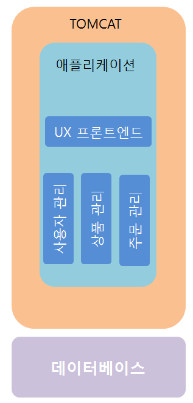
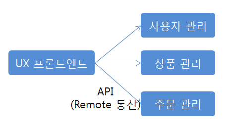

##마이크로 서비스 아키텍처

마이크로 서비스 아키텍처를 이해하려면 먼저 **모노리틱 아키텍처** 스타일에 대해서 이해해야 한다. 모노리틱 아키텍처 스타일은 기존의 전통적인 웹 시스템 개발 스타일로, 하나의 애클리케이션 내에 모든 로직이 들어가 있는 '통짜 구조'이다.   ex)

위와 같이 온라인 쇼핑몰이 있을 때 톰캣 서버에서 도는 WAR 파일내에 사용자 관리, 상품, 주문 관리 등 모든 컴포넌트가 들어 있고 이를 처리하는 UX로직까지 하나로 포장돼서 들어가 있는 구조이다. 

전체 애플리케이션을 하나로 처리하기 때문에 개발 도구에서 하나의 애플리케이션만 개발하면 되고 배포 역시 간편하며 테스트도 하나의 애플리케이션만 수행하면 되므로 편리하다. 

**모노리틱 아키텍처 문제점** 
작은 크기의 애플리케이션에서는 유용하지만, 규모가 큰 애플리케이션에서는 빌드 및 배포 시간, 서버의 기동 시간이 오래걸린다. 또한 프로젝트를 진행하는 관점에서도 한 두 사람의 실수는 전체 시스템의 빌드 실패를 유발하기 때문에 프로젝트가 커질수록 협업 개발하기가 쉽지 않다. 

그리고 시스템 컴포넌트들이 서로 로컬 콜(Call-by-Reference) 기반으로 타이트하게 연결되어 있기 때문에, 전체 시스템의 구조를 제대로 파악하지 않고 개발을 진행하면 특정 컴포넌트나 모듈에서의 성능 문제나 장애가 다른 컴포넌트에까지 영향을 주게 된다.

마지막으로 특정 컴포넌트를 수정할 때 수정된 컴포넌트만 재배포 하는 것이 아니라 전체 애플리케이션을 재컴파일해서 전체를 다시 통으로 재배포 해야 한다. 이 때문에 잦은 배포가 있는 시스템은 불리하며 컴포넌트별로 기능 / 비기능적 특성에 맞춰서 다른 기술을 도입하고자 할때 유연하지 않다. 예를들어 전체 애플리케이션을 자바로 개발했다고 했을 때 파일 업로드/다운로드 와 같은 IO 작업이 많은 컴포넌트는 Node.js를 사용하는 것이 좋을 수 있으나, 애플리케이션이 자바로 개발되었기 때문에 다른 기술을 집어넣기가 매우 어렵다. 

**마이크로 서비스 아키텍처** 
마이크로 서비스 아키텍처는 대용량 웹 서비스가 많아짐에 따라 정의된 아키텍처인데, 그 근간은 SOA에 두고 있다. SOA가 엔터프라이즈 시스템을 중심으로 고안된 아키텍처라면, 마이크로 서비스 아키텍처는 SOA 사상에 근간을 두고, 대용량 웹 서비스 개발에 맞는 구조로 사상이 경량화되고 대규모 개발팀의 조직 구조에 맞도록 변형된 아키텍처다. 

**마이크로 서비스 아키텍처의 구조** 

마이크로 서비스 아키텍처의 구조는 위와 같은 모양을 따른다. 각 컴포넌트는 서비스라는 형태로 구현되고 API를 이용하여 타 서비스와 통신을 한다.  

배포 구조 관점에서도 각 서비스는 독립된 서버로 타 컴포넌트와의 의존성 없이 독립적으로 배포된다. 

예를 들어 사용자 관리 서비스는 독립적인 war 파일로 개발되어 독립된 톰캣 인스턴스에 배치된다. 확장을 위해서 서비스가 배치된 톰캣 인스턴스는 횡적으로 스케일이 가능(스케일 아웃)하고, 앞단에 로드 밸런서를 배치하여 서비스 간의 로드를 분산시킨다. 

