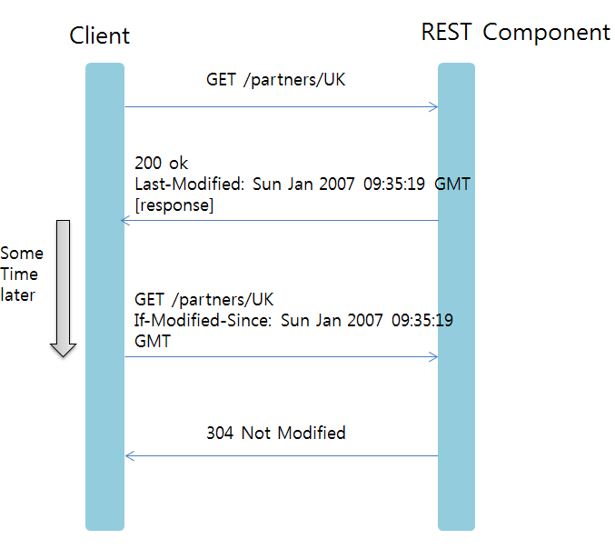
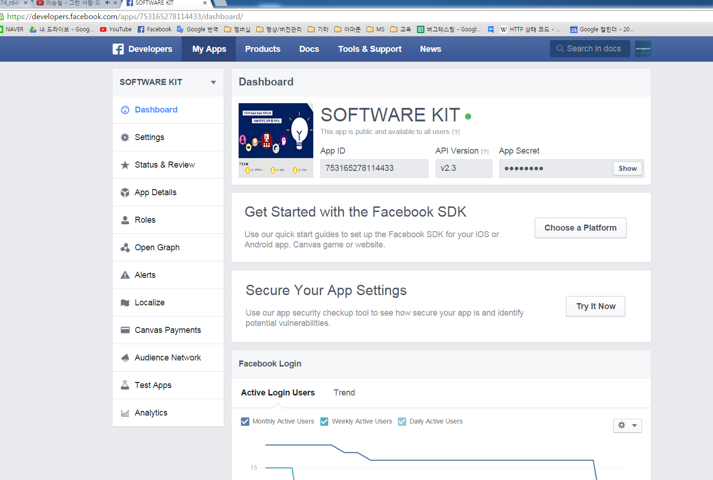
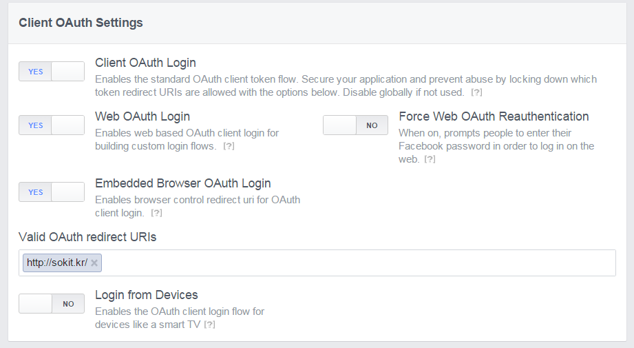
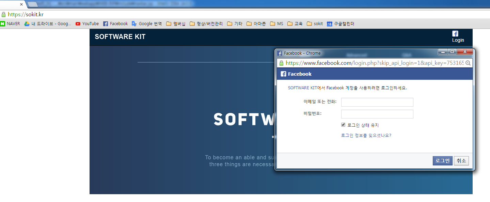

##1. REST기본 

REST는 근래에 들어 HTTP와 JSON을 함께 사용하여 OPEN API를 구현하는 방법으로 주류를 이루고 있으며, 대부분의 OPEN API는 이 REST 아키텍처를 기반으로 설계 및 구현되고 있다. 

REST원리를 따르는 시스템은 Restful이란 용어로 지칭된다.

REST는 크게 리소스, 메소드, 메세지 3가지 요소로 구성된다. <br>

ex) 이름이 Terry인 사용자를 생성한다
```
HTTP POST , http://myweb/users/
{
    "users" : {
        "name" : "terry"
    }
}
```
리소스  = http://myweb/users 형태의 URI <br>
HTTP POST메소드 = 생성한다<br>
메세지 = JSON 문서를 이용한 내용<br>

###1.1 HTTP 메소드

HTTP에는 여러 가지 메소드가 있지만, REST에서는 CRUD(Create, Read, Update, Delete)에 해당하는 4가지의 메소드만 사용한다.

| 메소드 | 의미 | Idempotent |
| -- | -- | -- |
| POST | Create | No |
| GET | Select | Yes |
| PUT | Update | Yes |
| DELETE | Delete | Yes |

Idempotent(멱등성)은 **여러 번 수행해도 결과가 같은 경우**를 의미한다. <br>
ex) a++은 Idempotent 하지 않다고 하지만(호출할 때마다 값이 증가하기 때문), a=4와 같은 명령은 반복적으로 수행해도 Idempotent 하다(값이 같기 때문).

POST 연산은 리소스를 추가하는 연산이기 때문에 Idempotent 하지 않지만, 나머지 GET, PUT, DELETE는 반복 수행해도 Idempotent하다. <br>GET의 경우 게시물의 조회 수 카운트를 늘려준다던가 하는 기능을 같이 수행했을 때는 Idempotent 하지 않은 메소드로 정의해야 한다. 

REST는 개별 API를 상태 없이 수행하게 된다. 그래서 해당 REST API를 다른 API와 함께 호출하다가 실패하였을 경우, 트랜잭션 복구를 위해서 다시 실행해야 하는 경우가 있는데, Idempotent 하지 않은 메소드의 경우는 기존 상태를 저장했다가 다시 원상복귀해줘야 하는 문제가 있지만, Idempotent 한 메소드의 경우에는 반복적으로 다시 메소드를 수행해주면 된다. <br>
ex) 게시물 조회를 하는 API가 있을 때 조회할 때마다 조회 수를 올리는 연산을 수행한다면 이 메소드는 Idempotent 하다고 볼 수 없고 조회하다가 실패하였을 때는 올라간 조회 수를 다시 -1 해줘야 한다. 즉, Idempotent 하지 않은 메소드에 대해서는 트랜잭션에 대한 처리에 주의가 필요하다. 

###1.2 REST의 리소스

REST는 리소스 지향 아키텍처 스타일이라는 정의답게 모든 것을 리소스, 즉 명사로 표현하며, 각 세부 리소스에는 ID를 붙인다.<br>
ex) 사용자라는 리소스 타입 : http://myweb/users <br>
terry라는 ID를 갖는 리소스 : http://myweb/users/terry<br>

REST의 리소스가 명사의 형태를 띄우다 보니 명령(Operation) 성격의 API를 정의하는 것에서 혼동이 올 수 있다. <br>
ex) "푸시 메세지를 보낸다"를 /myweb/sendpush 형태로 잘못 정의가 될 수 있지만 "푸시 메세지 요청을 생성한다"라는 형태로 정의를 변경하면, API포맷은 POST/myweb/push 형태와 같은 명사형으로 정의할 수 있다. <br>

**모든 형태의 명령이 이런식으로 정의가 가능한 것은 아니지만, 될 수 있으면 리소스 기반의 명사 형태로 정의하는 게 REST 형태의 디자인이 된다.**

사용자 생성 <br>
```
HTTP POST , http://myweb/users/
{
    "name" : "terry",
    "address" : "seoul"
}
```
http://myweb/users라는 리소스를 이름은 terry, 주소는 seoul이라는 내용(메세지)으로 HTTP POST를 이용해서 생성하는 정의 

조회 
```
HTTP Get, http://myweb/users/terry
```
생성된 리소스 중에서 http://myweb/users라는 사용자 리소스 중에 ID가 terry인 사용자 정보를 조회해오는 방식(조회이기 때문에 HTTP GET을 사용한다)

업데이트 
```
HTTP PUT, http://myweb/users/terry
{
    "name":"terry",
    "address":"suwon"
}
```
http://myweb/users라는 사용자 리소스 중에 ID가 terry인 사용자 정보에 대해서 주소를 suwon으로 수정하는 방식(수정은 HTTP메소드 중에 PUT을 사용한다) 

삭제
```
HTTP DELETE, http://myweb/users/terry
```
http://myweb/users라는 사용자 리소스 중에 ID가 terry인 사용자 정보를 삭제하는 방법

###1.3 REST 특성
1. 유니폼 인터페이스(Uniform Interface)
    - REST는 HTTP 표준에만 따른다면 어떠한 기술이든지 사용할 수 있는 인터페이스 스타일이다.
2. 무상태성(Stateless)
    - '상태가 있다,없다'라는 의미는 사용자나 클라이언트의 컨텍스트를 서버 쪽에서 유지하지 않는다는 의미로, 쉽게 표현하면 HTTP 세션과 같은 컨텍스트 저장소에 상태 정보를 저장하지 않는 형태를 의미한다. 상태 정보를 저장하지 않으면 각 API 서버는 들어오는 요청만을 메세지로 처리하고, 세션과 같은 컨텍스트 정보를 신경 쓸 필요가 없으므로 구현이 단순해진다. 
3. 캐시 가능(Cacheable)
    - REST의 큰 특징 중 하나는 HTTP라는 기존의 웹 표준을 따르기 때문에 웹에서 사용하는 기존 인프라를 그대로 활용할 수 있다는 점이다. HTTP의 리소스들을 웹 캐시 서버 등에 캐싱하는 것은 용량이나 성능 면에서 많은 장점이 있다. HTTP 프로토콜 표준에서 사용하는 Last-Modifyed태그나 E-Tag를 이용하면 캐싱을 구현할 수 있다. <br>  <br>다음과 같이 HTTP GET을 Last-Modified 값과 함께 보냈을 때 콘텐츠에 변화가 없으면 REST 컴포넌트는 '304 Not Modified'를 반환하면 클라이언트는 자체 캐시에 저장된 값을 사용하게 된다. 
4. 자체 표현 구조(Self-descriptiveness)
    - REST의 또 다른 특징 중 하나는 REST API 자체가 쉬워서 API 메세지만 보고도 이를 이해 할 수 있는 자체 표현 구조로 되어 있다는 것이다. 
5. 클라이언트 서버 구조 
    - REST 서버는 API를 제공하고 제공된 API를 이용해서 비즈니스 로직 처리 및 저장을 책임진다. 클라이언트는 사용자 인증이나 컨텍스트(세션, 로그인 정보)를 직접 관리하고 책임지는 구조로 역할이 나누어지고 있다. 이렇게 각각의 역할이 확실하게 구분되면서 개발 관점에서 클라이언트와 서버에서 개발해야 할 내용이 명확해지고 서로의 개발에서 의존성이 줄어들게 된다.
6. 계층형 구조 
    - 클라이언트로서는 REST API 서버만 호출한다. 그러나 서버는 다중 계층으로 구성될 수 있다. 순수 비즈니스 로직을 수행하는 API 서버와 그 앞단에 사용자 인증, 암호화, 로드 밸런싱을 하는 계층을 추가해서 구조상의 유연성을 둘 수 있는데 이는 마이크로 서비스 아키텍처의 API Gateway나 HAProxy Apache와 같은 Reverse Proxy를 이용해서 구현하는 경우가 많다. 


###1.4 REST 안티 패턴 

1. GET이나 POST를 이용한 터널링 <br>
ex) http://myweb/users?method=update&id=terry <br> 메소드의 실제 동작은 리소스를 업데이트 하는 내용인데, HTTP PUT을 사용하지 않고 GET에 쿼리 파라미터로 넘겨서 명시했다. 

    ex) Insert(Create)성 오퍼레이션이 아닌데도 불구하고 JSON body에 오퍼레이션 명을 넘기는 형태
```
HTTP POST, http://myweb/users
{
    "getuser" : 
    {
        "id":"terry"
    }
}
```
2. Self-descriptiveness 속성을 사용하지 않음
    - 자체 표현 구조를 갉아먹는 가장 대표적인 사례가 GET, POST를 이용한 터널링 구조
3. HTTP 응답 코드를 사용하지 않음
    - 1~2개의 HTTP 응답 코드만 사용하는 문제 

##2. REST API 디자인 가이드


###2.1 REST URI는 단순하고 직관적으로 만들자 

최대 2단계 정도로 간단하게 만드는 것이 이해하기 편하다.
```
/dogs/
/dogs/1234
```

URI에 리소스명은 동사보다는 명사를 사용한다. REST API는 리소스에 대해서 행동을 정의하는 형태를 사용한다. 
```
POST /dogs
```
위는 /dogs라는 리소스를 생성하라는 의미로, URL은 HTTP 메소드에 의해 CRUD(생성, 읽기, 수정, 삭제)의 대상이 되는 개체(명사)라야 한다. 

잘못된 예들은 다음과 같다.
```
HTTP POST: /getDogs
HTTP POST: /setDogsOwner
```
위의 예제는 HTTP POST로 정의하지 않고 get/set 등의 행위를 URL에 붙인 경우인데, 좋지 않다. <br> 그리고 될 수 있으면 단수형 명사(/dog) 보다는 복수형 명사(/dogs)를 사용하는 것이 의미상 표현하기가 더 좋다.

```
HTTP GET: /dogs
HTTP POST: /dogs/{puppy}/owner/{terry}
```

일반적으로 권고하는 디자인은 다음과 같다.

| 리소스 | POST | GET | PUT | DELETE |
| -- | -- | -- | -- | -- |
| 리소 | create | read | update | delete |
| /dogs | 새로운 dogs 등록 | dogs 목록을 반환 | Bulk로 여러 dogs 정보를 업데이트 | 모든 dogs 정보를 삭제 |
| /dogs/baduk | 에러 | baduk이라는 이름의 dogs 정보를 반환 | baduk이라는 이름의 dogs 정보를 업데이트 | baduk이라는 이름의 dogs 정보를 삭제 |

###2.2 리소스 간의 관계를 표현하는 방법

REST 리소스 간에는 연관 관계가 있을 수 있다.예를 들어 사용자가 소유한 디바이스 목록이나 사용자가 가진 강아지들 등이 예가 될 수 있는데, 사용자-디바이스 또는 사용자-강아지 등 각각의 리소스 간의 관계를 표현하는 방법에는 여러 가지가 있다.

**옵션 1 : 서브 리소스로 표현하는 방법**<br>
예를 들어 사용자의 휴대전화 디바이스 목록을 표현해보면 다음과 같이 /terry라는 사용자가 가진 디바이스 목록을 반환하는 방법이 있다. 
```
/"리소스명"/"리소스 id"/"관계가 있는 다른 리소스명" 형태 
HTTP GET: /users/{userid}/devices
예)/users/terry/devices
```

**옵션 2 : 서브 리소스에 관계를 명시하는 방법** <br>
만약에 관계명이 복잡하다면 이를 명시적으로 표현하는 방법이 있다. 예를 들어 사용자가 '좋아하는' 디바이스 목록을 표현해보면 다음은 terry라는 사용자가 좋아하는 디바이스 목록을 반환하는 방식이다.
```
HTTP GET: /users/{userid}/likes/devices
예)/users/terry/likes/devices
```
옵션 1의 경우 일반적으로 소유 'has'의 관계를 묵시적으로 표현할 때 좋으며, 옵션 2의 경우에는 관계명이 애매하거나 구체적인 표현이 필요할 때 사용한다. 

###2.3 에러 처리
에러 처리의 기본은 HTTP 응답 코드를 사용한 후 HTTP 응답 코드를 사용한 후 응답 보디(Response Body)에 에러에 대한 자세한 내용을 서술하는 것이다. 

다음과 같은 응답 코드만 사용하는 것을 권장한다. <br>
200 - 성공 <br>
400 Bad Request - field validation 실패 시 <br>
401 Unauthorized - API 인증, 인가 실패<br>
404 Not found - 해당 리소스가 없음<br>
500 Internal Server Error - 서버 에러 <br>

에러에는 에러 내용에 대한 구체적인 내용을 HTTP 보디에 정의해서 상세한 에러의 원인을 전달하는 것이 디버깅에 유리하다. <br> 
ex)
```
HTTP Status Code: 401
{
    "status":"401", "message":"Authenticate","code":200003, "more in-fo":"http://www.twillo.com/docs/errors/20003"
}
```

에러 발생 시에 선택적으로 에러에 대한 스택 정보를 포함 시킬 수 있다. 에러 메세지에서 에러 스택 정보를 출력하는 것은 대단히 위험한 일이다. 내부적인 코드 구조와 프레임워크 구조를 외부에 노출함으로써, 해커들에게 해킹을 할 수 있는 정보를 제공하기 때문이다. 일반적인 서비스 구조에서는 에러 스택 정보를 API 에러 메세지에 포함 시키지 않는 것이 바람직하다. 

###2.4 API 버전 관리 

필자는 다음과 같은 형태로 정의할 것을 권장한다<br>
```
{servicename}/{version}/{REST URL}
예)api.server.com/account/v2.0/groups
```
이는 서비스의 배포 모델과 관계가 있는데 자바 애플리케이션의 경우 account.v1.0.war, account.v2.0.war와 같이 다른 war로 각각 배포하여 버전별로 배포 바이너리를 관리할 수 있고 앞단에 서비스명을 별도의 URL로 떼어 놓는 것은 이후에 서비스가 확장되었을 때 account 서비스만 별도의 서버로 분리해서 배포하는 경우를 대비하기 위함이다. 

외부로 제공되는 URL은 api.server.com/account/v2.0/groups로 하나의 서버를 가리키지만, 내부적으로 HAProxy 등의 Reverse Proxy를 이용해서 이런 URL을 맵핑할 수 있는데, api.server.com/account/v2.0/groups를 내부적으로 account.server.com/v2.0/groups로 맵핑하도록 하면 외부에 노출되는 URL 변경 없이 향후 확장되었을 때 서버를 물리적으로 분리해내기가 편리하다. 

###2.5 페이징 

페이스북 API가 직관적이기 때문에 페이스북 스타일을 사용할 것을 권장한다. <br>

ex) 100번째 레코드부터 125번째 레코드를 받는 API 정의하기 
```
페이스북 스타일 : /record?offset=100&limit=25
```
100번째 레코드에서부터 25개의 레코드를 출력한다는 의미이다. 

###2.6 부분 응답 처리
리소스에 대한 응답 메세지에 대해서 굳이 모든 필드를 포함할 필요가 없는 경우가 있다. 예를 들어 페이스북 feed의 경우 사용자 ID, 이름, 글 내용, 날짜, 좋아요 카운트, 댓글, 사용자 사진 등 여러가지 정보를 갖는데, API를 요청하는 클라이언트의 용도에 따라 선별적으로 몇 가지 필드만이 필요할 수 있다. 

페이스북 스타일의 부분 응답을 사용할 것을 권장한다 <br>
```
/terry/friends?fields=id, name
```

###2.7 검색(전역 검색과 지역 검색)
검색은 HTTP GET에서 쿼리 스트링 검색 조건을 정의하는 경우가 일반적이다 
```
/users?name=cho&region=seoul
```
그런데 여기에 페이징 처리를 추가하게 되면 다음과 같이 된다. 
```
/users?name=cho&region=seoul&offset=20&limit=10
```

페이징 처리에 정의된 offset과 limit가 검색 조건인지 아니면 페이징 조건인지 분간이 가지 않는다. 그래서 쿼리 조건은 하나의 쿼리 스트링으로 정의 하는것이 좋다. 

```
/user?q=name%3Dcho,  region%3Dseoul&offset=20&limit=10
```

이런 식으로 검색 조건에 URLEncode를 써서 'q=name%3Dcho, region%3Dseoul'처럼 표현하고, 구분자를 사용하게 되면 검색 조건은 다른 쿼리 스트링과 분리된다. 

다음으로는 검색 범위인데 전역 검색은 전체 리소스에 대한 검색이고 /search와 같은 검색 URI를 사용한다. 
```
/search?q=id%3Dterry
```

반대로 특정 리소스 안에서의 검색은 다음과 같이 리소스명에 쿼리 조건을 붙이는 식으로 표현할 수 있다. 
```
/users?q=id%3Dterry
```

###2.8 HATEOS를 이용한 링크 처리 
HATEOS는 Hypermedia as the engine of application state의 약어로, 하이퍼미디어의 특징을 이용하여 HTTP 응답에 다음 액션이나 관계된 리소스에 대한 HTTP 링크를 함께 반환하는 것이다.
```
{
    [
        {
            "id":"user1",
            "name":"terry"
        },
        {
            "id":"user2",
            "name":"carry"
        }
    ],
    "links" :[
        {
            "rel":"pre_page",
            "href":"http://xxx/users?offset=6&limit=5"
        },
        {
            "rel":"next_page",
            "href":"http://xxx/users?offset=11&limit=5"
        }
    ]
}
```
예를들어 앞서 설명한 페이징 처리의 경우 반환 시 전후 페이지에 대한 링크를 제공한다거나 위와 같이 표현하거나 연관된 리소스에 대한 디테일한 링크를 표시하는 것에 이용할 수 있다. 

```
{
    "id":"terry"
    "links":[
        {
            "rel":"friends",
            "href":"http://xxx/users/terry/friends"
        }
    ]
}
```
위는 사용자 정보 조회 시 친구 리스트를 조회할 수 있는 링크를 HATEOS를 이용하여 추가한 것이다.

HATEOS를 API에 적용하게 되면 자체 표현 구조 특성이 증대되어 API에 대한 가독성이 증가하는 장점이 있지만, 응답 메세지가 다른 리소스 URI에 대한 의존성을 가지기 때문에 구현이 다소 까다롭다는 단점이 있다. 

###2.9 단일 API 엔드포인트 활용 
API 서비스는 물리적으로 서버가 분리되어 있더라도 단일 URL을 사용하는 것이 좋은데, 방법은 HAProxy나 nginx와 같은 Reverse Proxy를 사용하는 방법이 있다. HAProxy를 앞에 세우고 api.apiserver.com이라는 단일 URL을 구축한 후에 HAProxy 설정에서 api.apiserver.com/user는 user.apiserver.com으로 라우팅하게 하고, api.apiserver.com/car는 car.apiserver.com으로 라우팅하도록 구현하면 된다. 

##3. REST의 문제점 

HTTP + JSON만 쓴다고 REST가 아니다. REST 아키텍처를 제대로 사용하는 것은 리소스를 제대로 정의하고 이에 대한 CRUD를 HTTP 메소드인 POST/PUT/GET/DELETE에 대해서 맞춰 사용하며, 에러 코드에 대해서 HTTP 응답 코드를 사용해야 한다.

###3.1 표준 규약이 없다. 
###3.2 기존의 전통적인 RDBMS에 적용하기가 쉽지 않다. 
리소스를 표현할 때 리소스는 DB의 하나의 행(Row)이 되는 경우가 많은데, DB의 경우는 기본 키가 복합 키 형태로 존재하는 경우가 많다(여러 개의 칼럼이 묶여서 하나의 PK가 되는 경우). DB에서는 유효한 설계일지 몰라도 HTTP URI는 / 에 따라서 계층 구조를 가지기 때문에 이에 대한 표현이 매우 부자연스러워진다. 

예를들어 DB의 PK가 '세대주 주민번호' + '사는 지역' + '본인 이름' 일때 DB에서는 문제없으나 REST에서 이를 userinfo/{세대주 주민번호}/{사는 지역}/{본인 이름} 식으로 표현하게 되면 다소 이상한 의미가 부여될 수 있다. 

##4. REST 보안 
###4.1 API에 대한 인증 

**클라이언트 인증 추가**<br>
추가적인 보안 강화를 위해 사용자 인증(ID, Passwd)뿐만 아니라, 클라이언트 인증 방식을 추가할 수 있다. 페이스북은 API 토큰을 발급받으려면 사용자 ID , 비밀번호 뿐만 아니라 Client ID와 Client Secret이라는 것을 같이 입력받도록 하는데, Client ID는 특정 앱에 대한 등록 ID이고 Client Secret은 특정 앱에 대한 비밀번호로, 페이스북 개발자 포털에서 앱을 등록하면 앱 별로 발급되는 일종의 비밀번호이다. <br>

API 토큰을 발급받을 때, Client ID와 Client Secret을 이용하여 클라이언트 앱을 인증하고 사용자 ID와 비밀번호를 추가로 받아서 사용자를 인증하여 API 액세스 토큰을 발급받는다. <br>

**제 3자 인증 방식(OAuth 2.0 Autorization grant type)** <br>
제 3자 인증 방식은 페이스북이나 트위터와 같은 API 서비스 제공자들이 파트너 애플리케이션에 많이 적용하는 방법으로 내 서비스를 페이스북 계정을 이용하여 인증을 하는 경우다. 

cf) sokit은 개인 웹 서비스 프로젝트 이름<br>

중요한 점은 서비스(Sokit)에 대해서 해당 사용자가 페이스북 유저임을 인증해주고, 서비스(Sokit)는 사용자의 비밀번호를 받지 않는다. 대신 페이스북이 사용자를 인증하고 서비스(Sokit)에 알려주는 방식이다. 즉, 서비스에는 페이스북 유저의 비밀번호가 노출되지 않는다.

전체적인 흐름을 보면 다음과 같다. 

1. 먼저 페이스북의 개발자 포털에 접속하여, 페이스북 인증을 사용하고자 하는 애플리케이션 정보를 등록한다.(서비스명, 서비스 URL, 그리고 인증이 성공했을 때 인증 성공 정보를 받을 콜백 URL)

2. 페이스북 개발자 포털은 등록된 정보를 기준으로 해당 애플리케이션에 대한 client_id와 client_secret을 발급한다. 이 값은 앞에서 설명한 클라이언트 인증에 사용된다.
3. 다음으로 개발하고자 하는 애플리케이션에 이 client_id와 client_secret 등을 넣고, 페이스북 인증 페이지 정보를 넣어서 애플리케이션을 개발한다. 

Sokit 웹 애플리케이션은 Javascript SDK를 적용했다. 


애플리케이션이 개발돼서 실행되면 다음과 같은 흐름에 따라서 사용자 인증을 수행하게 된다. 
1. 웹 브라우저에서 사용자가 Sokit 서비스에 접근하려고 요청한다. 
2. Sokit은 사용자의 인증이 되지 않았기 때문에 페이스북 로그인 페이지 URL을 HTTP 리다이렉션으로 브라우저에 보낸다. 이때 이 URL로 페이스북에 이 로그인 요청이 Sokit에 대한 사용자 인증 요청임을 알려주고자 client_id 등의 추가 정보와 함께 페이스북의 정보 접근 권한(사용자 정보, 그룹 정보 등)을 scope라는 필드를 통해서 요청한다.


3. 브라우저는 페이스북 로그인 페이지로 이동하여 2단계에서 받은 추가적인 정보와 함께 로그인을 요청한다.
4. 페이스북은 사용자에게 로그인 창을 보낸다.
5. 사용자는 로그인 창에 ID/비밀번호를 입력한다.
6. 페이스북은 사용자를 인증하고 인증 관련 정보와 함께 브라우저로 전달하면서 Sokit의 로그인 완료 페이지로 리다이렉션을 요청한다. 
7. Sokit은 6에서 온 인증 관련 정보를 받는다.
8. Sokit은 이 정보를 가지고 페이스북에 이 사용자가 제대로 인증을 받은 사용자인지 문의한다. 
9. 페이스북은 해당 정보를 보고 제대로 인증된 사용자임을 확인해주고 Access Token을 발급한다. 
10. Sokit은 9에서 받은 Access Token으로 페이스북 API 서비스에 접근한다.

