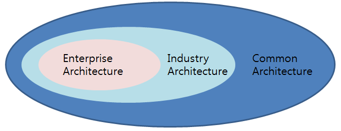
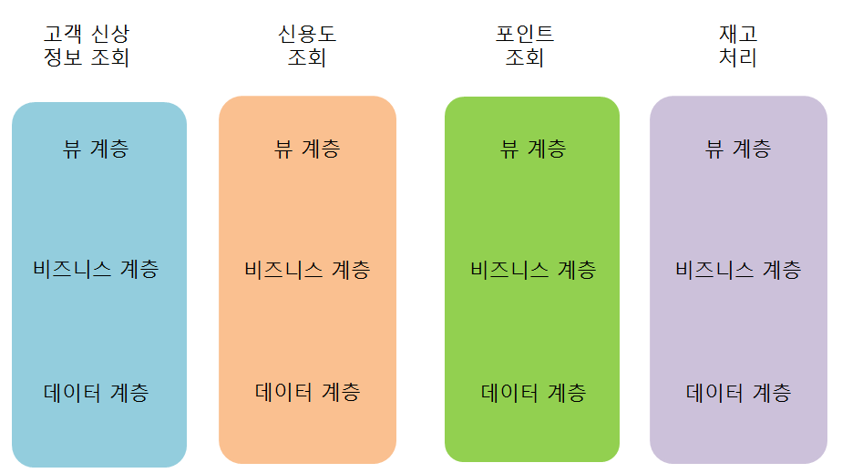
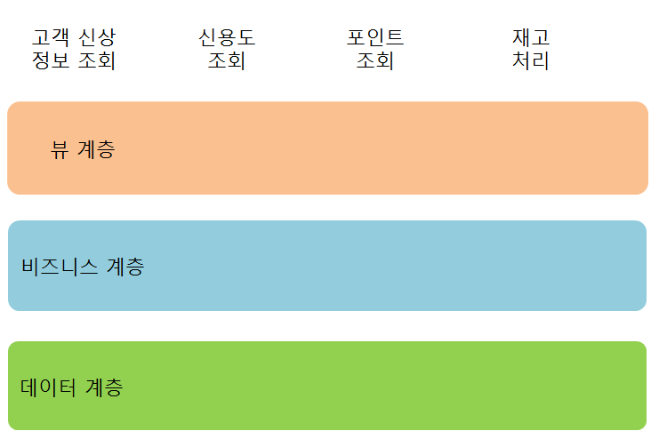

##레퍼런스 아키텍처

레퍼런스 아키텍처는 아키텍처 설계를 할 때 참고할 수 있는 아키텍처다. 그 담위에 따라서 다음과 같이 3가지로 구분할 수 있다. 

**Common Architecture**는 기술 중심으로, 일반적인 소프트웨어 개발에 사용할 수 있는 아키텍처 스타일이다. 특정 업무 도메인에 대한 종속성 없이 널리 적용할 수 있다.  
SOA(서비스 지향 아키텍처) , CBD(컴포넌트 기반 아키텍처), ROA(리소스 기반 아키텍처), EAI(엔터프라이즈 애플리케이션 통합) 등이 이에 해당한다.  

**Industry Architecture**는 업무 도메인에 대한 종속성을 갖는다. 금융, 공공, 가스/오일, 하이테크/제조, 통신 등 특정 산업 분야에 대한 레퍼런스 아키텍처다. 

**Enterprise Architecture**는 업무 도메인 내에서 회사 내부의 표준 아키텍처를 정의한다.  

##SOA의 기본 개념

SOA란 기본 애플리케이션들의 기능을 비즈니스적인 의미가 있는 기능 단위로 묶고 

표준화된 호출 인터페이스를 통해 ex) XML/HTTP, CORBA, SOAP, REST 

서비스라는 소프트웨어 컴포넌트 단위로 재조합한 후, 이 서비스들을 서로 조합하여 

업무 기능을 구현한 애플리케이션을 만들어내는 소프트웨어 아키텍처다. 

SOA는 서비스 구축을 위한 표준 인터페이스에 대한 방안으로 제시되었던 CORBA 등의 기술 난도 가 높았으나 XML/HTTP나 SOAP 기반의 웹 서비스 기술의 등장으로 서비스의 구현 기술 난도 문제가 해결되고 각각의 업무별로 독립된 시스템의 형태로 개발되어 이에 대한 통합이 필요해지면서 주목받게 되었다. 

cf) 지금은 REST가 SOAP을 밀어내고 Web API의 실질적 표준으로 자리매김 한거같다. 

SOA 기반의 시스템을 구축하는데 필요한 기술을 이야기하면 SOAP를 많이 이야기 하는데 꼭 SOAP를 이용해서 서비스 기반 아키텍처를 만들어야 하는 것은 아니다. (REST가능)

SOAP 과 REST 비교  
http://greatkim91.tistory.com/79 여기 글 참고  

**SOAP** 
SOAP는 웹서비스를 만들기 위한 표준들이 있다. (WSDL, WS-Security 등등) 
SOAP의 힘은 이런한 표준에서 나온다. 하지만 단점은 복잡성이다.(복잡도는 REST와 비교했을때)
그리고 REST에 비해 무겁다. 

장점
- 언어, 플랫폼 그리고 통신에 중립적
- 분산 컴퓨팅 환경을 다루기 위해 설계
- 웹 서비스를 위해 보급된 많은 표준(WSDL, WS-*)과 벤더에서 제공하는 도구들
- 에러 처리에 대한 내용이 기본으로 내장
- 확장성

단점 
- 개념적으로 REST 보다 어렵고 무거움
- 복잡함 

**REST** 
REST는 HTTP의 기본 개념에 충실히 따르는 웹서비스를 이야기한다. 
이러한 웹 서비스를 Restful 웹 서비스라고 하며 단순한 HTTP 요청과 그결과를 단순한 XML,JSON등의 포맷으로 돌려주는 구조 

장점 
- 언어, 플랫폼에 중립적
- SOAP보단 개발하기 단순함
- 학습곡선이 작고 도구가 거의 필요없음
- 간결함. 추가적인 메시징 계층이 없음
- 웹에 가까운 설계와 철학

단점
- point-to-point 통신 모델을 가정함 둘 이상을 대상으로 상호작용하는 분산환경에는 유용하지 않음
- 보안, 정책 등에 대한 표준이 없음 
- HTTP 통신 모델에 의존 

##SOA에서 서비스의 정의
서비스란 플랫폼에 종속되지 않는 표준 인터페이스(CORBA나 웹 서비스)를 통해서 기업의 업무를 표현한 '느슨하게 연결되고 상호 조합 가능한 소프트웨어'이다. 

서비스를 말하는 데 있어서 가장 중요한 특징은 "기업의 업무를 표현한다."라는 것이다. 다시말해 '임직원 정보 서비스', '계좌 이체 서비스'같은 기업의 업무는 서비스로 정의할 수 있지만 'JNDI Lookup', 'SMTP 이메일 클라이언트'와 같은 비 업무성 서비스는 존재할 수 없다. 

**서비스의 특징** 
1. 수직적 분할 
수직적 분할이란 애플리케이션을 개발 할 때 전체 애플리케이션을 여러 개의 서비스로 나누고 각각의 서비스를 독립적으로 개발하는 것을 말한다. 

이전의 소프트웨어 개발은 애플리케이션을 아래와 같이 수평적으로 분리하였다. 

그러나 SOA에서는 각각의 서비스가 데이터 계층, 비즈니스 로직, 뷰에 대한 모듈을 모두 가지고 있다. 그래서 각 서비스 간의 의존성이 최소화된다.

2. 표준 인터페이스 기반 
서비스가 제공하는 인터페이스는 표준 기술로 구현되어야 한다. 즉, 플랫폼이나 기술에 종속되지 않아야 한다. 
3. 느슨한 결합 
각 서비스 컴포넌트들은 다른 서비스에 대해 의존성이 최소화 되어 있어서 서비스의 구현 내용을 변ㅎ경하였을 때 다른 서비스는 이에 영향을 거의 받지 않는다. 
4. 조합 가능 
서비스 컴포넌트들은 섭로 연결되어 하나의 조합된 형태의 애플리케이션을 구성해야 하기 때문에 서비스 간에 연결 및 조합이 가능해야 한다. 
5. 큰 단위의 서비스 분류 
서비스의 구성 단위나 인터페이스의 단위는 업무 단위를 기본으로 한다.
6.  검색 가능 
SOA 시스템의 규모가 증가함에 따라 서비스의 중복이 발생되면 안된다. 그러므로  서비스에 대한 정보가 검색 가능해야 한다. 검색 내용에는 서비스의 내용과 서비스에 대한 사용 방법, 권한, 보안에 대한 정보들을 포함해야 한다.