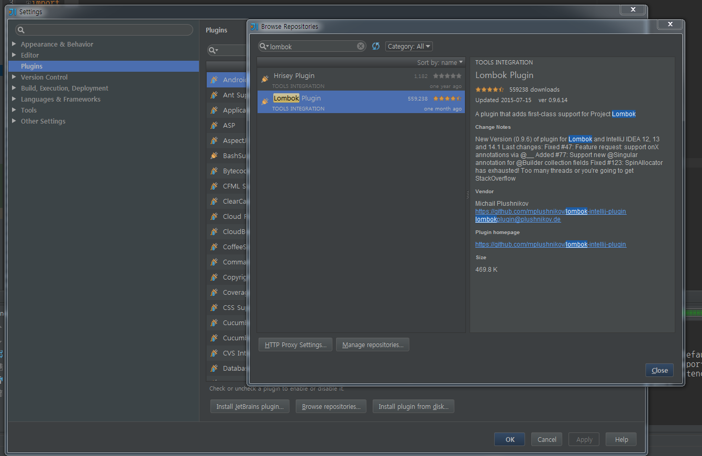

# 백기선님의 Spring Boot 강의 


**github : https://github.com/keesun/amugona**


소스를 다운받자마자 메소드를 인식 못한다는 에러가 발생했다. 이유는 lombok 때문(spring boot에서 지원안해줌)) !! 

lombok이 뭔고하니 
```
@Entity
@Getter
@Setter
public class Account {

    @Id @GeneratedValue
    private Long id;

    @Column(unique = true)
    private String username;

    private String password;

    private String email;

    private String fullName;

    @Temporal(TemporalType.TIMESTAMP)
    private Date joined;

    @Temporal(TemporalType.TIMESTAMP)
    private Date updated;

}
```
위 처럼 getter/setter를 줄여주는 기능이다.

lombok을 사용하기 위해서는 

1. lombok plugin 설치 

2. lombok 설정 


AccountController에서 

클래스에 @Controller, @ResponseBody 두개를 붙이면 이 클래스안의 모든 public 메소드에 @ResponseBody가 다 적용이 되는것이다.
(@RestContoller = @Controller + @ResponseBody)
요즘은 서버사이드 개발이 API개발로 바뀌었기 때문에 @RestController 쓰는게 무방하다. 

메인 메소드를 실행하면 내장 임베디드 톰캣이 실행되면서 뜬다. 

Account 클래스를 만드는데 

```
@Id @GeneratedValue
private Long id;
```
@Id는 해당 프로퍼티가 테이블의 기본키 역할을 한다는 것을 나타낸다. @GeneratedValue는 기본키의 값을 위한 자동 생성 전략을 명시하는데 사용한다. 

AccountRepository는 jpa사용해서 만듦 두번째 인자는 pk 데이터타입
```
extends JpaRepository<Account, Long>
```

AccountService 클래스는 @Service 등록해서 component scan으로 빈으로 등록되게끔만 하고 @Autowired로 AccountRepository를 가지고 있게끔만 한다. 그리고 @Transactional 붙여주면 이 클래스 안에 만드는 모든 public 메소드는 다 transactional 애노테이션이 적용된다. 

AccountController에서 
```
public ResponseEntity createAccount(@RequestBody @Valid AccountDto.Create create,
                                          BindingResult result) {
```
@RequestBody 대신에 @RequestParam, @ModelAttribute 많이 썼었는데 요즘은 서버 사이드 개발이 주로 REST API쪽으로 많이 가다보니까 Request 본문에 들어오는걸 파싱받는게 많아져서 @RequestBody를 많이 씀
@RequestBody를 쓰면 메세지 컨버터가 작동됌 (@RequestParam, @ModelAttribute와는 다르게 바인딩해줌) 
spring-boot를 쓰게되면 여러개의 메세지 컨버터가 이미 등록이 되어 있어 

그런데 Acount 객체를 바로 받는게 아니라 AccountDto 객체를 따로 만들어서 (내가 받을것만 또 지정해주는) 그걸로 바인딩 되게 하면 Acoount객체의 모든 변수를 바인딩 받지 않을 때 헷갈려 지지 않는다. 받을것만 AccountDto를 만들어서 넣게끔하니까 

AccountDto 클래스 가보면 @NotBlank @Size가 적용되어 있는데 그걸 붙였다고 바로 검증이 되진 않는다. 
실제 검증을 하려면 createAccount메소드 파라미터로 @Valid 꼭 붙여 줘야함

**질문** 
- 테스트에 @Transactional에 붙으면 자동으로 롤백이 된다고 말씀하셨는데 제가 아는 롤백이란 개념은 
'데이터베이스에서 업데이트에 오류가 발생할 때, 이전 상태로 되돌리는 것' 인데 테스트에서 롤백이 된다라는 부분이 잘 와닿지 않습니다.<br>


답변 : 테스트의 모든 transactional은 에러가 나든, 안나든 롤백이 되도록 설정이 되어 있다. 롤백은 데이터의 변경사항을 commit하지 않고 되돌리는것 ex) 비지니스 로직상, 트랜잭션의 타임아웃 

테스트코드를 메모리 DB쓰지않고 Mysql을 썼다고 가정하면 하나의 @Test의 DB 작업이 
다른 @Test에 영향을 끼칠 수 있다. 테스트 간의 의존성이 생기기 때문에 테스트를 만드는게 
어려워진다. 그래서 DB에 기록을 남기지 않으려고 so @Transactional을 붙임으로써 기본적으로 롤백이 되게끔 한다. 


- 테스트에 붙은 @Transactional 과 서비스에 있는 @Transactional과 정확히 어떤 차이가 있는건가요?
 

답변 : 테스트의 @Transactional이 기본적으로 롤백이 디폴트로 적용되는거 밖에 없다. 


TransactionConfiguration는 class-level
rollback은 method 레벨 
근데 4.2 버전부터는 Rollback이 다 한다. 
TransactionConfiguration는 desperated 될것. 


ErrorResponse 클래스에 @Data붙이면 lombok에 의해 getter, setter 만들어짐 

Maven에서 dependency 의 scope 설정<br>
compile(default) : 컴파일 시 라이브러리를 사용한다<br>
runtime : 실행 시 라이브러리를 사용한다<br>
provided : 외부에서 라이브러리가 제공된다. 컴파일 시 사용하지만 빌드에 포함하지 않는다. 보통 JSP, Servlet 라이브러리들에 사용한다.<br>
test : 테스트 코드에만 사용한다. <br>