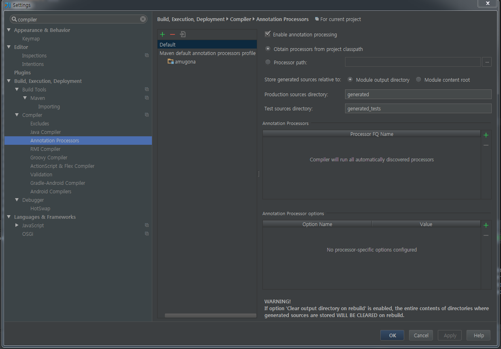
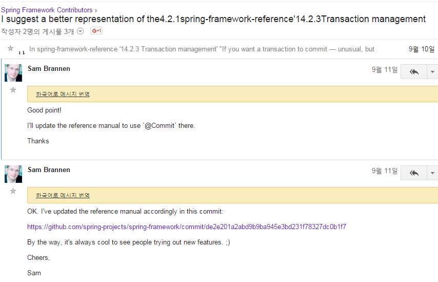

# 백기선님의 Spring Boot 강의 


**github : https://github.com/keesun/amugona**


소스를 다운받자마자 메소드를 인식 못한다는 에러가 발생했다. 이유는 lombok 때문(spring boot에서 지원안해줌)) !! 

lombok이 뭔고하니 
```
@Entity
@Getter
@Setter
public class Account {

    @Id @GeneratedValue
    private Long id;

    @Column(unique = true)
    private String username;

    private String password;

    private String email;

    private String fullName;

    @Temporal(TemporalType.TIMESTAMP)
    private Date joined;

    @Temporal(TemporalType.TIMESTAMP)
    private Date updated;

}
```
위 처럼 getter/setter를 줄여주는 기능이다.

lombok을 사용하기 위해서는 

1. lombok plugin 설치 

2. lombok 설정 


AccountController에서 

클래스에 @Controller, @ResponseBody 두개를 붙이면 이 클래스안의 모든 public 메소드에 @ResponseBody가 다 적용이 되는것이다.
(@RestContoller = @Controller + @ResponseBody)
요즘은 서버사이드 개발이 API개발로 바뀌었기 때문에 @RestController 쓰는게 무방하다. 

메인 메소드를 실행하면 내장 임베디드 톰캣이 실행되면서 뜬다. 

Account 클래스를 만드는데 

```
@Id @GeneratedValue
private Long id;
```
@Id는 해당 프로퍼티가 테이블의 기본키 역할을 한다는 것을 나타낸다. @GeneratedValue는 기본키의 값을 위한 자동 생성 전략을 명시하는데 사용한다. 

AccountRepository는 jpa사용해서 만듦 두번째 인자는 pk 데이터타입
```
extends JpaRepository<Account, Long>
```

AccountService 클래스는 @Service 등록해서 component scan으로 빈으로 등록되게끔만 하고 @Autowired로 AccountRepository를 가지고 있게끔만 한다. 그리고 @Transactional 붙여주면 이 클래스 안에 만드는 모든 public 메소드는 다 transactional 애노테이션이 적용된다. 

AccountController에서 
```
public ResponseEntity createAccount(@RequestBody @Valid AccountDto.Create create,
                                          BindingResult result) {
```
@RequestBody 대신에 @RequestParam, @ModelAttribute 많이 썼었는데 요즘은 서버 사이드 개발이 주로 REST API쪽으로 많이 가다보니까 Request 본문에 들어오는걸 파싱받는게 많아져서 @RequestBody를 많이 씀
@RequestBody를 쓰면 메세지 컨버터가 작동됌 (@RequestParam, @ModelAttribute와는 다르게 바인딩해줌) 
spring-boot를 쓰게되면 여러개의 메세지 컨버터가 이미 등록이 되어 있어 

그런데 Acount 객체를 바로 받는게 아니라 AccountDto 객체를 따로 만들어서 (내가 받을것만 또 지정해주는) 그걸로 바인딩 되게 하면 Acoount객체의 모든 변수를 바인딩 받지 않을 때 헷갈려 지지 않는다. 받을것만 AccountDto를 만들어서 넣게끔하니까 

AccountDto 클래스 가보면 @NotBlank @Size가 적용되어 있는데 그걸 붙였다고 바로 검증이 되진 않는다. 
실제 검증을 하려면 createAccount메소드 파라미터로 @Valid 꼭 붙여 줘야함

**질문** 
- 테스트에 @Transactional에 붙으면 자동으로 롤백이 된다고 말씀하셨는데 제가 아는 롤백이란 개념은 
'데이터베이스에서 업데이트에 오류가 발생할 때, 이전 상태로 되돌리는 것' 인데 테스트에서 롤백이 된다라는 부분이 잘 와닿지 않습니다.<br>


답변 : 테스트의 모든 transactional은 에러가 나든, 안나든 롤백이 되도록 설정이 되어 있다. 롤백은 데이터의 변경사항을 commit하지 않고 되돌리는것 ex) 비지니스 로직상, 트랜잭션의 타임아웃 

테스트코드를 메모리 DB쓰지않고 Mysql을 썼다고 가정하면 하나의 @Test의 DB 작업이 
다른 @Test에 영향을 끼칠 수 있다. 테스트 간의 의존성이 생기기 때문에 테스트를 만드는게 
어려워진다. 그래서 DB에 기록을 남기지 않으려고 so @Transactional을 붙임으로써 기본적으로 롤백이 되게끔 한다. 


- 테스트에 붙은 @Transactional 과 서비스에 있는 @Transactional과 정확히 어떤 차이가 있는건가요?
 

답변 : 테스트의 @Transactional이 기본적으로 롤백이 디폴트로 적용되는거 밖에 없다. 


TransactionConfiguration는 class-level
rollback은 method 레벨 
근데 4.2 버전부터는 Rollback이 다 한다. 
TransactionConfiguration는 desperated 될것. 




ErrorResponse 클래스에 @Data붙이면 lombok에 의해 getter, setter 만들어짐 

**Maven에서 dependency 의 scope 설정**<br>
compile(default) : 컴파일 시 라이브러리를 사용한다<br>
runtime : 실행 시 라이브러리를 사용한다<br>
provided : 외부에서 라이브러리가 제공된다. 컴파일 시 사용하지만 빌드에 포함하지 않는다. 보통 JSP, Servlet 라이브러리들에 사용한다.<br>
test : 테스트 코드에만 사용한다. <br>
```
<mvc:annotation-driven/>
<context:component-scan base-package=""/>
```
base-package포함, 하위의 클래스들 중 @Controller, @Repository, @Service, @Component가 붙어 있는 클래스들을 자동으로 스프링 빈으로 등록한다. 

```
<tx:annotation-driven/>
<context:component-scan base-package=""/>
```
bace-package포함, 하위의 클래스들 중 @Transcational이 붙은 곳에 트랜잭션을 적용한다.

**mvc:resources**<br>

```
<mvc:default-servlet-handler default-servlet-name="default"/>
```
DispatcherServlet이 처리하지 못한 요청을 서블릿 컨테이너의 DefaultServlet에게 넘겨주는 역할을 하는 핸들러이다. 

/js/jquery.js 처럼 컨트롤러에 매핑안되는 URL같은 경우는 DefaultServletHttpRequestHandler가 담당한다. 이 핸들러는 매핑 우선순위가 가장 낮아서 애노테이션 매핑 등등을 거쳐서 다 실패한 URL만 넘어온다. 그리고 요청을 자신이 직접 읽어서 처리하는 것이 아니라, 원래 서버가 제공하는 디폴트 서블릿으로 넘겨버린다. 그러면 서버의 기본 디폴트 서블릿이 동작해서 스태틱리소스를 처리하는 것이다. 다시말해 일단 스프링이 다 받고 스프링이 처리 못하는 건 다시 서버의 디폴트 서블릿으로 넘긴다는 아이디어이다. 

`*.ico`파일 처리 못하는 현상은 `web.xml`에 ico의 MIME타입을 지정해주면 된다. 
```
<mime-mapping>
    <extension>ico</extension>
    <mime-type>image/vnd.microsoft.icon</mime-type>
</mime-mapping>
```

**정적자원 설정하기**<br>

CSS,JS,이미지 등의 자원은 거의 변하지 않기 때문에, 웹 브러우저에 캐시를 하면 네트워크 사용량, 서버 사용량, 웹 브라우저의 반응 속도 등을 개선할 수 있다. 스프링 MVC를 이용하는 웹 애플리케이션에 정적 자원 파일이 함께 포함되어 있다면 웹 서버 설정을 사용하지 않고 캐시를 사용하도록 지정할 수 있다. 

```
<mvc:resources mapping="/resources/**" location="/resources/" cache-period="60"/>
```

mapping : 요청 경로 패턴을 설정한다. (컨텍스트 경로를 제외한 나머지 부분의 경로)<br>
location : 웹 애플리케이션 내에서 요청 경로 패턴에 해당하는 자원의 위치를 지정한다. 위치가 여러곳일 경우 각 위치를 콤마로 구분한다.<br>
cache-period: 웹 브라우저에 캐시 시간 관련 응답 헤더를 전송한다. 초 단위로 캐시 시간을 지정하며 이 값이 0이면 웹 브라우저가 캐시하지 않도록 한다. <br>

위 설정의 경우 요청 경로가 /resources/로 시작하면, 그에 해당하는 자원을 /resources/나 /WEB-INF/resources/ 디렉토리에서 검색한다. 


## 스프링 정의 
자바 엔터프라이즈 개발을 편하게 해주는 오픈소스 경량급 애플리케이션 프레임워크<br>  

**애플리케이션 프레임워크 :** 특정 계층에서 동작하는 한가지 기술분야가 아닌 범용적인 프레임워크 <br> 

**경량급 :** 과거 EJB같은 과도한 엔지니어링이 적용된 기술은 무겁다. 스프링은 복잡한 EJB와 고가의 WAS를 갖추지 않고 단순 서버환경인 톰캣, 제티에서도 잘돌아간다. <br> 

**자바 엔터프라이즈 개발을 편하게 해준다 :** 스프링이라는 프레임워크가 제공하는 기술이 아니라 자신이 작성하는 애플리케이션 로직에 더 많은 관심과 시간을 쏟게 해준다. (초기 기본설정, 적용기술을 잘 선택하고 준비해두면 더이상 크게 신경 쓸 부분이 없다.) 

자바의 근본적인 목적 : 객체지향 프로그래밍을 통해 유연하고 확장성 좋은 애플리케이션을 빠르게 만드는것.

스프링이 만들어진 이유 : 경량급 프레임워크인 스프링을 활용해서 엔터프라이즈 개발을 편하게. 

엔터프라이즈 시스템 : 서버에서 동작하며 기업과 조직의 업무를 처리해주는 시스템이다. 그래서 많은 사용자의 요청을 동시에 처리해야함(보안성, 안정성, 확장성 고려) 여러 기술도 요구되고, 점점 기술적인 요구는 심화되고 복잡도는 증가한다. 

**스프링은 비침투적인 기술을 적용(IOC, DI, AOP 등)함으로써 비지니스로직의 복잡함과 엔터프라이즈 기술의 복잡함을 분리시켜 애플리케이션 코드에서 설계와 구현 방식을 제한하지 않는다.** 

기술적 복잡함을 상대하는 전략은 1. 서비스 추상화 2. AOP

스프링의 DI/AOP는 단지 객체지향언어의 장점을 제대로 살리지 못하게 방해했던 요소를 제거하도록 도와줄뿐이다. 

###IOC(Inversion of control)제어의 역전
일반적인 자바프로그램에서는 main() 메서드에서 시작해서 개발자가 미리 정한 순서를 따라 오브젝트가 생성되고 실행된다. 그런데 서블릿을 개발해서 서버에 배포할 수는 있지만, 그 실행을 개발자가 직접 제어할 수 있는 방법은 없다. 서블릿 안에 main() 메서드가 있어서 직접 실행시킬 수 있는 것도 아니다. **대신 서블릿에 대한 제어 권한을 가진 컨테이너가 적절한 시점에 서블릿 클래스의 오브젝트를 만들고 그 안에 메서드를 호출한다.**

제어권을 상위 템플릿 메서드에 넘기고 자신은 필요할 때 호출되어 사용되도록 한다는 개념 

**라이브러리와 프레임워크의 차이 :**라이브러리를 사용하는 애플리케이션 코드는 애플리케이션 흐름을 직접 제어한다. 단지 동작하는 중에 필요한 기능이 있을 때 능동적으로 라이브러리를 사용할 뿐. 

프레임워크는 거꾸로 애플리케이션 코드가 프레임워크에 의해 사용된다. 보통 프레임워크 위에 개발한 클래스를 등록해두고, 프레임워크가 흐름을 주도하는 중에 개발자가 만든 애플리케이션 코드를 사용하도록 만드는 방식이다. 

**빈 :** 스프링이 제어권을 가지고 직접 만들고 관계를 부여하는 오브젝트.(제어의 역전이 허용된 오브젝트) 

**빈팩토리 :** 스프링의 IOC를 담당하는 핵심 컨테이너. 빈을 등록하고 생성하고 조회하고 돌려주고, 그 외에 부가적인 빈을 관리하는 기능을 담당한다. 

**application context :** 빈 팩토리를 상속한, 빈 팩토리를 확장한 IOC 컨테이너. 
기본적인 기능은 빈 팩토리와 동일하고 스프링이 제공하는 각종 부가 서비스를 추가로 제공한다. 

### 스프링 싱글톤 
스프링은 여러번에 걸쳐 빈을 요청하더라도 매번 동일한 오브젝트를 돌려준다. 

applicationcontext는 싱글톤을 저장하고 관리하는 싱글톤 레지스트리이다. 스프링은 별다른 설정을 하지 않으면 기본적으로 내부에서 생성하는 빈 오브젝트를 모두 싱글톤으로만든다. 

**서버 애플리케이션과 싱글톤**<br>
스프링이 싱글톤으로 빈을 만드는 이유는 스프링이 주로 적용되는 대상이 자바 엔터프라이즈 기술을 사용하는 서버 환경이기 때문이다. 대규모 엔터프라이즈 서버 환경은 서버 하나당 초당 수십에서 수백번씩 요청을 받아 처리해야 되기 때문에 요청이 올때마다 각 로직을 담당하는 오브젝트를 새로 만들어서 사용하면 부하가 심해진다. 

**싱글톤 패턴 :** 어떤 클래스를 애플리케이션 내에서 제한된 인스턴스 개수, 주로 하나만 존재하도록 강제하는 패턴이다. 이렇게 하나만 만들어지는 클래스의 오브젝트는 애플리케이션 내에서 전역적으로 접근이 가능하다. 단일 오브젝트만 존재해야 하고, 이를 애플리케이션의 여러 곳에서 공유하는 경우에 주로 사용한다.

```
public class UserDao{

    private static UserDao userDao;
    
    private UserDao(){
        //...
    }
    
    public static UserDao getInstance(){
        if(userDao == null) userDao = new UserDao();
        retrun userDao; 
    }
}
```

**싱글톤 방식의 문제점 : **<br>
1. private 생성자로 인해 상속 못한다.(객체지향 특징이 적용안됌) 
2. 테스트 하기 힘들다 - 테스트에서 사용될 때 목 오브젝트 등으로 대체하기 힘들다. 
3. 서버 환경에서는 싱글톤이 하나만 만들어 지는 것을 보장하지 못한다.
    1. 서버에서 클래스 로더를 어떻게 구성하고 있는가에 따라 싱글톤 클래스임에도 하나 이상의 오브젝트가 만들어질 수 있다. 
    2. 여러 개의 JVM에 분산돼서 설치가 되는 경우에도 각각 독립적으로 오브젝트가 생기기 때문에 싱글톤으로서의 가치가 떨어진다. 
4. 싱글톤의 사용은 전역 상태를 만들 수 있기 때문에 바람직하지 못하다.
    1. 아무 객체나 자유롭게 접근하고 수정하고 공유할 수 있는 전역상태를 갖는 것은 객체지향 프로그래밍에서는 권장되지 않는 프로그래밍 모델이다. 


**스프링은 직접 싱글톤 형태의 오브젝트를 만들고 관리하는 기능을 제공한다. => 싱글톤 레지스트리 (자바의 기본적인 싱글톤 패턴 구현방식에 여러가지 단점이 있기 때문에) **<br>

스프링 컨테이너는 싱글톤을 생성하고 관리하고 공급하는 싱글톤 관리 컨테이너이기도 하다. 싱글톤 레지스트리의 장점은 static 메서드와 private 생성자를 사용해야 하는 비정상적인 클래스가 아니라 평범한 자바클래스를 싱글톤으로 활용하게 해준다. 

평범한 자바 클래스도 IOC방식의 컨테이너를 사용해서 생성, 관계 설정 등에 대한 제어권을 컨테이너에게 넘기면 쉽게 싱글톤 방식으로 만들어져 관리될 수 있다. 

싱글톤은 멀티스레드 환경이라면 여러 스레드가 동시에 접근해서 사용할 수 있다. 따라서 상태관리에 주의를 기울여야 한다. <br>
=> 상태정보를 내부에 갖고 있지 않는 무상태(stateless)방식으로 만들어져야 한다.<br>
cf)읽기 전용이라면 인스턴스 변수로 생성해도 상관없다. 값이 바뀌는 정보를 담은 변수가 문제를 야기시킨다.

스프링 빈의 기본 스코프는 싱글톤이다. 그러나 싱글톤 외의 스코프를 가질 수도 있는데 웹을 통한 새로운 http요청이 생길때마다 생성되는 request 스코프 세션 스코프 등 ...

**DI**<br>
보통 그동안 `<context: annotation-config>` 하고 `@Autowired` 통해서 자동으로 주입 받아서 사용했다.(따로 빈 등록 필요없이) 

스프링 IOC 기능의 대표적인 동작원리는 주로 의존관계 주입이라고 불린다. 


A는 B에 의존한다.(B가 변하면 A에 영향을 끼친다)

모델이나 코드에서 클래스와 인터페이스를 통해 드러나는 의존관계 말고, 런타임 시에 오브젝트 사이에서 만들어지는 의존관계도 있다. (런타임 의존관계, 오브젝트 의존관계) 설계 시점의 의존관계가 실체화 된것. 

의존관계 주입은 구체적인 의존 오브젝트와 그것을 사용할 주체, 보통 클라이언트라고 부르는 오브젝트를 **런타임시에** 연결해주는 작업이다.

DI란 다음 3가지 조건을 충족해야 한다. 
1. 클래스 모델이나 코드에는 런타임 시점의 의존관계가 드러나지 않는다. 그러기 위해서는 인터페이스에만 의존하고 있어야 한다. 
2. 런타임 시점의 의존관계는 컨테이너나 팩토리 (applicationcontext)같은 제 3의 존재가 결정한다.
3. 의존관계는 사용할 오브젝트에 대한 레퍼런스를 외부에서 제공해줌으로써 만들어진다.

ㅇ